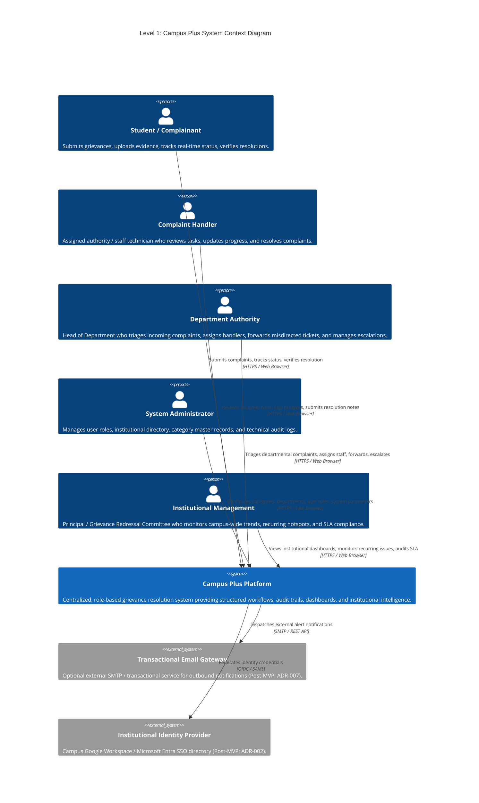
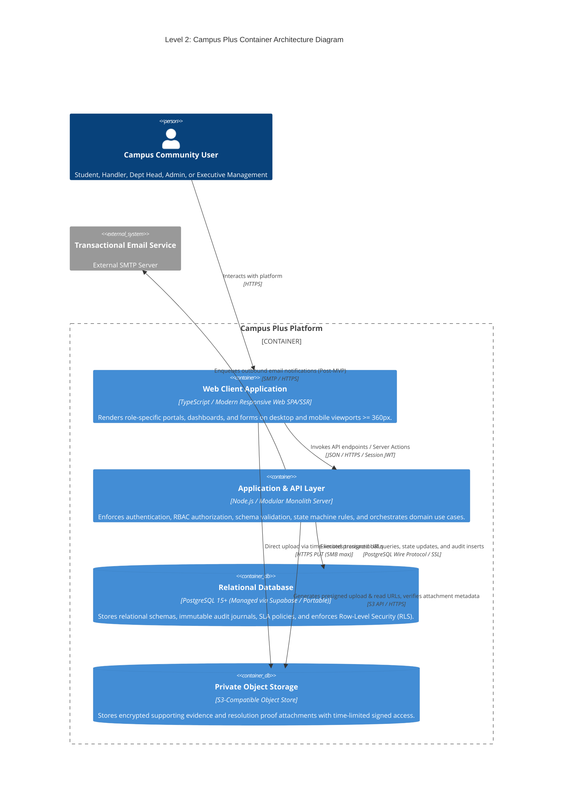
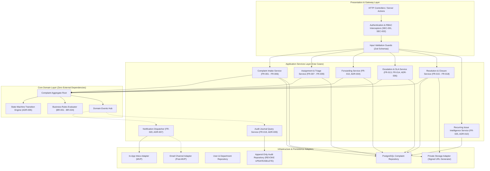

# Campus Plus — C4 Architecture Models (Levels 1, 2, and 3)

**Project**: Campus Plus — Campus Complaint and Grievance Resolution System  
**Phase**: Phase 02 — Architecture Definition & Technical Blueprint  
**Document**: C4-ARCHITECTURE-MODELS.md  
**Version**: 1.0  
**Status**: Formal Architectural Blueprint  
**Authors**: Enterprise Systems Architect, Lead Software Architect  

---

## 1. Executive Summary

This document specifies the system architecture using the standardized **C4 Model** (Context, Containers, Components). These models define the physical and logical boundaries of **Campus Plus**, illustrating how human actors, external services, containers, and internal domain modules interact while preserving explicit security trust boundaries.

---

## 2. Level 1: System Context Diagram

The System Context diagram illustrates the boundary of the Campus Plus platform, its human stakeholder roles, and genuinely required external systems. No imaginary systems are introduced.

---

## 3. Level 2: Container Diagram

The Container diagram decomposes Campus Plus into its executable runtime units, data stores, and private storage subsystems.

---

## 4. Level 3: Component Diagram (Application Layer Decomposition)

The Component diagram reveals the internal modular composition of the **Application & API Layer** (`api_gateway`), demonstrating strict dependency direction and domain module boundaries.

---

## 5. Major Application Module Specifications

| Module Name | Core Responsibility | Public Interface / Methods | Downstream Dependencies | Data Owned | Authorization Boundary | Failure & Fallback Behavior |
| :--- | :--- | :--- | :--- | :--- | :--- | :--- |
| **Identity & Access** | Authenticate credentials, issue signed session tokens, resolve role claims. | `authenticate()`, `validateSession()`, `provisionRole()` | PostgreSQL `users` table | `users`, `roles`, `sessions` | Public login; Admin for role provisioning. | Return 401 Unauthorized; log security warning; zero token issuance on failure. |
| **Complaint Intake** | Validate mandatory fields, enforce suggested priority, issue reference ID (`CP-YYYY-XXXXX`). | `submitComplaint(command)` | Domain FSM, Complaint Repo, Audit Repo, Storage Adapter | `complaints` (creation) | `ROLE_STUDENT` only. | Reject invalid input with 422 Unprocessable Entity; atomic rollback on DB failure. |
| **Assignment & Triage** | Manage department queue, assign single responsible handler, execute intra-department reassignments. | `assignHandler(command)`, `reassignHandler(command)` | Domain FSM, Complaint Repo, Audit Repo, Event Hub | `complaints.handler_id`, `complaints.status` | `ROLE_DEPT_HEAD`, `ROLE_ADMIN` within department. | Reject cross-department staff assignments with 403 Forbidden. |
| **Forwarding Engine** | Transfer owning department across boundaries with mandatory recorded rationale. | `forwardComplaint(command)` | Domain FSM, Complaint Repo, Audit Repo, Event Hub | `complaints.department_id`, `complaints.status` | Assigned `ROLE_HANDLER`, `ROLE_DEPT_HEAD`. | Validate target department is active; atomic transaction rolls back if audit fails. |
| **Escalation & SLA** | Evaluate manual escalations and execute automated background scans for SLA threshold breaches. | `escalateComplaint(command)`, `evaluateSLABreaches()` | SLA Policy Table, Complaint Repo, Event Hub | `complaints.is_escalated`, `complaints.escalation_tier` | Handler/Dept Head for manual; Scheduled Worker for automated. | Idempotency guard prevents duplicate tier increments or alert storms. |
| **Resolution & Closure** | Validate resolution summary, enforce proof rules per category, manage 5-day dispute window. | `resolveComplaint(command)`, `verifyResolution()`, `reopenComplaint()` | Domain FSM, Complaint Repo, Storage Adapter, Event Hub | `complaints.status`, `complaints.resolution_notes` | Handler for resolve; Student for verify/reopen. | Enforce category proof requirements; reject resolution without text note. |
| **Audit Journal** | Record append-only lifecycle transitions and comments with dual-level visibility partitioning. | `appendAuditEvent(event)`, `queryComplaintTimeline(refId)` | PostgreSQL `action_history` table (REVOKE UPDATE/DELETE) | `action_history` | Internal write-only; Role-filtered read. | If audit insert fails, parent transaction MUST abort completely (zero un-audited state mutations). |
| **Notification Dispatcher** | Consume domain events and deliver in-app inbox alerts to target users. | `dispatch(domainEvent)`, `getUserInbox(userId)` | Relational `notifications` table, Email Adapter | `notifications` | User can only read own notification records. | Notification failure must NOT roll back core complaint state transaction; logged asynchronously. |
| **Recurring Intelligence** | Execute deterministic 30-day multi-attribute clustering to surface chronic campus hotspots. | `getRecurringHotspots(deptId, windowDays)` | PostgreSQL Complaint View (`recurring_complaint_clusters`) | None (read-only analytical view) | `ROLE_DEPT_HEAD`, `ROLE_ADMIN`, `ROLE_MANAGEMENT`. | Fallback to cached view if analytical query exceeds timeout. |

---

## 6. Architecture Verification Checklist

- [x] Level 1 System Context includes all confirmed human roles and zero imaginary systems.
- [x] Level 2 Container Diagram explicitly shows stateless Web Client, Modular Monolith API, PostgreSQL, and Private Object Storage.
- [x] Level 3 Component Diagram cleanly partitions Presentation, Application, Domain, and Persistence layers.
- [x] Public interfaces, dependencies, data ownership, authorization, and failure modes defined for every module.
- [x] Strict dependency direction: Domain layer has zero outgoing dependencies on infrastructure.
