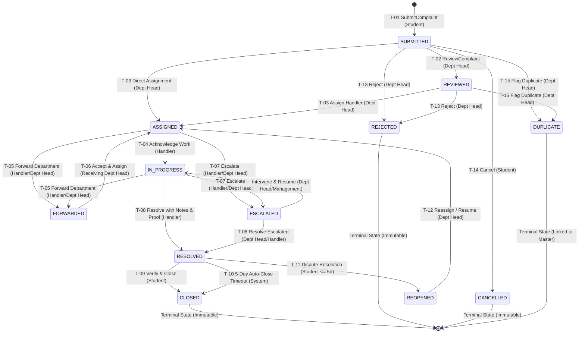

# Campus Plus — Complaint State Machine & Transition Safety Specification

**Project**: Campus Plus — Campus Complaint and Grievance Resolution System  
**Phase**: Phase 02 — Architecture Definition & Technical Blueprint  
**Document**: COMPLAINT-STATE-MACHINE.md  
**Version**: 1.0  
**Status**: Formal State Machine & Concurrency Specification  
**Authors**: Lead Software Architect, QA/Test Analyst  

---

## 1. Executive Summary

This document specifies the complete, deterministic **Finite State Machine (FSM)** governing complaint lifecycles in Campus Plus. It provides an exhaustive transition table, detailed transition semantics, Mermaid state diagrams, and robust concurrency/safety mechanisms (optimistic locking, idempotency keys, atomic transaction boundaries) to prevent race conditions and invalid state mutations.

---

## 2. Complete State Machine Transition Table

The state machine strictly enforces authorized actors, input pre-conditions, state invariants, side effects, notifications, and audit logging for every permitted transition. Any transition not explicitly listed in this table is **STRICTLY INVALID** and will be rejected with an `InvalidStateTransitionException` (HTTP 409 Conflict).

| # | Source State | Destination State | Triggering Action | Authorized Actor | Preconditions & Validation | Required Input Fields | Side Effects & State Mutations | Notification Dispatched | Audit Event Appended | SLA Behavior | Failure Behavior |
| :- | :--- | :--- | :--- | :--- | :--- | :--- | :--- | :--- | :--- | :--- | :--- |
| **T-01** | `[NONE]` | `SUBMITTED` | `SubmitComplaint` | `ROLE_STUDENT` | Authenticated student; Title (10–120c), Desc ($\ge 30$c), active Category & Dept. | `title`, `description`, `category_id`, `department_id`, `suggested_priority`, `location` | Generate unique `ref_id` (`CP-YYYY-XXXXX`); set `created_at`; bind `complainant_id`. | Confirmation alert to Student; Triage alert to Dept Head. | `SUBMITTED` | SLA timer initiates. | Rollback transaction; return 422 with validation errors. |
| **T-02** | `SUBMITTED` | `REVIEWED` | `ReviewComplaint` | `ROLE_DEPT_HEAD`, `ROLE_ADMIN` | Complaint belongs to actor's department. | None (optional triage note) | Sets `status = REVIEWED`; updates `updated_at`. | None (internal triage progress). | `REVIEWED` | SLA timer continues. | Abort if not in actor's dept; return 403 Forbidden. |
| **T-03** | `SUBMITTED` or `REVIEWED` | `ASSIGNED` | `AssignHandler` | `ROLE_DEPT_HEAD`, `ROLE_ADMIN` | Target handler is active and belongs to the owning department. | `handler_id`, optional `instructions` | Sets `handler_id`; sets `status = ASSIGNED`; updates `updated_at`. | Task alert to assigned Handler; Progress alert to Student. | `ASSIGNED` | SLA response milestone met. | Rollback if handler inactive or wrong dept; return 422. |
| **T-04** | `ASSIGNED` | `IN_PROGRESS` | `AcknowledgeWork` | Assigned `ROLE_HANDLER` | Caller must be the assigned handler. | Optional `preliminary_remarks` | Sets `status = IN_PROGRESS`; records acknowledgement timestamp. | Status change alert to Student. | `IN_PROGRESS` | Active investigation ongoing. | Reject if caller is not assigned handler; return 403. |
| **T-05** | `IN_PROGRESS` or `ASSIGNED` | `FORWARDED` | `ForwardComplaint` | Assigned Handler, `ROLE_DEPT_HEAD` | Target department must be active and distinct from current department. | `target_department_id`, mandatory `forwarding_reason` ($\ge 15$c) | Sets `department_id = target_dept`; resets `handler_id = NULL`; sets `status = FORWARDED`. | Transfer alert to receiving Dept Head; update to Student. | `FORWARDED` | SLA timer recalculates or pauses pending transfer. | Rollback on DB error; return 422 if reason missing. |
| **T-06** | `FORWARDED` | `ASSIGNED` | `AcceptAndAssign` | Receiving `ROLE_DEPT_HEAD` | Caller belongs to receiving department. | `handler_id` in new department | Sets new `handler_id`; sets `status = ASSIGNED`. | Alert to new Handler and Student. | `ASSIGNED` | SLA timer resumes under new department. | Reject if caller not in new dept; return 403. |
| **T-07** | `IN_PROGRESS` or `ASSIGNED` | `ESCALATED` | `EscalateComplaint` | Assigned Handler, `ROLE_DEPT_HEAD` | Escalation tier $< 3$; complaint not resolved. | Mandatory `escalation_reason` ($\ge 15$c), target tier | Increments `escalation_tier`; sets `is_escalated = TRUE`; sets `status = ESCALATED`. | High-priority urgent alert to Dept Head / Management. | `ESCALATED` | Triggers SLA escalation alert flag. | Reject if already at maximum tier (Tier 3); return 409. |
| **T-08** | `IN_PROGRESS` or `ESCALATED` | `RESOLVED` | `ResolveComplaint` | Assigned `ROLE_HANDLER`, `ROLE_DEPT_HEAD` | Resolution summary $\ge 20$c. If category requires proof, attachment must exist. | `resolution_summary`, optional/mandatory `proof_attachment_ids` | Sets `status = RESOLVED`; sets `resolved_at`; records resolution summary. | Resolution alert to Student with verification prompt. | `RESOLVED` | SLA resolution milestone stopped. | Reject if summary $< 20$c or proof missing; return 422. |
| **T-09** | `RESOLVED` | `CLOSED` | `VerifyResolution` | Complainant (`ROLE_STUDENT`) | Caller must be the original complainant. | Optional `satisfaction_rating` (1–5) | Sets `status = CLOSED`; sets `closed_at`. Terminal state. | Closure confirmation to Student and Handler. | `CLOSED` | Lifecycle terminated. | Reject if caller is not original complainant; return 403. |
| **T-10** | `RESOLVED` | `CLOSED` | `AutoCloseTimeout` | System Scheduled Worker | 5 business days elapsed since `resolved_at` without student dispute (`OD-008`). | System reason: `AUTO_CLOSED_TIMEOUT` | Sets `status = CLOSED`; sets `closed_at`. Terminal state. | Auto-closure notice to Student. | `CLOSED` | Lifecycle terminated. | Idempotent batch execution. |
| **T-11** | `RESOLVED` | `REOPENED` | `DisputeResolution` | Complainant (`ROLE_STUDENT`) | Within 5 business days of `resolved_at`; mandatory dispute reason. | Mandatory `dispute_reason` ($\ge 20$c) | Sets `status = REOPENED`; resets `resolved_at = NULL`; increments reopen count. | Urgent dispute alert to Dept Head & Handler. | `REOPENED` | SLA dispute timer initiated. | Reject if dispute window expired; return 409 Conflict. |
| **T-12** | `REOPENED` | `ASSIGNED` or `IN_PROGRESS` | `ReassignOrResume` | `ROLE_DEPT_HEAD` | Re-reviewed dispute validity. | `handler_id`, corrective instructions | Updates handler or confirms existing handler; transitions to `ASSIGNED`. | Alert to Handler and Student. | `REASSIGNED` | Re-investigation SLA initiated. | Reject if caller not department authority; return 403. |
| **T-13** | `SUBMITTED` or `REVIEWED` | `REJECTED` | `RejectComplaint` | `ROLE_DEPT_HEAD`, `ROLE_ADMIN` | Pre-assignment triage; complaint invalid, abusive, or non-actionable. | Mandatory `rejection_reason` ($\ge 15$c) | Sets `status = REJECTED`; terminal state. | Rejection notice with rationale to Student. | `REJECTED` | SLA cancelled. | Reject if complaint already in progress; return 409. |
| **T-14** | `SUBMITTED` | `CANCELLED` | `CancelComplaint` | Complainant (`ROLE_STUDENT`) | Caller is original complainant; complaint has not been triaged/assigned. | Optional `cancellation_reason` | Sets `status = CANCELLED`; terminal state. | Cancellation confirmation. | `CANCELLED` | SLA cancelled. | Reject if complaint already assigned or in progress; return 409. |
| **T-15** | `SUBMITTED` or `REVIEWED` | `DUPLICATE` | `FlagDuplicate` | `ROLE_DEPT_HEAD`, `ROLE_ADMIN` | Matches existing open complaint in same location/category. | `master_complaint_id`, duplicate rationale | Sets `status = DUPLICATE`; links to master reference. Terminal state. | Notice to Student linking master ticket. | `DUPLICATE` | SLA merged into master ticket. | Reject if master ticket not provided; return 422. |

---

## 3. Mermaid State Transition Diagram



---

## 4. Transition Safety & Concurrency Architecture

To guarantee that real-world concurrent usage cannot corrupt complaint state or produce race conditions, the architecture establishes four defensive layers:

### 4.1 Optimistic Concurrency Control (OCC)
Every `complaints` row includes a monotonic integer version column: `version INT NOT NULL DEFAULT 1`.
- Any state transition mutation must execute with an OCC predicate:
  ```sql
  UPDATE complaints 
  SET status = :new_status, version = version + 1, updated_at = CURRENT_TIMESTAMP
  WHERE id = :complaint_id AND version = :expected_version;
  ```
- **Collision Handling**: If `rows_affected == 0`, a concurrent update occurred (e.g., another handler acknowledged or forwarded the complaint milliseconds earlier). The API immediately throws `StaleStateConflictException` (HTTP 409 Conflict), instructing the client to refresh its state view.

### 4.2 Idempotency Keys for Critical State Mutations
All state-mutating requests (`POST /complaints`, `POST /complaints/{id}/assign`, `POST /complaints/{id}/resolve`) support an `Idempotency-Key: <UUID>` HTTP header:
- The gateway checks whether the idempotency key was executed within the last 15 minutes.
- If identical key is received during processing, the server rejects with HTTP 409. If already completed, it returns the cached response, preventing duplicate ticket creation or duplicate assignments caused by mobile network retries.

### 4.3 Atomic Transaction Boundaries
A state transition is NEVER a simple `UPDATE` query. Every transition executes within an explicit database transaction with `READ COMMITTED` or `REPEATABLE READ` isolation:
$$\text{BEGIN TRANSACTION} \longrightarrow \text{Lock Row / Verify Preconditions} \longrightarrow \text{Mutate Complaint} \longrightarrow \text{Insert Action History} \longrightarrow \text{Queue Domain Event} \longrightarrow \text{COMMIT}$$
If the audit log insert fails for any reason (e.g. disk quota), the entire transition rolls back cleanly, ensuring zero untracked state changes.

### 4.4 Invariant Guards Against Common State Machine Pitfalls
1. **Double Resolution Guard**: A complaint cannot transition to `RESOLVED` if `status` is already `RESOLVED` or `CLOSED`.
2. **Terminal Immutability Guard**: Any command targeting a complaint in `CLOSED`, `REJECTED`, or `CANCELLED` status is halted immediately before checking business rules.
3. **Circular Forwarding Detection**: If `action_history` records $\ge 3$ forwarding events within the current lifecycle, the forwarding command is blocked and automatically elevates the ticket to `ESCALATED` for executive intervention (`EDGE-004`).

---

## 5. Architecture Verification Summary

- [x] All 12 lifecycle states from Phase 01 validated and formally defined.
- [x] Transition table specifies exact actors, pre-conditions, required fields, side effects, notifications, and failure behaviors for all 15 valid transitions.
- [x] Mermaid state diagram depicts all paths, terminal nodes, and dispute loops.
- [x] Optimistic locking (OCC), idempotency keys, and atomic transaction boundaries eliminate race conditions.
