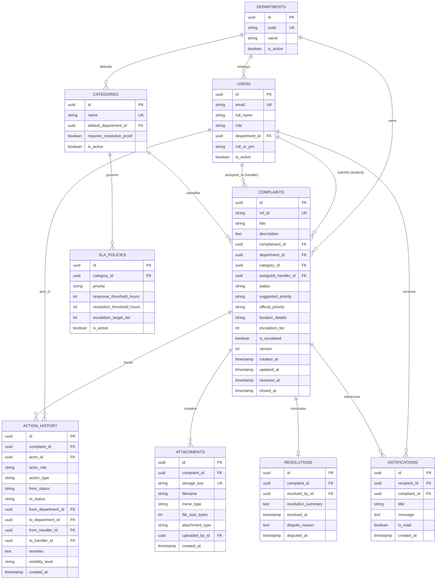

# Campus Plus — Conceptual Data Architecture & Relational Schema Design

**Project**: Campus Plus — Campus Complaint and Grievance Resolution System  
**Phase**: Phase 02 — Architecture Definition & Technical Blueprint  
**Document**: DATA-ARCHITECTURE.md  
**Version**: 1.0  
**Status**: Formal Data Architecture & Integrity Blueprint  
**Authors**: Database Architect, Lead Software Architect  

---

## 1. Executive Summary

This document specifies the **Conceptual Data Architecture**, relational entity schemas, entity relationships, physical data integrity constraints, and retention policies for Campus Plus. 

In accordance with [ADR-012](file:///d:/Deparment%20Project/department%20project/docs/engineering/architecture/decisions/ADR-012-SUPABASE-EVALUATION-DECISION.md), the persistence layer adopts **PostgreSQL 15+** (managed via Supabase under architectural constraints). All schemas, foreign keys, views, and integrity triggers are designed in standard ANSI/PostgreSQL DDL to guarantee 100% portability to vanilla self-hosted campus PostgreSQL if mandated.

---

## 2. Conceptual Entity-Relationship (ER) Model



---

## 3. Comprehensive Entity Catalog & Attribute Specifications

### 3.1 `departments`
- **Purpose**: Represents academic departments (IT, Computer, Mechanical) or administrative/service wings (Hostel, Electrical Maintenance, Sanitation, Library).
- **Ownership**: System Administrator (`ROLE_ADMIN`).
- **Identifiers**: `id` (UUID, PK), `code` (VARCHAR, UNIQUE, e.g. `DEPT-IT`, `DEPT-HOSTEL`).
- **Sensitivity**: Public / Tier 1.
- **Retention**: Permanent reference; soft-delete flag `is_active`.

### 3.2 `categories`
- **Purpose**: Functional complaint categories (Academic, Infrastructure, Hostel, Cleanliness, Administration).
- **Ownership**: System Administrator (`ROLE_ADMIN`).
- **Identifiers**: `id` (UUID, PK), `name` (VARCHAR, UNIQUE).
- **Key Fields**: `default_department_id` (UUID, FK), `requires_resolution_proof` (BOOLEAN, default FALSE; TRUE for physical categories).
- **Sensitivity**: Public / Tier 1.
- **Retention**: Permanent reference; soft-delete flag `is_active` (`BR-007`).

### 3.3 `users`
- **Purpose**: System identity record for all authenticated users across all 5 roles.
- **Ownership**: Identity & Access Module / Admin.
- **Identifiers**: `id` (UUID, PK), `email` (VARCHAR, UNIQUE, restricted to institutional domain patterns).
- **Key Fields**: `full_name`, `role` (ENUM: `ROLE_STUDENT`, `ROLE_HANDLER`, `ROLE_DEPT_HEAD`, `ROLE_ADMIN`, `ROLE_MANAGEMENT`), `department_id` (UUID, FK, nullable for students/admins), `roll_or_prn` (VARCHAR, nullable for staff).
- **Sensitivity**: Confidential / Tier 3.
- **Retention**: Active during student/staff enrollment; soft-deleted upon graduation/departure (`is_active = FALSE`).

### 3.4 `complaints` (Core Aggregate Root)
- **Purpose**: Primary operational grievance aggregate containing current lifecycle status, ownership, and metadata.
- **Ownership**: Student creates; State Machine governs.
- **Identifiers**: `id` (UUID, PK), `ref_id` (VARCHAR, UNIQUE, formatted `CP-YYYY-XXXXX`).
- **Key Fields**:
  - `title` (VARCHAR(120), NOT NULL, 10–120 chars)
  - `description` (TEXT, NOT NULL, $\ge 30$ chars)
  - `complainant_id` (UUID, NOT NULL, FK to `users`)
  - `department_id` (UUID, NOT NULL, FK to `departments`)
  - `category_id` (UUID, NOT NULL, FK to `categories`)
  - `assigned_handler_id` (UUID, NULLABLE, FK to `users`)
  - `status` (ENUM: `SUBMITTED`, `REVIEWED`, `ASSIGNED`, `IN_PROGRESS`, `FORWARDED`, `ESCALATED`, `RESOLVED`, `CLOSED`, `REOPENED`, `REJECTED`, `DUPLICATE`, `CANCELLED`)
  - `suggested_priority` (ENUM: `LOW`, `MEDIUM`, `HIGH`, `URGENT`)
  - `official_priority` (ENUM: `LOW`, `MEDIUM`, `HIGH`, `URGENT`)
  - `location_details` (VARCHAR(255), NOT NULL)
  - `escalation_tier` (INT, NOT NULL DEFAULT 1, range 1–3)
  - `is_escalated` (BOOLEAN, NOT NULL DEFAULT FALSE)
  - `version` (INT, NOT NULL DEFAULT 1, for Optimistic Concurrency Control)
  - `created_at`, `updated_at`, `resolved_at`, `closed_at` (TIMESTAMPTZ)
- **Sensitivity**: Confidential / Tier 3.
- **Retention**: Minimum 4 academic years (`NFR-010`). Permanent archival; hard deletion strictly prohibited.

### 3.5 `attachments`
- **Purpose**: Metadata links to private object storage files uploaded as initial evidence or resolution proof.
- **Ownership**: Complainant (initial); Handler (resolution proof).
- **Identifiers**: `id` (UUID, PK), `storage_key` (VARCHAR, UNIQUE, e.g. `complaints/{id}/{uuid}.jpg`).
- **Key Fields**: `complaint_id` (UUID, FK), `mime_type` (VARCHAR), `file_size_bytes` (INT), `attachment_type` (ENUM: `INITIAL_EVIDENCE`, `RESOLUTION_PROOF`), `uploaded_by_id` (UUID, FK).
- **Sensitivity**: Highly Sensitive / Tier 4.
- **Retention**: Parallels complaint retention; immutable after creation.

### 3.6 `action_history` (Append-Only Audit Journal)
- **Purpose**: Comprehensive, immutable chronological audit log capturing every lifecycle transition, assignment, forward, escalate, and comment.
- **Ownership**: State Machine Engine.
- **Identifiers**: `id` (UUID, PK, `gen_random_uuid()`).
- **Key Fields**:
  - `complaint_id` (UUID, NOT NULL, FK)
  - `actor_id` (UUID, NOT NULL, FK)
  - `actor_role` (VARCHAR(50), NOT NULL)
  - `action_type` (VARCHAR(50), NOT NULL)
  - `from_status`, `to_status` (VARCHAR(50), NULLABLE)
  - `from_department_id`, `to_department_id` (UUID, NULLABLE, FK)
  - `from_handler_id`, `to_handler_id` (UUID, NULLABLE, FK)
  - `remarks` (TEXT, NULLABLE)
  - `visibility_level` (VARCHAR(20), NOT NULL DEFAULT 'PUBLIC', 'PUBLIC' | 'INTERNAL')
  - `created_at` (TIMESTAMPTZ, NOT NULL DEFAULT CURRENT_TIMESTAMP)
- **Sensitivity**: Confidential / Tier 3.
- **Integrity**: Physical `REVOKE UPDATE, DELETE, TRUNCATE` enforced at database kernel level. Append-only forever.

### 3.7 `resolutions`
- **Purpose**: Captures completion summaries, timestamps, and student verification or dispute rationales.
- **Identifiers**: `id` (UUID, PK), `complaint_id` (UUID, UNIQUE FK).
- **Key Fields**: `resolved_by_id` (UUID, FK), `resolution_summary` (TEXT, $\ge 20$ chars), `resolved_at` (TIMESTAMPTZ), `dispute_reason` (TEXT, NULLABLE), `disputed_at` (TIMESTAMPTZ, NULLABLE).
- **Sensitivity**: Internal / Tier 2.

### 3.8 `sla_policies`
- **Purpose**: Dynamic configuration table specifying response and resolution hour thresholds per category and priority (`OD-006`).
- **Identifiers**: `id` (UUID, PK), `category_id` (UUID, FK), `priority` (VARCHAR).
- **Key Fields**: `response_threshold_hours` (INT), `resolution_threshold_hours` (INT), `escalation_target_tier` (INT, default 2), `is_active` (BOOLEAN).
- **Sensitivity**: Internal / Tier 2.

### 3.9 `notifications`
- **Purpose**: In-app inbox alert records dispatched to individual users (`OD-011`, `FR-020`).
- **Identifiers**: `id` (UUID, PK), `recipient_id` (UUID, FK to `users`).
- **Key Fields**: `complaint_id` (UUID, FK), `title` (VARCHAR(120)), `message` (TEXT), `is_read` (BOOLEAN DEFAULT FALSE), `created_at` (TIMESTAMPTZ).
- **Sensitivity**: Internal / Tier 2. Purgeable after 90 days.

---

## 4. Physical Data Integrity Constraints & Defense Layers

| Integrity Invariant | Concrete Constraint Mechanism | Enforcement Layer | Failure Action |
| :--- | :--- | :--- | :--- |
| **Unique Tracking Reference** | `CONSTRAINT uk_complaints_ref_id UNIQUE (ref_id)` | Database Kernel | Reject duplicate creation; abort transaction. |
| **Non-Empty Text Lengths** | `CHECK (char_length(title) >= 10 AND char_length(title) <= 120)`<br>`CHECK (char_length(description) >= 30)` | Domain Layer + DB Check Constraint | Reject with 422 Unprocessable Entity. |
| **Single Owning Department** | `department_id UUID NOT NULL REFERENCES departments(id)` | Database Foreign Key | Prevents orphaned complaints. |
| **Valid Lifecycle Status** | `status complaint_status_enum NOT NULL` | PostgreSQL ENUM Type | Reject unknown status strings with 400 Bad Request. |
| **Strict File Size Boundary** | `CHECK (file_size_bytes <= 5242880)` (5 MB) | Storage API + DB Check | Reject file uploads $> 5$ MB immediately. |
| **Audit Journal Immutability**| `REVOKE UPDATE, DELETE, TRUNCATE ON action_history FROM PUBLIC, authenticated, anon` | PostgreSQL Permission Grant | Database throws unhandled permission error if mutation attempted. |
| **Optimistic Lock Check** | `WHERE id = :id AND version = :version` | Application Domain / SQL Predicate | Throws 409 Conflict if concurrent update detected. |

---

## 5. Analytical Views Architecture: Recurring Hotspots

To satisfy `FR-025` and [ADR-010](file:///d:/Deparment%20Project/department%20project/docs/engineering/architecture/decisions/ADR-010-RECURRING-ISSUE-DETECTION.md) without introducing premature AI dependencies, the architecture defines a high-performance relational aggregation view:

```sql
-- Conceptual DDL Specification (Not executed in Phase 02)
CREATE VIEW recurring_complaint_clusters AS
SELECT 
    c.department_id,
    d.name AS department_name,
    c.category_id,
    cat.name AS category_name,
    LOWER(TRIM(c.location_details)) AS normalized_location,
    COUNT(*) AS incident_count,
    COUNT(CASE WHEN c.status NOT IN ('RESOLVED', 'CLOSED') THEN 1 END) AS active_unresolved_count,
    ARRAY_AGG(c.ref_id ORDER BY c.created_at DESC) AS complaint_ref_ids,
    MIN(c.created_at) AS first_reported_at,
    MAX(c.created_at) AS last_reported_at
FROM complaints c
JOIN departments d ON c.department_id = d.id
JOIN categories cat ON c.category_id = cat.id
WHERE c.created_at >= CURRENT_TIMESTAMP - INTERVAL '30 days'
GROUP BY c.department_id, d.name, c.category_id, cat.name, LOWER(TRIM(c.location_details))
HAVING COUNT(*) >= 3;
```

---

## 6. Performance Indexing Blueprint (`NFR-001`)

To guarantee sub-second query performance (<800ms) across all role dashboards and searches:
1. `CREATE INDEX idx_complaints_complainant ON complaints (complainant_id, created_at DESC);`
   - Accelerates student personal dashboard rendering (`FR-006`, `FR-021`).
2. `CREATE INDEX idx_complaints_dept_status ON complaints (department_id, status, created_at DESC);`
   - Powers department head triage queues and unassigned complaint backlogs (`FR-023`).
3. `CREATE INDEX idx_complaints_handler_status ON complaints (assigned_handler_id, status);`
   - Drives handler active task worklist queries (`FR-022`).
4. `CREATE INDEX idx_complaints_recurring ON complaints (department_id, category_id, created_at);`
   - Optimizes rolling 30-day recurring hotspot aggregation view (`FR-025`).
5. `CREATE INDEX idx_action_history_complaint ON action_history (complaint_id, created_at ASC);`
   - Ensures instantaneous timeline rendering for audit logs (`FR-019`).

---

## 7. Architecture Verification Summary

- [x] All 9 core relational entities defined with attributes, ownership, and retention rules.
- [x] Complete Mermaid ER diagram illustrates relational cardinalities.
- [x] Defense-in-depth physical database constraints enforce data integrity.
- [x] Deterministic 30-day recurring hotspot aggregation view specified without AI dependencies.
- [x] Composite indexing strategy guarantees sub-800ms response targets.
- [x] Zero SQL tables or database migrations executed in this phase.
