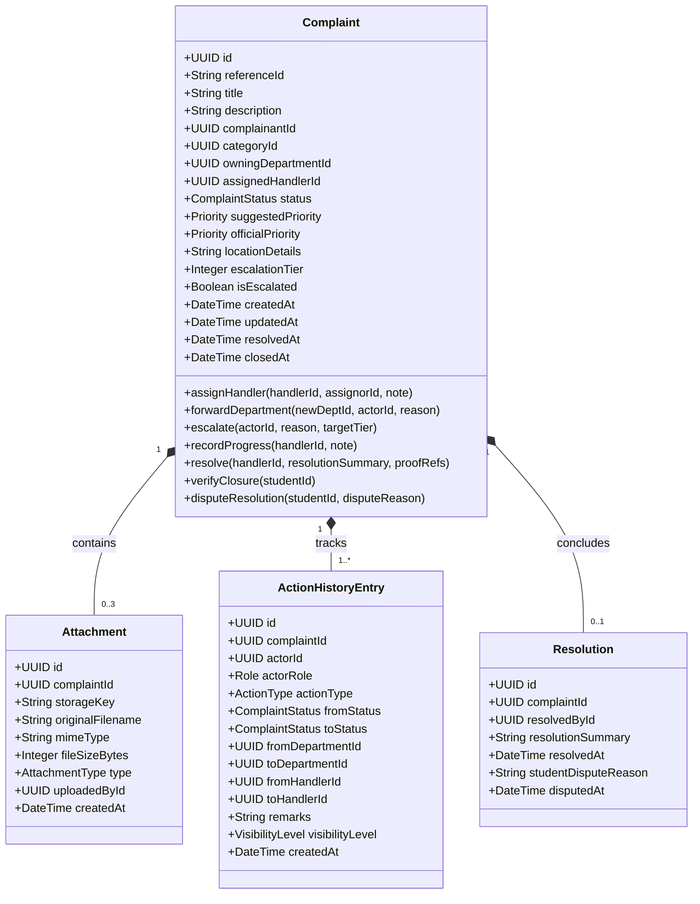

# Campus Plus — Domain Architecture & Core Domain Model

**Project**: Campus Plus — Campus Complaint and Grievance Resolution System  
**Phase**: Phase 02 — Architecture Definition & Technical Blueprint  
**Document**: DOMAIN-ARCHITECTURE.md  
**Version**: 1.0  
**Status**: Formal Architectural Blueprint  
**Authors**: Domain Analyst, Lead Software Architect  

---

## 1. Executive Summary

This document specifies the **Domain-Driven Architecture** for Campus Plus. It partitions the system into bounded contexts, defines unambiguous data ownership rules, establishes aggregate boundaries, and models the **Complaint Aggregate Root** as the core entity around which all workflows, state changes, attachments, assignments, escalations, and audit records revolve.

---

## 2. Bounded Context Map

The system is decomposed into 7 cohesive Bounded Contexts interacting through domain services and published domain events:

```text
 ┌──────────────────────────────────────────────────────────────────────────┐
 │                      IDENTITY & ACCESS CONTEXT                           │
 │  • Users, Roles, Department Memberships, Institutional Email Validation  │
 └────────────────────────────────────┬─────────────────────────────────────┘
                                      │ Identity Claims (User ID, Role, Dept ID)
                                      ▼
 ┌──────────────────────────────────────────────────────────────────────────┐
 │                     CLASSIFICATION & DIRECTORY CONTEXT                   │
 │  • Departments, Categories, Default Department Mappings, Proof Flags    │
 └────────────────────────────────────┬─────────────────────────────────────┘
                                      │ Category & Department Invariants
                                      ▼
 ┌──────────────────────────────────────────────────────────────────────────┐
 │                     COMPLAINT MANAGEMENT CONTEXT                         │
 │                     (Core Problem & Aggregate Root)                      │
 │  • Intake, State Machine, Assignment, Forwarding, Resolution, Dispute    │
 └──────┬─────────────────────────────┼──────────────────────────────┬──────┘
        │ Emits Lifecycle Events       │ State Transitions            │ Attachment Metadata
        ▼                             ▼                              ▼
 ┌──────────────┐             ┌──────────────┐              ┌──────────────┐
 │ NOTIFICATION │             │ AUDIT & LOG  │              │  ATTACHMENT  │
 │   CONTEXT    │             │   CONTEXT    │              │   CONTEXT    │
 │ In-App Inbox │             │ Append-Only  │              │ Presigned S3 │
 │ Outbound Svc │             │ Transaction  │              │ Storage Link │
 └──────────────┘             └──────────────┘              └──────────────┘
        ▲                             ▲                              ▲
        │ SLA Warnings                │ Escalation Records           │ Hotspot Metrics
 ┌──────┴─────────────────────────────┴──────────────────────────────┴──────┐
 │                      OPERATIONAL INTELLIGENCE CONTEXT                    │
 │  • Escalation Watchdog, SLA Policy Engine, Recurring Hotspot Detector    │
 └──────────────────────────────────────────────────────────────────────────┘
```

---

## 3. Domain Ownership Matrix

To prevent ambiguous responsibility, every business entity is assigned an explicit owning module, creation authority, modification authority, read boundary, and deletion policy:

| Domain Entity | Owning Context | Creation Authority | Modification Authority | Read Authority / Data Scope | Deletion Policy | Audit Requirement |
| :--- | :--- | :--- | :--- | :--- | :--- | :--- |
| **`User`** | Identity & Access | `ROLE_ADMIN` (or self via institutional email verify) | `ROLE_ADMIN` (roles); User (own profile) | Authenticated Users (name/dept); Admin (all) | **Soft delete / Deactivate only** (`is_active = false`). Hard delete prohibited. | Audit account status and role changes. |
| **`Department`** | Classification | `ROLE_ADMIN` | `ROLE_ADMIN` | All authenticated users | **Soft delete only** (`is_active = false`). Cannot delete if complaints exist. | Audit creation and modification. |
| **`Category`** | Classification | `ROLE_ADMIN` | `ROLE_ADMIN` | All authenticated users | **Soft delete only** (`is_active = false`). Cannot delete if complaints reference it (`BR-007`). | Audit creation and modification. |
| **`Complaint`** | Complaint Management | `ROLE_STUDENT` | State Machine methods only (invoked by Handler / Dept Head) | Student (own); Handler (assigned/dept); Dept Head (dept); Management/Admin (all) | **STRICTLY PROHIBITED**. Complaints can never be deleted from system. | Every state, priority, and assignment change audited. |
| **`Attachment`** | Attachment | `ROLE_STUDENT` (intake); `ROLE_HANDLER` (proof) | **Immutable** once created. | Authorized readers of parent complaint. | Deletion prohibited once complaint progresses past `SUBMITTED` (`BR-021`). | Audit upload actor, MIME type, and size. |
| **`ActionHistory`** | Audit & Log | Core Domain FSM Engine | **STRICTLY PROHIBITED**. Database revokes UPDATE/DELETE permissions. | Student (public timeline); Staff/Admin (public + internal remarks). | **NEVER**. Physical append-only journal (`BR-019`, `NFR-003`). | Self-auditing write-once journal. |
| **`SLAPolicy`** | Operational Intelligence | `ROLE_ADMIN` | `ROLE_ADMIN` | Dept Head, Admin, Management | Soft delete / Deactivate. | Audit threshold updates. |
| **`Notification`** | Notification | Event Dispatcher | Recipient (mark as read) | Recipient user only | Archival / purge allowed after 90 days. | Log delivery failures. |

---

## 4. Complaint as the Core Aggregate Root

In Domain-Driven Design (DDD), the **Complaint** entity is the Aggregate Root. External modules cannot manipulate child components (attachments, assignments, resolution notes) directly; all mutations MUST occur through invariant-enforcing methods on the `Complaint` aggregate.



---

## 5. Aggregate Invariants & Domain Constraints

1. **Identifier Immutability**: `id`, `referenceId`, and `complainantId` are assigned upon creation and can NEVER be altered.
2. **Deterministic Status Guard**: The `status` property can only be mutated if the transition passes through the formal state machine transition matrix (ADR-005). Arbitrary status setting is rejected.
3. **Single Active Ownership**: `owningDepartmentId` must never be null. `assignedHandlerId` can be null only during unassigned states (`SUBMITTED`, `REVIEWED`, `FORWARDED`).
4. **Mandatory Resolution Invariant**: A complaint cannot enter `RESOLVED` status unless `resolutionSummary` contains at least 20 characters, and if the category requires proof (`requires_proof = true`), at least one attachment of type `RESOLUTION_PROOF` must be attached.
5. **Closure Finality Invariant**: Once `status` becomes `CLOSED`, the aggregate rejects all subsequent mutation commands (`OD-009`).
6. **Audit Coupling Invariant**: Every domain method on the `Complaint` aggregate automatically produces an `ActionHistoryEntry` and appends a corresponding `DomainEvent` to its internal uncommitted events collection.

---

## 6. Architecture Verification Summary

- [x] All 7 bounded contexts defined with explicit context relationships.
- [x] Domain ownership matrix guarantees zero unowned or ambiguously owned entities.
- [x] Complaint aggregate root encapsulates all lifecycle invariants and child entities.
- [x] Zero SQL tables or database migrations created in this phase.
