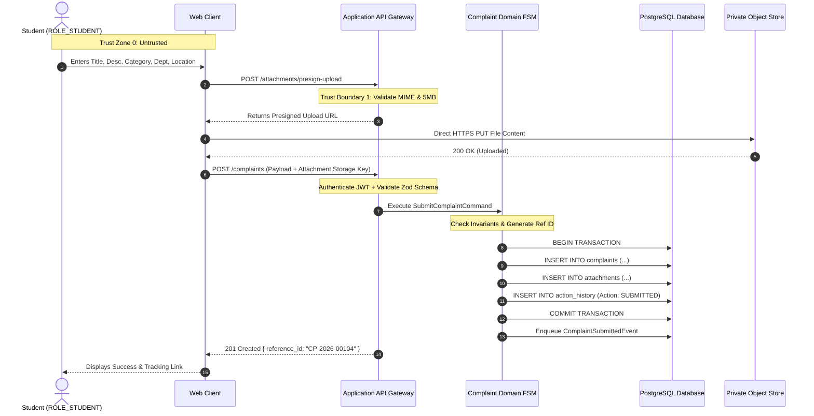
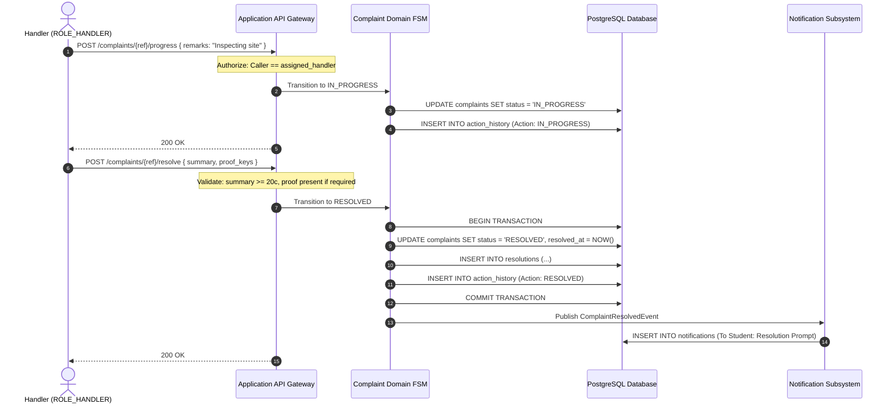
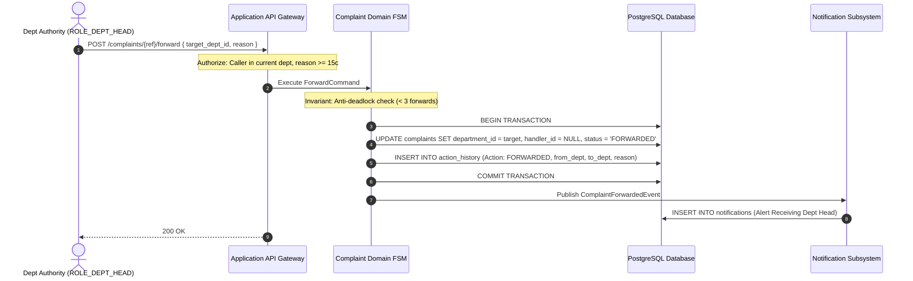
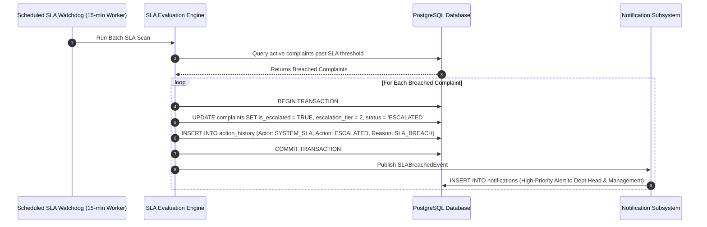
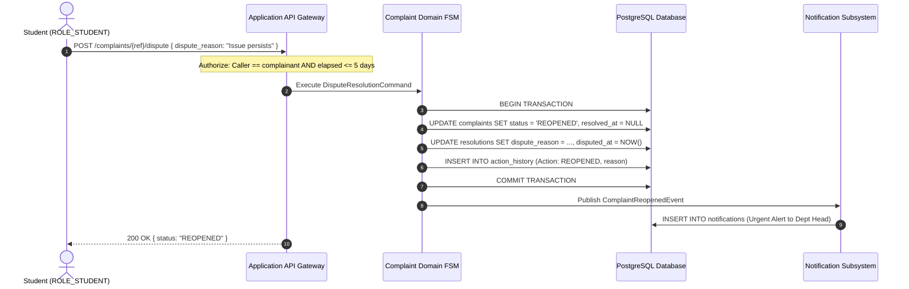
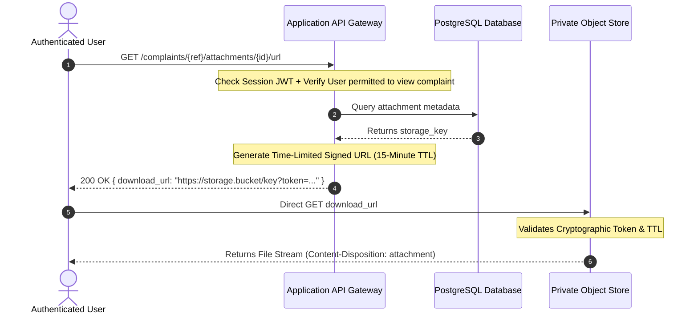
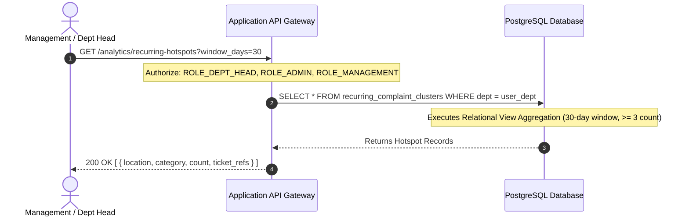

# Campus Plus — Security Threat Model, Trust Boundaries & Data Flow Diagrams

**Project**: Campus Plus — Campus Complaint and Grievance Resolution System  
**Phase**: Phase 02 — Architecture Definition & Technical Blueprint  
**Document**: SYSTEM-SECURITY-THREAT-MODEL.md  
**Version**: 1.0  
**Status**: Formal Security Blueprint  
**Authors**: Security Architect, Lead Software Architect  

---

## 1. Executive Summary

This document specifies the **System Security Architecture**, **STRIDE Threat Model**, **Explicit Trust Boundaries**, and **Data Flow Diagrams (DFDs)** for Campus Plus. 

Grievance platforms in educational institutions face specific threat vectors: unauthorized inspection of disciplinary records, student harassment reporting leaks, privilege escalation by students, malicious file payload execution, denial-of-service spam, and internal staff tampering with resolution records. This blueprint proves how every attack vector is neutralized through defense-in-depth security controls.

---

## 2. Explicit System Trust Boundaries

The system enforces rigorous separation across 6 distinct trust zones:

```text
 ┌────────────────────────────────────────────────────────────────────────────────┐
 │ ZONE 0: UNTRUSTED CLIENT ZONE (Public Internet / Campus Wi-Fi)                 │
 │ • Browser Client, Mobile Browser, Untrusted Network Packets                     │
 └───────────────────────────────────────┬────────────────────────────────────────┘
                                         │ HTTPS (TLS 1.3) / Strict Input Validation
                                         ▼ [TRUST BOUNDARY 1: API Gateway Boundary]
 ┌────────────────────────────────────────────────────────────────────────────────┐
 │ ZONE 1: APPLICATION SERVER ZONE (Stateless Node.js Compute)                    │
 │ • Input Sanitization, Token Verification, RBAC Interceptor, FSM Domain Engine  │
 └───────────────────┬───────────────────────────────────────┬────────────────────┘
                     │ Session Claims (uid, role)            │ Signed URLs
                     ▼ [TRUST BOUNDARY 2: DB Boundary]       ▼ [TRUST BOUNDARY 3: Storage Boundary]
 ┌──────────────────────────────────────────────┐  ┌──────────────────────────────┐
 │ ZONE 2: DATA PERSISTENCE ZONE (PostgreSQL)   │  │ ZONE 3: PRIVATE STORAGE ZONE │
 │ • Native Row-Level Security (RLS) Engine     │  │ • Private S3-Compatible      │
 │ • Table Constraints & Enums                  │  │   Object Storage Bucket      │
 │ • Append-Only Audit Journal (REVOKE MUTATE)  │  │ • Zero Public Access Allowed │
 └──────────────────────────────────────────────┘  └──────────────────────────────┘
```

### Trust Boundary Rules:
1. **Rule 1 (The Client is Never Trusted)**: UI state, hidden buttons, and JavaScript client logic are treated as zero-trust. All validations and authorization rules are strictly executed on the application server.
2. **Rule 2 (The Application is Never Trusted by the Database)**: PostgreSQL Row-Level Security (RLS) evaluates session claims on every query, ensuring that even if application code is flawed or exploited, the database engine physically rejects unauthorized row extraction.
3. **Rule 3 (Storage Buckets are Never Public)**: No bucket endpoint permits anonymous HTTP GET. Access to attachments requires an authenticated, signed, time-limited token generated by the application server.

---

## 3. STRIDE Threat Model & Mitigation Matrix

| Threat Category | Specific Threat Scenario | Affected Asset / Attack Surface | Impact | Architectural Mitigation Strategy | Residual Risk |
| :--- | :--- | :--- | :--- | :--- | :---: |
| **Spoofing** | Attacker submits complaints forging another student's identity. | Complaint Submission (`POST /complaints`) | High (Identity fraud, false allegations) | Complainant ID is bound strictly to authenticated session token (`auth.uid()`). `BR-001` rejects spoofed IDs at gateway. | Low (Session token theft mitigated by HttpOnly cookies). |
| **Tampering** | Rogue staff member alters past resolution notes or deletes audit entries. | `action_history`, `resolutions` tables | Critical (Destruction of legal/institutional evidence) | Database privilege revocation (`REVOKE UPDATE, DELETE, TRUNCATE ON action_history`) + `BEFORE UPDATE` SQL trigger (`ADR-009`). | Negligible (Kernel-enforced immutability). |
| **Repudiation** | Handler denies having received an assigned complaint. | Assignment workflow | High (Accountability failure) | System automatically logs immutable audit record with timestamp, assignor ID, assignee ID, and IP context (`FR-019`). | Zero (Append-only audit trail). |
| **Information Disclosure (IDOR/BOLA)** | Student modifies complaint ID in URL (`/complaints/104`) to view another student's private grievance. | REST API endpoints | Critical (Privacy violation, PII leak) | Defense-in-depth: Application RBAC guard rejects query + PostgreSQL RLS policy filters row: `WHERE complainant_id = auth.uid()` (`ADR-003`). | Zero (Database kernel blocks unauthorized rows). |
| **Information Disclosure** | Internal staff notes leak to complainant tracking portal. | Timeline Query (`GET /complaints/{id}`) | High (Staff deliberation exposure) | Projection layer and RLS policy filter out rows where `visibility_level = 'INTERNAL'` for `ROLE_STUDENT` (`PRIV-002`). | Low. |
| **Denial of Service** | Malicious user floods system with rapid automated complaint submissions. | Intake API (`POST /complaints`) | High (Database bloat, handler overload) | IP and User rate-limiting (max 5 submissions/10 mins) + minimum character constraints (30 chars) (`SEC-004`). | Low (Sufficient for campus scale). |
| **Elevation of Privilege** | Student sends PATCH request claiming `ROLE_ADMIN` or assigning staff. | API Controller routes | Critical (Unauthorized takeover) | Server-side `@Authorize` interceptors inspect cryptographically signed JWT role claims, not client payload (`SEC-002`). | Zero. |
| **Malicious Payload Upload** | Attacker uploads PHP/JavaScript/HTML file disguised as `.jpg` to execute XSS or RCE. | File Upload Pipeline (`POST /attachments/presign`) | Critical (Remote code execution / Session theft) | Presigned upload validates MIME type against strict whitelist (`jpeg`, `png`, `pdf`); files served from isolated storage domain with `Content-Disposition: attachment` (`ADR-008`). | Very Low. |

---

## 4. End-to-End Data Flow Diagrams (DFDs)

### Flow A: Student Submits Complaint


---

### Flow B: Handler Processes & Resolves Complaint


---

### Flow C: Cross-Department Forwarding


---

### Flow D: Automated SLA Breach Escalation


---

### Flow E: Complainant Disputes Resolution (Reopen Loop)


---

### Flow F: Secure Attachment Download


---

### Flow G: Recurring Issue Hotspot Detection


---

## 5. Architecture Verification Summary

- [x] Trust boundaries clearly delineated across 4 zones with zero trust in client browser.
- [x] Comprehensive STRIDE threat matrix maps mitigations to specific security mechanisms.
- [x] Complete Data Flow Diagrams (Flows A through G) illustrate end-to-end data movement, authorization, transactions, audit trails, and notifications.
- [x] Anti-tampering, IDOR/BOLA, and malicious payload mitigations formally codified.
