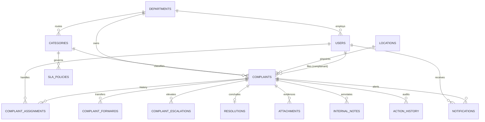

# Phase 04 — Entity-Relationship (ER) Architecture Diagrams

**Project**: Campus Plus — Campus Complaint & Grievance Resolution System  
**Phase**: Phase 04 — Database Engineering & Migration Design  
**Date**: 2026-09-10  
**Status**: Formal Relational ER Diagrams Approved  

---

## 1. High-Level Core Aggregate ER Diagram

---

## 2. Detailed Relational ER Diagram with Attributes & Foreign Keys

```mermaid
erDiagram
    DEPARTMENTS {
        uuid id PK
        varchar code UK
        varchar name
        boolean is_active
        timestamptz created_at
    }

    CATEGORIES {
        uuid id PK
        varchar name UK
        uuid default_department_id FK
        boolean requires_resolution_proof
        boolean is_active
    }

    LOCATIONS {
        uuid id PK
        varchar campus
        varchar building
        varchar block
        varchar floor
        varchar room_or_area
        boolean is_active
    }

    WORKING_CALENDARS {
        uuid id PK
        varchar name UK
        varchar timezone
        time work_start_time
        time work_end_time
        integer work_days_bitmask
        boolean is_active
    }

    CALENDAR_HOLIDAYS {
        uuid id PK
        uuid calendar_id FK
        date holiday_date
        varchar description
    }

    USERS {
        uuid id PK
        varchar email UK
        varchar full_name
        varchar phone_number
        varchar roll_or_prn
        boolean is_active
    }

    ROLES {
        varchar id PK
        text description
    }

    USER_ROLES {
        uuid user_id PK,FK
        varchar role_id PK,FK
        timestamptz assigned_at
    }

    DEPARTMENT_MEMBERSHIPS {
        uuid id PK
        uuid user_id FK
        uuid department_id FK
        boolean is_head
        boolean is_active
    }

    COMPLAINTS {
        uuid id PK
        varchar ref_id UK
        varchar title
        text description
        uuid complainant_id FK
        uuid department_id FK
        uuid category_id FK
        uuid location_id FK
        varchar location_details
        enum status
        enum suggested_priority
        enum official_priority
        uuid assigned_handler_id FK
        enum escalation_tier
        boolean is_escalated
        integer version
        timestamptz sla_due_at
        timestamptz resolved_at
        timestamptz closed_at
        timestamptz created_at
        timestamptz updated_at
    }

    COMPLAINT_ASSIGNMENTS {
        uuid id PK
        uuid complaint_id FK
        uuid handler_id FK
        uuid assigned_by_id FK
        timestamptz assigned_at
        timestamptz unassigned_at
        boolean is_current
        text reason
    }

    COMPLAINT_FORWARDS {
        uuid id PK
        uuid complaint_id FK
        uuid from_department_id FK
        uuid to_department_id FK
        uuid forwarded_by_id FK
        integer forward_sequence
        text rationale
        timestamptz forwarded_at
    }

    COMPLAINT_ESCALATIONS {
        uuid id PK
        uuid complaint_id FK
        enum from_tier
        enum to_tier
        uuid escalated_by_id FK
        boolean is_automated
        text reason
        timestamptz escalated_at
    }

    RESOLUTIONS {
        uuid id PK
        uuid complaint_id UK,FK
        uuid resolved_by_id FK
        text resolution_summary
        timestamptz resolved_at
        boolean student_verified
        text verification_feedback
        text dispute_reason
        timestamptz disputed_at
    }

    ATTACHMENTS {
        uuid id PK
        uuid complaint_id FK
        varchar storage_key UK
        varchar original_filename
        varchar mime_type
        integer file_size_bytes
        enum attachment_type
        uuid uploaded_by_id FK
        timestamptz created_at
    }

    INTERNAL_NOTES {
        uuid id PK
        uuid complaint_id FK
        uuid author_id FK
        varchar author_role
        text note
        timestamptz created_at
    }

    ACTION_HISTORY {
        uuid id PK
        uuid complaint_id FK
        uuid actor_id FK
        varchar actor_role
        varchar action_type
        varchar from_status
        varchar to_status
        text remarks
        jsonb metadata
        timestamptz created_at
    }

    SLA_POLICIES {
        uuid id PK
        uuid category_id FK
        enum priority
        integer response_threshold_hours
        integer resolution_threshold_hours
        enum escalation_target_tier
        boolean is_active
    }

    NOTIFICATIONS {
        uuid id PK
        uuid recipient_id FK
        uuid complaint_id FK
        varchar title
        text message
        boolean is_read
        timestamptz read_at
        timestamptz created_at
    }

    OUTBOX_EVENTS {
        uuid id PK
        varchar event_type
        varchar aggregate_type
        uuid aggregate_id
        jsonb payload
        enum status
        integer retry_count
        timestamptz created_at
        timestamptz published_at
    }

    IDEMPOTENCY_KEYS {
        varchar key PK
        varchar request_hash
        integer response_code
        jsonb response_body
        timestamptz created_at
        timestamptz expires_at
    }

    DEPARTMENTS ||--o{ CATEGORIES : "routes"
    DEPARTMENTS ||--o{ DEPARTMENT_MEMBERSHIPS : "staffs"
    DEPARTMENTS ||--o{ COMPLAINTS : "owns"
    DEPARTMENTS ||--o{ COMPLAINT_FORWARDS : "from_dept"
    DEPARTMENTS ||--o{ COMPLAINT_FORWARDS : "to_dept"

    WORKING_CALENDARS ||--o{ CALENDAR_HOLIDAYS : "defines"

    USERS ||--o{ USER_ROLES : "has"
    ROLES ||--o{ USER_ROLES : "assigned_to"
    USERS ||--o{ DEPARTMENT_MEMBERSHIPS : "belongs_to"
    USERS ||--o{ COMPLAINTS : "complainant"
    USERS ||--o{ COMPLAINT_ASSIGNMENTS : "handler"
    USERS ||--o{ COMPLAINT_ASSIGNMENTS : "assigner"
    USERS ||--o{ COMPLAINT_FORWARDS : "forwarder"
    USERS ||--o{ COMPLAINT_ESCALATIONS : "escalator"
    USERS ||--o{ RESOLUTIONS : "resolver"
    USERS ||--o{ ATTACHMENTS : "uploader"
    USERS ||--o{ INTERNAL_NOTES : "author"
    USERS ||--o{ ACTION_HISTORY : "actor"
    USERS ||--o{ NOTIFICATIONS : "recipient"

    CATEGORIES ||--o{ COMPLAINTS : "classifies"
    CATEGORIES ||--o{ SLA_POLICIES : "governs"
    LOCATIONS ||--o{ COMPLAINTS : "pinpoints"

    COMPLAINTS ||--o{ COMPLAINT_ASSIGNMENTS : "tracks"
    COMPLAINTS ||--o{ COMPLAINT_FORWARDS : "transfers"
    COMPLAINTS ||--o{ COMPLAINT_ESCALATIONS : "elevates"
    COMPLAINTS ||--o| RESOLUTIONS : "concludes"
    COMPLAINTS ||--o{ ATTACHMENTS : "contains"
    COMPLAINTS ||--o{ INTERNAL_NOTES : "notes"
    COMPLAINTS ||--o{ ACTION_HISTORY : "audits"
    COMPLAINTS ||--o{ NOTIFICATIONS : "triggers"
```

