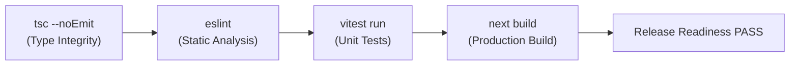

# Code Quality & Verification Standards

## 1. Quality Gate Architecture

Campus Plus establishes a non-negotiable **Five-Pillar Verification Gate**:



All 5 steps are automated via a single root command:
```bash
pnpm verify
```

---

## 2. Static Analysis & Linter Rules

The project uses ESLint 9 Flat Config (`eslint.config.mjs`) integrating:
- `eslint-config-next/core-web-vitals`: Enforces Next.js performance best practices, optimal image loading, script optimizations, and React hooks rules.
- `eslint-config-next/typescript`: Enforces strict TypeScript rules, eliminating unused variables, unhandled promises, and implicit type coercions.

### Zero Warning Policy
No code may be merged with unresolved ESLint warnings. All warnings must either be resolved cleanly in code or explicitly justified.

---

## 3. Formatting & Source Integrity Standards

1. **EditorConfig (`.editorconfig`)**:
   - Indentation: 2 spaces.
   - Character set: UTF-8.
   - End of line: Unix LF (`\n`).
   - Trailing whitespace: Automatically trimmed on save.
   - Final newline: Inserted automatically.

2. **Git Attributes (`.gitattributes`)**:
   - `* text=auto eol=lf`: Enforces LF across all operating systems, preventing git status churn between Windows and Linux/macOS environments.

---

## 4. Error Handling Standard

1. **Never Throw Naked Errors**:
   - Application code must never throw raw strings (`throw "failed"`) or generic `new Error(...)`.
   - Use strongly-typed domain and application errors derived from `AppError`.

2. **Functional Result Pattern for Domain Logic**:
   - Operations that can fail due to domain rules or validation must return `Result<T, E>`.
   - Exceptions (`throw`) are reserved for truly unexpected or unrecoverable operational failures.

3. **Correlation ID Propagation**:
   - All errors must accept and propagate a `correlationId` to ensure end-to-end audit tracing from HTTP response to server logs.
