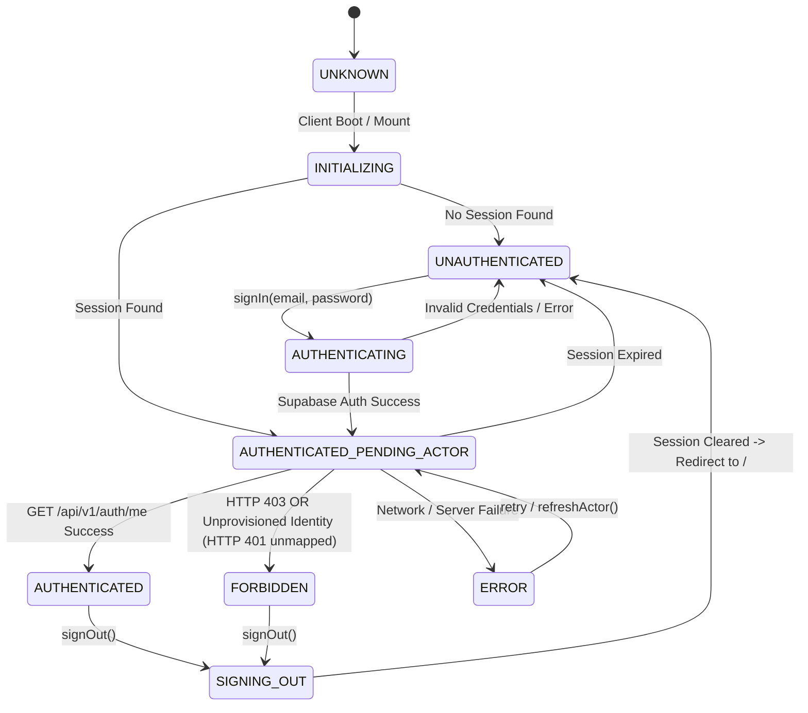
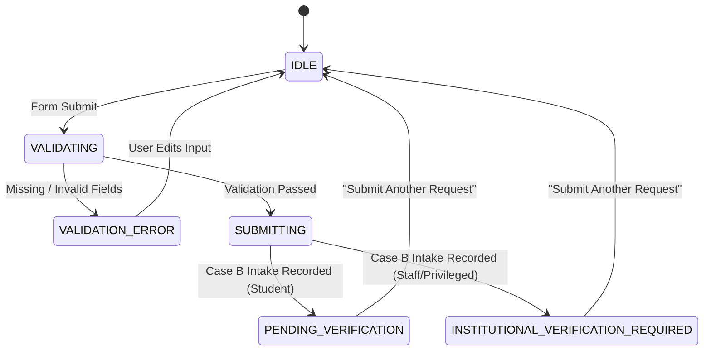

# 02 — Authentication & Registration State Machines

**Product:** Campus Plus  
**Subsystem:** State Machine Specifications (AuthContext & RegistrationFlow)  
**Date:** 2026-09-13  
**Classification:** ARCHITECTURAL SPECIFICATION  

---

## 1. Authentication Context State Machine (`AuthContext.tsx`)

The client session state machine manages global authentication and actor resolution:

### 1.1 AuthContext State Definitions

| State | Purpose | Transition Triggers | Security Guarantee |
| :--- | :--- | :--- | :--- |
| **`UNKNOWN`** | Initial SSR / pre-hydration state | Client hydration | Prevents flash of unauthenticated UI |
| **`INITIALIZING`** | Checking local storage / Supabase session | `getSession()` resolved | Renders shell loading indicator |
| **`AUTHENTICATING`** | Active sign-in request in progress | `signInWithPassword()` invoked | Disables submit button, shows spinner |
| **`AUTHENTICATED_PENDING_ACTOR`** | Supabase JWT acquired; resolving actor | `getAuthMe()` in-flight | User identity unconfirmed until server responds |
| **`AUTHENTICATED`** | Authoritative technical role confirmed | Valid actor DTO received | Renders role-specific workspace |
| **`UNAUTHENTICATED`** | No active session | User signed out or login failed | Protected routes redirect to `/login` |
| **`FORBIDDEN`** | Authenticated in Supabase but unprovisioned in `public.users` | Server returns 403 or unmapped 401 | Prevents access, renders 403 notice |
| **`ERROR`** | Network or server connectivity issue | 500 error / fetch failure | Displays retry control |
| **`SIGNING_OUT`** | Active sign-out in progress | `signOut()` invoked | Clears cookies/tokens, redirects to `/` |

---

## 2. Registration Flow State Machine (`RoleRegistrationForm.tsx`)

### 2.1 State Truthfulness Guarantees
- In **Case B**, `SUBMITTING` transitions directly to `PENDING_VERIFICATION` or `INSTITUTIONAL_VERIFICATION_REQUIRED`.
- Under no circumstances does the state machine transition to `AUTHENTICATED`, `REGISTRATION_SUCCESS`, or `ACCOUNT_CREATED` without a verified server provisioning response.
- The UI strictly remains on the institutional confirmation screen with a clean link to home (`/`) and a secondary link for pre-provisioned accounts to `/login`.
