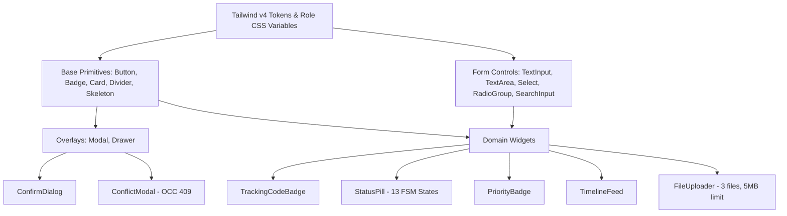

# Campus Plus — Phase 08-C: Stage 08-C-C Component Architecture

**Authority:** Principal Frontend Architect, Frontend Platform Lead  
**Stage:** 08-C-C  
**Status:** COMPLETED & VERIFIED  

---

## 1. Architectural Principles

The Campus Plus component system is structured around four non-negotiable architectural tenets:

1. **Zero External Component Dependencies:**
   - The entire system is implemented using React 19, TypeScript, and Tailwind CSS v4.
   - Zero component libraries (no Radix, no Headless UI, no Shadcn, no Lucide).
   - Icons are authored directly as semantic, lightweight SVGs embedded inside components or variants.

2. **Tailwind v4 Token-Driven Theming:**
   - All color, border, and background treatments consume the CSS tokens defined in `src/app/globals.css`.
   - Dynamic `:root` CSS variables (`--role-primary`, `--role-secondary`, `--role-btn-text`, etc.) are consumed directly by interactive controls (`Button`, `Badge`, `RadioGroup`, `SearchInput`).
   - Role pastel buttons use dark button text tokens (`#1E3A5F`, `#1A3830`, `#2B1E40`, `#1C2B38`, `#3D1C22`) to guarantee WCAG AA contrast (>= 4.5:1).

3. **Composite & Layered Abstraction Hierarchy:**
   - **Layer 1: Base Primitives** (`Button`, `Badge`, `Card`, `Divider`, `Skeleton`) — Unaware of domain entities.
   - **Layer 2: Accessible Form Controls** (`TextInput`, `TextArea`, `Select`, `RadioGroup`, `SearchInput`) — Pure presentation controls with built-in ARIA attributes and character tracking.
   - **Layer 3: Feedback & Overlays** (`AlertBanner`, `Toast`, `EmptyState`, `Modal`, `Drawer`, `ConfirmDialog`, `ConflictModal`) — Accessible dialog and notice managers with focus trapping and Escape handlers.
   - **Layer 4: Domain Widgets** (`TrackingCodeBadge`, `StatusPill`, `PriorityBadge`, `TimelineFeed`, `FileUploader`) — Specialized for the Campus Plus grievance lifecycle and business invariants.

4. **Pure Server Component Compatibility with Explicit Client Directives:**
   - All interactive components declaring event listeners (`onClick`, `onChange`, `onKeyDown`) or hooks (`useState`, `useEffect`, `useRef`, `useId`) explicitly specify `"use client";` at the top of the module.
   - Components can be cleanly imported into both Server Components and Client Components in Next.js App Router.

---

## 2. Architectural Composition Diagram

---

## 3. Class Concatenation Utility (`src/presentation/utils/cn.ts`)

To avoid pulling in external libraries like `clsx` or `tailwind-merge`, a zero-dependency classname utility `cn(...inputs: ClassValue[]): string` is implemented in `src/presentation/utils/cn.ts`. It cleanly handles:
- String literals
- Numeric expressions
- Boolean conditionals
- Object dictionaries (`{ "opacity-50": isDisabled }`)
- Null and undefined filtering
