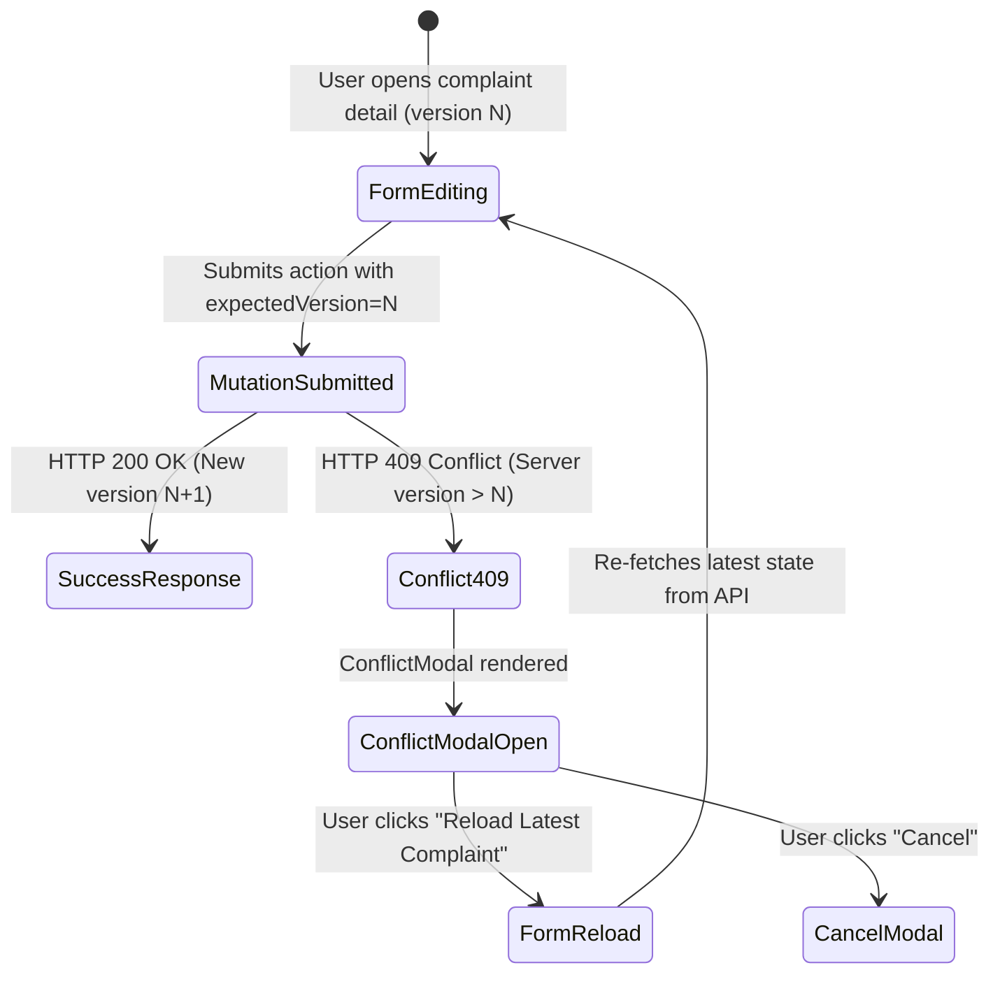

# Campus Plus — Phase 08-C: Stage 08-C-C Component State Matrix

**Authority:** Design Systems Lead, UX Engineer, QA Lead  
**Stage:** 08-C-C  
**Status:** COMPLETED & VERIFIED  

---

## 1. Interactive Control States Matrix

| Component | Default | Hover | Focus-Visible | Active | Disabled | Loading / Busy | Invalid / Error |
| :--- | :--- | :--- | :--- | :--- | :--- | :--- | :--- |
| **`Button`** | Role primary bg, role btn text | `hover:opacity-90` | `outline-2 outline-offset-2` | `active:opacity-95` | `opacity-50 pointer-events-none` | `animate-spin` spinner, `aria-busy="true"` | N/A |
| **`TextInput`** | White bg, slate-300 border | `border-slate-400` | `outline-2 outline-[var(--role-primary)]` | N/A | `bg-slate-50 text-slate-400 border-slate-200 cursor-not-allowed` | N/A | `border-red-400 bg-red-50/20 text-red-900 aria-invalid="true"` |
| **`TextArea`** | White bg, slate-300 border | `border-slate-400` | `outline-2 outline-[var(--role-primary)]` | N/A | `bg-slate-50 text-slate-400 border-slate-200 cursor-not-allowed` | Live counter updates | `border-red-400 bg-red-50/20 aria-invalid="true"`, counter warning |
| **`Select`** | White bg, slate-300 border | `border-slate-400` | `outline-2 outline-[var(--role-primary)]` | N/A | `bg-slate-50 text-slate-400 border-slate-200 cursor-not-allowed` | N/A | `border-red-400 bg-red-50/20 aria-invalid="true"` |
| **`RadioGroup`** | White bg, slate-200 border | `bg-slate-50` | `focus:ring-2 focus:ring-[var(--role-primary)]` | Selected: role accent bg + role primary border | `opacity-50 cursor-not-allowed` | N/A | Error message below group |
| **`FileUploader`** | White bg, dashed slate-300 border | `bg-slate-50` | N/A | Drag-over: role accent bg + role primary border | `opacity-60 cursor-not-allowed` | N/A | Error banner for MIME/size violation |

---

## 2. 13 FSM Lifecycle Status Representation Matrix (`StatusPill`)

| FSM State | Label | Background Token | Border Token | Text Token | Non-Color Cue (WCAG 1.4.1) |
| :--- | :--- | :--- | :--- | :--- | :--- |
| `DRAFT` | Draft | `--color-status-draft-bg` (`#F1F5F9`) | `--color-status-draft-border` (`#CBD5E1`) | `--color-status-draft-text` (`#475569`) | Hollow circle icon |
| `SUBMITTED` | Submitted | `--color-status-submitted-bg` (`#EFF6FF`) | `--color-status-submitted-border` (`#BFDBFE`) | `--color-status-submitted-text` (`#1E40AF`) | Solid blue dot |
| `REVIEWED` | Reviewed | `--color-status-reviewed-bg` (`#EEF2FF`) | `--color-status-reviewed-border` (`#C7D2FE`) | `--color-status-reviewed-text` (`#3730A3`) | Solid indigo dot |
| `ASSIGNED` | Assigned | `--color-status-assigned-bg` (`#F0FDFA`) | `--color-status-assigned-border` (`#99F6E4`) | `--color-status-assigned-text` (`#115E59`) | Solid teal dot |
| `IN_PROGRESS` | In Progress | `--color-status-inprogress-bg` (`#ECFDF5`) | `--color-status-inprogress-border` (`#A7F3D0`) | `--color-status-inprogress-text` (`#065F46`) | Pulsing ping green dot indicator |
| `FORWARDED` | Forwarded | `--color-status-forwarded-bg` (`#FFFBEB`) | `--color-status-forwarded-border` (`#FDE68A`) | `--color-status-forwarded-text` (`#92400E`) | Right-pointing transfer arrow SVG |
| `ESCALATED` | Escalated | `--color-status-escalated-bg` (`#FFF1F2`) | `--color-status-escalated-border` (`#FECDD3`) | `--color-status-escalated-text` (`#9F1239`) | Warning triangle alert SVG |
| `RESOLVED` | Resolved | `--color-status-resolved-bg` (`#F0FDF4`) | `--color-status-resolved-border` (`#BBF7D0`) | `--color-status-resolved-text` (`#166534`) | Checkmark badge SVG |
| `CLOSED` | Closed | `--color-status-closed-bg` (`#F8FAFC`) | `--color-status-closed-border` (`#E2E8F0`) | `--color-status-closed-text` (`#475569`) | Padlock terminal SVG |
| `REOPENED` | Reopened | `--color-status-reopened-bg` (`#FFFBEB`) | `--color-status-reopened-border` (`#FCD34D`) | `--color-status-reopened-text` (`#78350F`) | Circular refresh arrows SVG |
| `REJECTED` | Rejected | `--color-status-rejected-bg` (`#FEF2F2`) | `--color-status-rejected-border` (`#FECACA`) | `--color-status-rejected-text` (`#991B1B`) | Cross mark (✕) SVG |
| `DUPLICATE` | Duplicate | `--color-status-duplicate-bg` (`#F8FAFC`) | `--color-status-duplicate-border` (`#E2E8F0`) | `--color-status-duplicate-text` (`#64748B`) | Overlapping documents SVG |
| `CANCELLED` | Cancelled | `--color-status-cancelled-bg` (`#F8FAFC`) | `--color-status-cancelled-border` (`#E2E8F0`) | `--color-status-cancelled-text` (`#64748B`) | Prohibited slash circle SVG |

---

## 3. OCC HTTP 409 Concurrency State Machine (`ConflictModal`)

