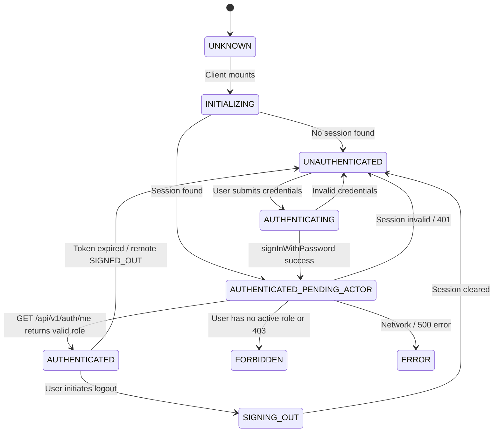

# Campus Plus — Phase 08-C-D: Authentication Flow & State Machine

**Authority:** IAM / Authentication Engineer, Application Security Engineer  
**Stage:** 08-C-D  
**Status:** COMPLETED & VERIFIED  

---

## 1. Authoritative 9-State Authentication State Machine

To prevent ambiguous booleans, infinite loading, and flashes of unauthorized content, authentication is governed strictly by an explicit 9-state machine:

---

## 2. Server-Authoritative Identity Reconciliation

1. **Client Session != Authorization:** A client possessing a Supabase Auth session is merely authenticated at the identity layer.
2. **Actor Resolution:** The client immediately calls `GET /api/v1/auth/me` with Bearer JWT.
3. **Role & Scope Extraction:** The server extracts the cryptographically verified JWT, queries `user_roles`, and returns `{ userId, role, departmentId }`.
4. **Theme & Navigation Synchronization:** The frontend sets dynamic CSS variables (`--role-primary`, `--role-btn-text`) and filters navigation items according to the server-confirmed role.
