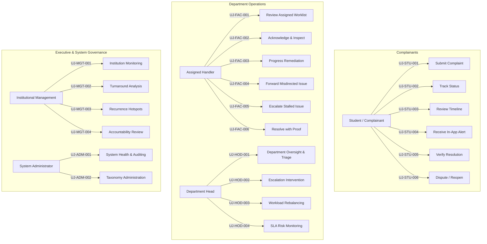
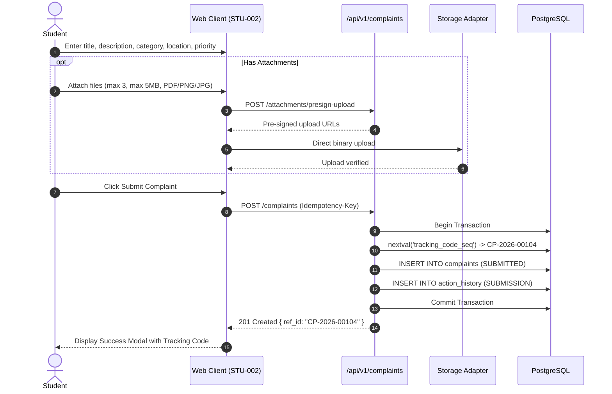

# Phase 08-A: User Journey Architecture

**Document Identifier:** `04-user-journeys.md`  
**Classification:** Enterprise UX / Product Experience Blueprint  
**Standard:** Every journey defines Trigger, Actor, Preconditions, Goal, Steps, Decision points, System response, Success state, Failure state, Permission boundary, Audit implication, Notification implication, and Exit state.

---

## 1. Journey Architecture Overview

The Campus Plus user experience is architected around 5 core personas interacting with an immutable, append-only complaint lifecycle engine.

---

## 2. Student User Journeys (`UJ-STU-*`)

### `UJ-STU-001`: Submit Complaint
- **Trigger:** Student observes an unresolved issue on campus (e.g. lab equipment breakdown, hostel plumbing failure).
- **Actor:** Authenticated Student (`ROLE_STUDENT`) [SOURCE-DERIVED]
- **Preconditions:** Authenticated session; verified account (`BR-001`). [SOURCE-DERIVED]
- **Goal:** Submit a structured complaint, receive a permanent tracking reference (`CP-YYYY-XXXXX`), and trigger triage. [SOURCE-DERIVED]
- **Steps:**
  1. Student clicks `[Submit New Complaint]` on `STU-001` dashboard. [UX INFERENCE]
  2. Form `STU-002` loads with pre-filled complainant institutional identity. [UX INFERENCE]
  3. Enters Title (10–120 characters) and Description (minimum 30 characters). [SOURCE-DERIVED]
  4. Selects Category (e.g. Infrastructure, Hostel, Sanitation) and Department. [SOURCE-DERIVED]
  5. Selects Campus Location and specifies physical room/area details. [SOURCE-DERIVED]
  6. Selects suggested priority (`LOW`, `MEDIUM`, `HIGH`, `URGENT`). [SOURCE-DERIVED]
  7. Optionally attaches up to 3 files (max 5MB each, JPEG/PNG/PDF). [SOURCE-DERIVED]
  8. Reviews submission summary. [UX INFERENCE]
  9. Clicks `[Confirm & Submit Complaint]`. [UX INFERENCE]
- **Decision Points:**
  - *Attachments selected:* Direct-to-storage upload via pre-signed URL.
  - *Cancel submission:* Confirmation modal prevents accidental data loss.
- **System Response:** Server verifies Zod `.strict()` schema, atomically allocates sequence tracking code `CP-YYYY-XXXXX`, inserts aggregate in `SUBMITTED` state, creates append-only `action_history` entry, and dispatches outbox event. [ARCHITECTURE-DERIVED]
- **Success State:** `STU-002` displays success screen showing tracking reference with quick-copy button. [UX INFERENCE]
- **Failure State:** Inline error messaging for character counts; network or duplicate request handled via idempotency. [ARCHITECTURE-DERIVED]
- **Permission Boundary:** Restricted to `ROLE_STUDENT` and `ROLE_FACULTY`. [SOURCE-DERIVED]
- **Audit Implication:** Appends `SUBMISSION` action history entry. [SOURCE-DERIVED]
- **Notification Implication:** Alerts department triage desk. [SOURCE-DERIVED]
- **Exit State:** Complaint in `SUBMITTED` status. [SOURCE-DERIVED]

---

### `UJ-STU-002`: Track Complaint
- **Trigger:** Student returns to portal to monitor resolution progress.
- **Actor:** Authenticated Student (`ROLE_STUDENT`).
- **Preconditions:** Complaint submitted by current user exists.
- **Goal:** View status badge, responsible department, and public timeline milestones.
- **Steps:**
  1. Student opens `STU-001` dashboard.
  2. Scans complaint cards filtered by status tabs (Active, Resolved, Closed).
  3. Clicks complaint card to navigate to `STU-003` detail view.
  4. Reads current status banner, SLA due date, and public updates.
- **Decision Points:**
  - *If SUBMITTED:* Student may cancel complaint.
  - *If RESOLVED:* Student prompted to verify or dispute.
- **System Response:** `GET /api/v1/complaints/[id]` returns sanitized `StudentComplaintDTO` (omits internal staff assignments and private notes).
- **Success State:** Current status and ownership accurately presented.
- **Failure State:** 404/403 for unauthorized complaint IDs (BOLA defense).
- **Permission Boundary:** Complainant ID match (`complainant_id = actor.userId`).
- **Audit Implication:** Telemetry read logged.
- **Notification Implication:** None.
- **Exit State:** Student stays informed on `STU-003`.

---

### `UJ-STU-003`: Review Timeline
- **Trigger:** Student wants to inspect the chronological action log of their grievance.
- **Actor:** Authenticated Student (`ROLE_STUDENT`).
- **Preconditions:** Complaint exists.
- **Goal:** Review audit milestones without viewing private internal staff remarks.
- **Steps:**
  1. On `STU-003`, student navigates to Timeline tab/section (`SHR-004`).
  2. Reviews chronological events: Submission, Triage Review, Assignment, Progress, Resolution.
  3. Reads public remarks associated with each milestone.
- **Decision Points:** None (read-only narrative).
- **System Response:** `GET /api/v1/complaints/[id]/timeline` returns timeline with `INTERNAL` notes stripped (`INV-012`).
- **Success State:** Clear chronological narrative visible.
- **Failure State:** Empty timeline handles gracefully.
- **Permission Boundary:** Complainant student only.
- **Audit Implication:** None (read operation).
- **Notification Implication:** None.
- **Exit State:** Timeline reviewed.

---

### `UJ-STU-004`: Receive In-App Update
- **Trigger:** System publishes an event regarding the student's complaint (e.g. Assigned, Forwarded, Resolved).
- **Actor:** Authenticated Student (`ROLE_STUDENT`).
- **Preconditions:** Unread notification exists for user.
- **Goal:** Learn of status changes without manual polling.
- **Steps:**
  1. Unread badge displayed on global header bell icon (`SHR-001`).
  2. Student clicks bell to open notification drawer.
  3. Reads notification title and timestamp.
  4. Clicks notification card to deep-link directly to `STU-003`.
- **Decision Points:** Click notification card vs. mark all as read.
- **System Response:** Marks notification `is_read = TRUE` and opens complaint.
- **Success State:** Student navigated to relevant complaint.
- **Failure State:** Network drop leaves badge un-cleared.
- **Permission Boundary:** Recipient ID matches session `actor.userId`.
- **Audit Implication:** None.
- **Notification Implication:** In-app inbox consumption.
- **Exit State:** Target complaint screen opened.

---

### `UJ-STU-005`: Verify Resolution
- **Trigger:** Handler marks complaint `RESOLVED`; student prompted to confirm satisfaction.
- **Actor:** Authenticated Student (original complainant only).
- **Preconditions:** Status is `RESOLVED`; within 5-business-day verification window (`BR-016`).
- **Goal:** Formally confirm resolution and transition ticket to terminal `CLOSED` state.
- **Steps:**
  1. Student navigates to `STU-003` for resolved complaint.
  2. Reviews resolution summary and proof photos.
  3. Clicks primary button `[Verify & Close Complaint]`.
  4. Confirmation dialog (`STU-004`) warns that closure is permanent.
  5. Student confirms action.
- **Decision Points:** Verify & Close vs. Dispute & Reopen.
- **System Response:** `POST /api/v1/complaints/[id]/verify` validates version (`OCC`), sets status to `CLOSED`, sets `closed_at = NOW()`, appends audit log, and notifies handler.
- **Success State:** Status updates to `CLOSED` (gray/slate); all action buttons disabled.
- **Failure State:** OCC conflict (409) if auto-closed concurrently.
- **Permission Boundary:** Original complainant only.
- **Audit Implication:** Appends `CLOSE` action history entry.
- **Notification Implication:** Informs handler and HOD of closure.
- **Exit State:** Complaint in terminal `CLOSED` state.

---

### `UJ-STU-006`: Dispute / Reopen
- **Trigger:** Student finds remediation incomplete or problem recurring immediately.
- **Actor:** Authenticated Student (original complainant only).
- **Preconditions:** Status is `RESOLVED`; within 5 business days of resolution (`BR-016`, `BR-018`).
- **Goal:** Reject inadequate resolution and return complaint to active investigation.
- **Steps:**
  1. On `STU-003`, student reviews resolution details.
  2. Clicks secondary button `[Dispute Resolution]`.
  3. Dispute modal opens (`STU-004`) requiring mandatory reason (>=10 chars).
  4. Enters detailed justification.
  5. Confirms dispute.
- **Decision Points:** If window expired, system blocks dispute and suggests filing a new complaint referencing old reference.
- **System Response:** `POST /api/v1/complaints/[id]/dispute` validates 5-day window via `CalendarReopenPolicyAdapter`, sets status to `REOPENED`, appends audit trail, and elevates alert level to HOD.
- **Success State:** Status badge updates to `REOPENED` (amber/orange); student sees confirmation.
- **Failure State:** Rejection after 5 days with 422 Precondition Failed.
- **Permission Boundary:** Original complainant only.
- **Audit Implication:** Appends `REOPEN` action history record.
- **Notification Implication:** Urgent notification to HOD and handler.
- **Exit State:** Complaint in `REOPENED` status.

---

## 3. Handler / Faculty User Journeys (`UJ-FAC-*`)

### `UJ-FAC-001`: Review Assigned Worklist
- **Trigger:** Handler logs in or receives assignment alert.
- **Actor:** Department Staff / Handler (`ROLE_HANDLER`).
- **Preconditions:** Active departmental membership.
- **Goal:** Prioritize tasks based on urgency, category, and SLA deadline.
- **Steps:**
  1. Handler navigates to `FAC-001` dashboard.
  2. Scans `Assigned Tasks` worklist sorted by priority and SLA due date.
  3. Identifies overdue or high-priority tickets flagged with amber/red SLA badges.
  4. Clicks row to open operational detail on `FAC-002`.
- **Decision Points:** Filter by status (Assigned, In Progress, Escalated).
- **System Response:** `GET /api/v1/complaints` returns complaints scoped to `assigned_handler_id = actor.userId`.
- **Success State:** Worklist rendered cleanly.
- **Failure State:** Timeout surfaces retryable card.
- **Permission Boundary:** Handler sees assigned tickets and department queue.
- **Audit Implication:** Telemetry read only.
- **Notification Implication:** None.
- **Exit State:** Target complaint opened.

---

### `UJ-FAC-002`: Acknowledge & Inspect Assignment
- **Trigger:** Handler opens an `ASSIGNED` complaint.
- **Actor:** Assigned Handler (`ROLE_HANDLER`).
- **Preconditions:** Status is `ASSIGNED`; caller matches `assigned_handler_id`.
- **Goal:** Inspect full grievance narrative, student attachments, and triage instructions.
- **Steps:**
  1. On `FAC-002`, handler reads description, complainant name, and physical location.
  2. Downloads and inspects evidence attachments.
  3. Reads internal triage notes from Department Head.
- **Decision Points:**
  - *Belongs to other dept?* -> Forward (`UJ-FAC-004`).
  - *Blocked?* -> Escalate (`UJ-FAC-005`).
  - *Ready?* -> Start Progress (`UJ-FAC-003`).
- **System Response:** Delivers `StaffComplaintDTO` with full operational history.
- **Success State:** Context acquired.
- **Failure State:** BOLA blocks unassigned handler.
- **Permission Boundary:** Assigned handler or HOD.
- **Audit Implication:** None.
- **Notification Implication:** None.
- **Exit State:** Operational action chosen.

---

### `UJ-FAC-003`: Progress Update
- **Trigger:** Handler starts physical repair or investigation.
- **Actor:** Assigned Handler (`ROLE_HANDLER`).
- **Preconditions:** Status is `ASSIGNED`; caller is assigned handler.
- **Goal:** Transition status to `IN_PROGRESS` and log public or internal remarks.
- **Steps:**
  1. On `FAC-002`, handler clicks `[Start Progress]`.
  2. Prompts optional progress remark.
  3. Confirms action.
- **Decision Points:** Post public progress remark vs. private internal note.
- **System Response:** `POST /api/v1/complaints/[id]/progress` sets status `IN_PROGRESS`, advances `version`, and appends audit log.
- **Success State:** Status badge changes to `IN_PROGRESS` (emerald/green).
- **Failure State:** OCC conflict (409) if reassigned concurrently.
- **Permission Boundary:** Assigned handler only.
- **Audit Implication:** Appends `STATUS_CHANGE` entry.
- **Notification Implication:** Informs student work has begun.
- **Exit State:** Complaint `IN_PROGRESS`.

---

### `UJ-FAC-004`: Forward Misdirected Issue
- **Trigger:** Inspection reveals problem belongs to another department.
- **Actor:** Handler or Department Head.
- **Preconditions:** Complaint in caller's department; not `CLOSED`.
- **Goal:** Transfer jurisdiction across departments with mandatory rationale.
- **Steps:**
  1. Handler clicks `[Forward Complaint]` on `FAC-002`.
  2. Modal opens (`FAC-003`).
  3. Selects receiving department (current department blocked by `INV-002`).
  4. Enters mandatory rationale (min 10 characters).
  5. Confirms transfer.
- **Decision Points:** If 3 forwards reached, Anti-Deadlock rule (`INV-010`) routes ticket to Management.
- **System Response:** `POST /api/v1/complaints/[id]/forward` updates `department_id`, clears handler, sets status `FORWARDED`, and logs audit trail.
- **Success State:** Modal closes; ticket transferred out of worklist.
- **Failure State:** Self-forwarding rejected with 400 Bad Request.
- **Permission Boundary:** Current owning department staff.
- **Audit Implication:** Appends `FORWARD` event with rationale.
- **Notification Implication:** Alerts receiving Department Head.
- **Exit State:** Complaint in `FORWARDED` status under new department.

---

### `UJ-FAC-005`: Escalate Stalled Issue
- **Trigger:** Operational blocker (procurement required, disciplinary issue, cross-dept deadlock).
- **Actor:** Handler or Department Head.
- **Preconditions:** Complaint in `IN_PROGRESS` or `ASSIGNED`.
- **Goal:** Elevate oversight to Tier 2 (HOD) or Tier 3 (Management).
- **Steps:**
  1. Handler clicks `[Escalate Complaint]` on `FAC-002`.
  2. Modal opens (`FAC-004`).
  3. Selects target tier (`TIER_2_DEPARTMENT_HEAD` or `TIER_3_MANAGEMENT`).
  4. Enters escalation reason and remarks.
  5. Confirms escalation.
- **Decision Points:** Escalation retains assigned handler context (`BR-012`).
- **System Response:** `POST /api/v1/complaints/[id]/escalate` updates `escalation_tier`, sets `is_escalated = TRUE`, transitions to `ESCALATED`, and logs audit.
- **Success State:** Status badge updates to `ESCALATED` (rose/red).
- **Failure State:** Missing justification rejected.
- **Permission Boundary:** Department staff only.
- **Audit Implication:** Appends `ESCALATION` event.
- **Notification Implication:** Alerts HOD / Management.
- **Exit State:** Complaint in `ESCALATED` status.

---

### `UJ-FAC-006`: Resolve with Proof
- **Trigger:** Field repair or administrative action completed.
- **Actor:** Assigned Handler or Department Head.
- **Preconditions:** Complaint in `IN_PROGRESS` or `ESCALATED`.
- **Goal:** Propose formal resolution with narrative summary and proof.
- **Steps:**
  1. Handler clicks `[Resolve Complaint]` on `FAC-002`.
  2. Modal opens (`FAC-005`).
  3. Enters Resolution Summary (minimum 20 characters per `BR-015`).
  4. If category mandates proof (`INV-006`), uploads resolution photo.
  5. Confirms resolution.
- **Decision Points:** Proof mandatory for physical infrastructure; optional for academic/administrative.
- **System Response:** `POST /api/v1/complaints/[id]/resolve` sets status `RESOLVED`, sets `resolved_at = NOW()`, inserts resolution record, and dispatches student alert.
- **Success State:** Status badge updates to `RESOLVED` (green); 5-day timer starts.
- **Failure State:** Summary < 20 chars or missing proof rejected (400 / 422).
- **Permission Boundary:** Assigned handler or HOD.
- **Audit Implication:** Appends `RESOLVE` event.
- **Notification Implication:** High-priority notification to student.
- **Exit State:** Complaint in `RESOLVED` status.

---

## 4. Department Head User Journeys (`UJ-HOD-*`)

### `UJ-HOD-001`: Department Oversight & Triage
- **Trigger:** New complaints submitted to department.
- **Actor:** Department Head (`ROLE_DEPT_HEAD`).
- **Preconditions:** Active HOD role in owning department.
- **Goal:** Review unassigned complaints, verify jurisdiction, and advance state.
- **Steps:**
  1. HOD opens `HOD-001` dashboard.
  2. Views `Triage Queue` widget of unassigned complaints.
  3. Opens ticket on `HOD-002`.
  4. Clicks `[Mark as Reviewed]` to advance to `REVIEWED`.
- **Decision Points:**
  - *Invalid?* -> Reject (`HOD-003`).
  - *Duplicate?* -> Mark Duplicate (`HOD-004`).
  - *Misdirected?* -> Forward.
  - *Valid?* -> Assign Handler (`UJ-HOD-002`).
- **System Response:** `POST /api/v1/complaints/[id]/review` sets status `REVIEWED`.
- **Success State:** Ticket triaged.
- **Failure State:** OCC conflict.
- **Permission Boundary:** HOD of owning department.
- **Audit Implication:** Appends `REVIEW` event.
- **Notification Implication:** None.
- **Exit State:** Complaint in `REVIEWED` status.

---

### `UJ-HOD-002`: Escalation Handling
- **Trigger:** Complaint escalated to Tier 2 (HOD).
- **Actor:** Department Head (`ROLE_DEPT_HEAD`).
- **Preconditions:** Complaint has `is_escalated = TRUE` in HOD's department.
- **Goal:** Intervene, provide resources, reassign, or enforce resolution.
- **Steps:**
  1. HOD views `Escalations Queue` on `HOD-001`.
  2. Opens escalated complaint.
  3. Reviews escalation reason and technician notes.
  4. Provides administrative clearance or reassigns technician.
- **Decision Points:** Reassign vs. Provide Resources vs. Escalate to Management.
- **System Response:** Executive actions executed via API.
- **Success State:** Stalemate resolved.
- **Failure State:** Unauthorized role blocked.
- **Permission Boundary:** HOD of department.
- **Audit Implication:** All actions appended to audit trail.
- **Notification Implication:** Updates sent to handler and student.
- **Exit State:** Complaint moving toward resolution.

---

### `UJ-HOD-003`: Workload Review
- **Trigger:** Weekly workload audit or sudden ticket volume spike.
- **Actor:** Department Head (`ROLE_DEPT_HEAD`).
- **Preconditions:** Departmental complaints active.
- **Goal:** Rebalance workload across technicians.
- **Steps:**
  1. HOD views `Technician Workload Distribution` chart on `HOD-001`.
  2. Identifies overburdened technician.
  3. Reassigns tickets to under-utilized technicians using `HOD-002`.
- **Decision Points:** Reassign intra-departmentally.
- **System Response:** `POST /assign` updates handler and creates assignment record.
- **Success State:** Workload balanced.
- **Failure State:** Assigning non-department member blocked (`INV-007`).
- **Permission Boundary:** HOD of department.
- **Audit Implication:** Appends `ASSIGNMENT` event with reassignment reason.
- **Notification Implication:** Notifies incoming and outgoing handlers.
- **Exit State:** Reassigned tickets updated.

---

### `UJ-HOD-004`: SLA Risk Review
- **Trigger:** Daily check or automated notification of near-breach tickets.
- **Actor:** Department Head (`ROLE_DEPT_HEAD`).
- **Preconditions:** Active complaints with `sla_due_at`.
- **Goal:** Intervene before SLA breach occurs.
- **Steps:**
  1. HOD reviews `SLA Risk` widget on `HOD-001`.
  2. Inspects tickets approaching threshold (<24h remaining).
  3. Contacts handler or expedites parts.
- **Decision Points:** Intervene internally vs escalate.
- **System Response:** Partial index `idx_complaints_sla_overdue` delivers rapid results.
- **Success State:** Grievances expedited proactively.
- **Failure State:** None.
- **Permission Boundary:** HOD department scope.
- **Audit Implication:** None.
- **Notification Implication:** Near-breach alerts issued.
- **Exit State:** Risk addressed.

---

## 5. Institutional Management User Journeys (`UJ-MGT-*`)

### `UJ-MGT-001`: Institution Monitoring
- **Trigger:** Executive weekly meeting or institutional audit.
- **Actor:** Institutional Management (`ROLE_MANAGEMENT`).
- **Preconditions:** Management role.
- **Goal:** Gain high-level visibility into campus grievance volume and health.
- **Steps:**
  1. Management opens `MGT-001` executive dashboard.
  2. Reviews overall KPIs: Total Volume, Resolution Rate %, Average Resolution Days.
  3. Filters by semester, quarter, or year.
- **Decision Points:** Drill into specific underperforming department.
- **System Response:** Global aggregation queries executed.
- **Success State:** Campus health verified.
- **Failure State:** Error fallback renders cached metrics.
- **Permission Boundary:** Management and Admin only.
- **Audit Implication:** Telemetry read logged.
- **Notification Implication:** None.
- **Exit State:** Executive visibility achieved.

---

### `UJ-MGT-002`: Trend Analysis
- **Trigger:** Evaluating departmental efficiency.
- **Actor:** Institutional Management (`ROLE_MANAGEMENT`).
- **Preconditions:** Multi-department data present.
- **Goal:** Compare performance metrics across departments on `MGT-003`.
- **Steps:**
  1. Navigates to Department Comparison view (`MGT-003`).
  2. Inspects comparative metrics: Inflow vs Resolved, Overdue %, Escalation %.
  3. Spots departmental bottlenecks.
- **Decision Points:** Initiate administrative inquiry or allocate resources.
- **System Response:** Queries `department_sla_performance` view.
- **Success State:** Comparative bottlenecks identified.
- **Failure State:** None.
- **Permission Boundary:** Management and Admin only.
- **Audit Implication:** None.
- **Notification Implication:** None.
- **Exit State:** Strategic planning informed.

---

### `UJ-MGT-003`: Recurrence Monitoring
- **Trigger:** Identifying chronic campus infrastructure breakdowns.
- **Actor:** Institutional Management, Campus Infrastructure Dean.
- **Preconditions:** Complaints filed across campus over rolling 30 days.
- **Goal:** Surface recurring clusters (>=3 incidents in same category + location within 30 days per `BR-023`).
- **Steps:**
  1. Navigates to `MGT-002` Recurring Issues Hotspots.
  2. Scans list of active clusters.
  3. Clicks cluster to view constituent complaints without merging them (`BR-024`).
  4. Triggers root-cause maintenance or capital replacement.
- **Decision Points:** Grouping only; individual ticket accountability maintained.
- **System Response:** Queries database view `recurring_complaint_clusters`.
- **Success State:** Chronic systemic breakdowns exposed.
- **Failure State:** Clean empty state when no clusters match.
- **Permission Boundary:** Management and Department Heads.
- **Audit Implication:** None.
- **Notification Implication:** None.
- **Exit State:** Long-term capital overhaul initiated.

---

### `UJ-MGT-004`: Accountability Review
- **Trigger:** Reviewing unresolved Tier 3 escalations.
- **Actor:** Central Grievance Committee Member (`ROLE_MANAGEMENT`).
- **Preconditions:** Complaints escalated to `TIER_3_MANAGEMENT`.
- **Goal:** Execute binding executive intervention to resolve inter-departmental deadlocks.
- **Steps:**
  1. Opens Critical Escalation Queue on `MGT-001`.
  2. Inspects full audit trail across departments.
  3. Issues binding executive directive or resolves directly.
- **Decision Points:** Authoritative executive action.
- **System Response:** Broad purview allows executive state transitions.
- **Success State:** Deadlock broken.
- **Failure State:** State machine violation if invalid transition attempted.
- **Permission Boundary:** Management and Admin only.
- **Audit Implication:** Records executive action in audit log.
- **Notification Implication:** Alerts HODs and complainant.
- **Exit State:** Complaint unblocked.

---

## 6. System Administrator User Journeys (`UJ-ADM-*`)

### `UJ-ADM-001`: System Oversight & Auditing
- **Trigger:** Scheduled security audit or operational health check.
- **Actor:** System Administrator (`ROLE_ADMIN`).
- **Preconditions:** Administrative privileges.
- **Goal:** Verify system health, monitor outbox event queue, and inspect immutable audit logs.
- **Steps:**
  1. Admin opens `ADM-001` dashboard.
  2. Checks system health indicators (`/api/health`), database latency, and storage.
  3. Inspects immutable audit log records via system audit viewer.
  4. Confirms zero records have been altered or deleted (`trg_action_history_no_mutation`).
- **Decision Points:** Inspect failed outbox events or unusual authorization rejections.
- **System Response:** Health checks and system audit logs returned.
- **Success State:** System integrity verified.
- **Failure State:** Degradation highlighted.
- **Permission Boundary:** Admin only.
- **Audit Implication:** Security log recorded.
- **Notification Implication:** None.
- **Exit State:** Audit verified.

---

### `UJ-ADM-002`: User & Role Administration (PROPOSED / GAP)
- **Trigger:** Academic term transition or staff onboarding.
- **Actor:** System Administrator (`ROLE_ADMIN`).
- **Preconditions:** Admin privileges.
- **Goal:** Maintain department directory, categories, and staff role bindings.
- **Steps:**
  1. Admin opens administration panel.
  2. Updates department status or creates category.
  3. Configures `requires_resolution_proof` flag per category.
  4. Assigns `ROLE_HANDLER` or `ROLE_DEPT_HEAD` to staff.
- **Decision Points:** Deprecate category (`is_active = FALSE`) instead of deleting (`BR-007`).
- **System Response:** Updates institutional registry tables.
- **Success State:** Taxonomy synchronized.
- **Failure State:** Deleting referenced category rejected by foreign key.
- **Permission Boundary:** Admin only.
- **Audit Implication:** Admin configuration change logged.
- **Notification Implication:** None.
- **Exit State:** System taxonomy updated.

---

## 7. Journey Verification Summary Matrix

| Journey ID | Primary Persona | Action Trigger | Resulting State | Key API Routes | Verified |
| :--- | :--- | :--- | :--- | :--- | :---: |
| **`UJ-STU-001`** | Student | Submit Form | `SUBMITTED` | `POST /complaints`, `POST /presign-upload` | [x] PASS |
| **`UJ-STU-002`** | Student | Track Progress | Unchanged | `GET /complaints`, `GET /complaints/[id]` | [x] PASS |
| **`UJ-STU-003`** | Student | Review Timeline | Unchanged | `GET /complaints/[id]/timeline` | [x] PASS |
| **`UJ-STU-004`** | Student | Notification Click | Unchanged | Notification Inbox | [x] PASS |
| **`UJ-STU-005`** | Student | Verify & Close | `CLOSED` | `POST /complaints/[id]/verify` | [x] PASS |
| **`UJ-STU-006`** | Student | Dispute / Reopen | `REOPENED` | `POST /complaints/[id]/dispute` | [x] PASS |
| **`UJ-FAC-001`** | Handler | View Tasks | Unchanged | `GET /complaints` | [x] PASS |
| **`UJ-FAC-002`** | Handler | Inspect Details | Unchanged | `GET /complaints/[id]` | [x] PASS |
| **`UJ-FAC-003`** | Handler | Start Progress | `IN_PROGRESS` | `POST /complaints/[id]/progress` | [x] PASS |
| **`UJ-FAC-004`** | Handler | Forward Issue | `FORWARDED` | `POST /complaints/[id]/forward` | [x] PASS |
| **`UJ-FAC-005`** | Handler | Escalate Issue | `ESCALATED` | `POST /complaints/[id]/escalate` | [x] PASS |
| **`UJ-FAC-006`** | Handler | Submit Resolution | `RESOLVED` | `POST /complaints/[id]/resolve` | [x] PASS |
| **`UJ-HOD-001`** | Dept Head | Triage / Review | `REVIEWED` | `POST /complaints/[id]/review` | [x] PASS |
| **`UJ-HOD-002`** | Dept Head | Assign Handler | `ASSIGNED` | `POST /complaints/[id]/assign` | [x] PASS |
| **`UJ-HOD-003`** | Dept Head | Reassign Staff | `ASSIGNED` | `POST /complaints/[id]/assign` | [x] PASS |
| **`UJ-HOD-004`** | Dept Head | SLA Risk Monitor | Unchanged | `GET /complaints` (Overdue) | [x] PASS |
| **`UJ-MGT-001`** | Management | Campus Overview | Unchanged | Aggregation queries | [x] PASS |
| **`UJ-MGT-002`** | Management | Dept Comparison | Unchanged | `department_sla_performance` view | [x] PASS |
| **`UJ-MGT-003`** | Management | Recurrence Scan | Unchanged | `recurring_complaint_clusters` view | [x] PASS |
| **`UJ-MGT-004`** | Management | Intervene Tier 3 | State Mutated | Executive APIs | [x] PASS |
| **`UJ-ADM-001`** | Admin | Health & Audit | Unchanged | `/api/health`, Audit log | [x] PASS |
| **`UJ-ADM-002`** | Admin | Taxonomy Admin | Registry Updated | Admin tables (PROPOSED) | [x] PASS |
