# Phase 08-A: Information Architecture & Navigation Governance

**Document Identifier:** `05-information-architecture.md`  
**Classification:** Enterprise UX / Product Experience Blueprint  
**Standard:** Every navigation destination must have an unambiguous functional purpose, role-visibility rule, and responsive behavior. No duplicate destinations.

---

## 1. Information Architecture Principles

Campus Plus information architecture is designed as a **role-scoped, status-first, hierarchical portal**.

```mermaid
graph TD
    ROOT[Campus Plus Application] --> AUTH[Authentication Boundary]
    AUTH --> S_PORTAL[Student Portal]
    AUTH --> F_PORTAL[Handler / Staff Portal]
    AUTH --> H_PORTAL[Department Head Portal]
    AUTH --> M_PORTAL[Management Portal]
    AUTH --> A_PORTAL[System Admin Portal]

    subgraph Student IA
        S_PORTAL --> S_DASH[Dashboard STU-001]
        S_PORTAL --> S_SUBMIT[Submit Complaint STU-002]
        S_PORTAL --> S_DETAIL[Complaint Detail & Timeline STU-003]
    end

    subgraph Handler IA
        F_PORTAL --> F_DASH[Operational Worklist FAC-001]
        F_PORTAL --> F_DETAIL[Complaint Remediation Workspace FAC-002]
        F_PORTAL --> F_DEPT[Department Complaint Queue]
    end

    subgraph HOD IA
        H_PORTAL --> H_DASH[Department Triage & SLAs HOD-001]
        H_PORTAL --> H_WORKLOAD[Technician Workload View]
        H_PORTAL --> H_HOTSPOTS[Department Recurring Hotspots]
    end

    subgraph Management IA
        M_PORTAL --> M_DASH[Executive Overview MGT-001]
        M_PORTAL --> M_RECURR[Recurrence Hotspots MGT-002]
        M_PORTAL --> M_DEPT_COMP[Department Turnaround MGT-003]
        M_PORTAL --> M_TIER3[Tier 3 Critical Escalations]
    end

    subgraph Admin IA
        A_PORTAL --> A_DASH[System Health ADM-001]
        A_PORTAL --> A_AUDIT[Immutable Audit Log Viewer]
        A_PORTAL --> A_REGISTRY[Taxonomy & Roles ADM-002]
    end

    subgraph Utility Services
        AUTH --> UTIL_SEARCH[Multi-Criteria Search SHR-002]
        AUTH --> UTIL_NOTIF[In-App Notification Drawer SHR-001]
        AUTH --> UTIL_USER[User Profile & Sign Out]
    end
```

---

## 2. Navigation Taxonomy

### 2.1 Global Top Navigation (Desktop & Mobile Shell)
- **Brand Identity:** Institutional logo + "Campus Plus" + active role indicator badge (using locked role color palette).
- **Utility Search:** Omnipresent reference search box (`CP-YYYY-XXXXX`) or icon button opening search modal (`SHR-002`).
- **Notification Center:** Bell icon displaying unread badge count with flyout/drawer panel (`SHR-001`).
- **User Profile & Session:** Actor name, role tag, and dropdown menu with `[Sign Out]`.

### 2.2 Role-Based Primary Sidebar Navigation
The sidebar reflects the caller's verified role and does not expose inaccessible menus:
1. **Student (`ROLE_STUDENT`):**
   - *Dashboard* (`/dashboard`) -> Personal active complaints and status summaries.
   - *Submit Complaint* (`/complaints/new`) -> Grievance intake workflow.
   - *My History* (`/complaints/history`) -> Resolved and closed tickets.
2. **Handler (`ROLE_HANDLER`):**
   - *Worklist* (`/dashboard`) -> Tasks assigned to the caller, sorted by SLA urgency.
   - *Department Queue* (`/complaints/department`) -> Read-only view of department tickets.
   - *Escalated Tasks* (`/complaints/escalated`) -> Active departmental escalations.
3. **Department Head (`ROLE_DEPT_HEAD`):**
   - *Triage & Backlog* (`/dashboard`) -> Unassigned tickets, overdue complaints.
   - *Workload & Staff* (`/team/workload`) -> Distribution of complaints across handlers.
   - *SLA & Performance* (`/analytics/sla`) -> Departmental turnaround compliance.
   - *Recurring Issues* (`/analytics/recurring`) -> Department-scoped cluster alerts.
4. **Institutional Management (`ROLE_MANAGEMENT`):**
   - *Executive Dashboard* (`/dashboard`) -> High-level campus KPIs and turnaround trends.
   - *Recurrence Hotspots* (`/analytics/hotspots`) -> Campus-wide chronic breakdown clusters.
   - *Department Comparison* (`/analytics/departments`) -> Turnaround comparison matrix.
   - *Critical Escalations* (`/complaints/tier-3`) -> Direct executive intervention queue.
5. **System Administrator (`ROLE_ADMIN`):**
   - *System Health* (`/dashboard`) -> Infrastructure status and health probes.
   - *Audit Trail* (`/admin/audit`) -> Immutable action history explorer.
   - *Taxonomy & Roles* (`/admin/taxonomy`) -> Department, category, and user registries.

---

## 3. Navigation Governance Matrix

| Nav ID | Menu Label | Role Scope | Functional Purpose | Destination Route | Priority | Frequency | Visibility Rule | Mobile Treatment | Desktop Treatment | Contextual Behavior |
| :--- | :--- | :--- | :--- | :--- | :---: | :---: | :--- | :--- | :--- | :--- |
| **`NAV-001`** | **Dashboard** | All Roles | Primary operational landing | `/dashboard` | High | High | Always visible for authenticated users | Bottom nav icon / Drawer item | Top left sidebar item | Resolves to role-specific dashboard |
| **`NAV-002`** | **New Complaint** | Student, Faculty | Lodge grievance intake | `/complaints/new` | High | Moderate | Only `ROLE_STUDENT` / `ROLE_FACULTY` | Prominent Floating Action Button (FAB) | High-contrast sidebar button | Clears draft on completed submission |
| **`NAV-003`** | **My Complaints** | Student | Personal complaint portfolio | `/complaints` | High | High | `ROLE_STUDENT` only | Bottom nav item | Sidebar primary item | Pre-filters query to complainant ID |
| **`NAV-004`** | **Assigned Tasks** | Handler | Daily operational worklist | `/dashboard` | High | High | `ROLE_HANDLER` only | Bottom nav item | Sidebar primary item | Displays count badge of active tasks |
| **`NAV-005`** | **Dept Queue** | Handler, HOD | All complaints in department | `/complaints/department` | Medium | Moderate | Department staff only | Drawer menu item | Sidebar secondary item | Scoped by caller department ID |
| **`NAV-006`** | **Triage Queue** | HOD | Unassigned incoming tickets | `/dashboard` | High | High | `ROLE_DEPT_HEAD` only | Bottom nav item | Sidebar top item with unassigned badge | Shows urgent badge if unassigned > 0 |
| **`NAV-007`** | **Staff Workload**| HOD | Workload balance & assignment | `/team/workload` | Medium | Weekly | `ROLE_DEPT_HEAD` only | Drawer menu item | Sidebar secondary item | Renders handler capacity cards |
| **`NAV-008`** | **Executive KPI** | Management | Campus-wide overview | `/dashboard` | High | Moderate | `ROLE_MANAGEMENT` only | Bottom nav item | Sidebar top item | Shows high-level trend charts |
| **`NAV-009`** | **Recurrence** | Mgt, HOD | Surface chronic clusters | `/analytics/hotspots` | High | Moderate | Management, Dept Heads | Drawer menu item | Sidebar prominent item | Displays red pulse badge if new cluster |
| **`NAV-010`** | **Dept Compare** | Management | Comparative performance | `/analytics/departments`| Medium | Monthly | `ROLE_MANAGEMENT` only | Drawer menu item | Sidebar secondary item | Turnaround table and chart |
| **`NAV-011`** | **Critical Escal**| Management | Tier 3 executive queue | `/complaints/tier-3` | High | As Needed | `ROLE_MANAGEMENT`, `ROLE_ADMIN` | Top banner notification | Sidebar alert item | Count badge of active Tier 3 tickets |
| **`NAV-012`** | **System Health** | Admin | Operational liveness & probes | `/dashboard` | High | Daily | `ROLE_ADMIN` only | Drawer menu item | Sidebar top item | Displays green/amber health status |
| **`NAV-013`** | **Audit Trail** | Admin | Immutable action history | `/admin/audit` | High | Audit | `ROLE_ADMIN` only | Drawer menu item | Sidebar item | Filterable append-only explorer |
| **`NAV-014`** | **Taxonomy** | Admin | Manage depts & categories | `/admin/taxonomy` | Medium | Occasional| `ROLE_ADMIN` only | Drawer menu item | Sidebar bottom item | Category proof rules toggle |
| **`NAV-015`** | **Search** | All Roles | Multi-criteria complaint search| Modal / Header | High | High | All authenticated users | Top header magnifying glass | Top search bar with quick shortcut (Ctrl+K) | Scoped strictly to caller RLS |
| **`NAV-016`** | **Notifications**| All Roles | In-app alerts & updates | Header Drawer | High | High | All authenticated users | Top header bell with badge | Top header bell with badge | Auto-marks read on ticket click |
| **`NAV-017`** | **Profile / Out**| All Roles | Identity check & session exit | Header Menu | Medium | Low | All authenticated users | Avatar tap in top bar | Avatar dropdown in top right | Executes clean JWT session logout |

---

## 4. Contextual & Detail Navigation
- **Breadcrumb Standard:** Every sub-page displays structured breadcrumb navigation:  
  `Dashboard > Complaints > CP-2026-00104`  
  Clicking any segment returns the user to that hierarchical level without destroying active filters.
- **Deep-Linking Governance:**
  - Route `/complaints/[id]` accepts both UUID and human-readable tracking code `CP-YYYY-XXXXX`.
  - Unauthorized deep-links display a safe, standardized `403 Forbidden` screen ("You do not have permission to view this complaint") without confirming whether the complaint exists for another user (BOLA defense).
  - Terminal `CLOSED` complaints remain accessible via deep-link in read-only mode.

---

## 5. Information Architecture Integrity Rules
1. **Single Canonical Destination:** A specific complaint is always viewed at `/complaints/[id]`. No role-specific sub-routes (e.g. `/student/complaints/1` vs `/handler/complaints/1`) exist; the view is projected dynamically based on caller role (`INV-012`).
2. **Zero Dead Ends:** Every empty state, error state, and terminal screen provides a clear exit path back to the user's primary dashboard.
3. **No Decorative Destinations:** No navigation item links to an empty placeholder or coming-soon page; all destinations are bound to implemented or formally scoped MVP views.
