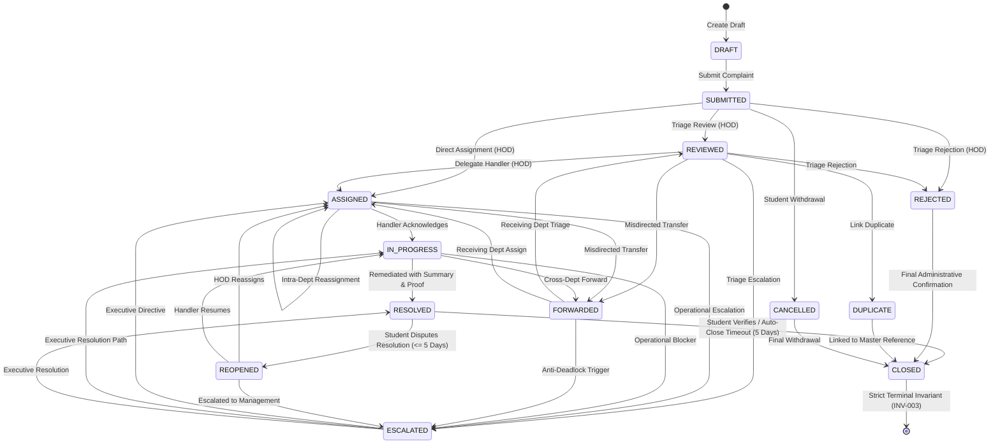
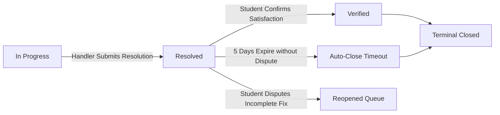

# Phase 08-A: Complaint Lifecycle UX Contract

**Document Identifier:** `07-complaint-lifecycle-ux.md`  
**Classification:** Enterprise UX / Product Experience Blueprint  
**Standard:** Defines the complete user-facing behavioral contract for all 13 canonical states in the domain finite state machine.

---

## 1. Authoritative Complaint State Machine

The complaint progresses through 13 deterministic states governed by domain invariants (`ComplaintStatus.ts`, `BusinessInvariants.ts`).

---

## 2. Canonical State-by-State UX Specification

### 1. `DRAFT`
- **Semantic Meaning:** In-progress submission locally or temporarily persisted prior to final submission.
- **User-Facing Label:** "Draft"
- **Who Can Trigger:** Student / Complainant.
- **Who Can See:** Authoring complainant only.
- **Allowed Actions:** Edit attributes, Upload attachments, Submit complaint, Discard draft.
- **Disallowed Actions:** Staff triage, Handler assignment, Escalation.
- **Next Expected State:** `SUBMITTED`.
- **Timeline Representation:** Not logged in public action history until submitted.
- **Notification Implication:** None.
- **Visual Treatment:** Neutral slate outline; dashed border badge.
- **Accessibility:** Labeled as draft with assistive text: "Complaint not yet submitted to authorities."

---

### 2. `SUBMITTED`
- **Semantic Meaning:** Grievance formally received by the system; tracking reference issued; awaiting initial departmental triage.
- **User-Facing Label:** "Submitted"
- **Who Can Trigger:** Student (upon form submission).
- **Who Can See:** Complainant, Department Head of owning department, System Admin.
- **Allowed Actions:**
  - *Complainant:* View tracking, Cancel complaint (`UJ-STU-001`).
  - *Dept Head:* Review (`FR-007`), Assign (`FR-008`), Reject (`HOD-003`).
- **Disallowed Actions:** Handler progress update, Resolution, Reopening.
- **Next Expected State:** `REVIEWED` or `ASSIGNED`.
- **Timeline Representation:** Milestone Node: "Complaint Submitted by Complainant" with timestamp.
- **Notification Implication:** Alert dispatched to Department Head inbox.
- **Visual Treatment:** Blue badge (`bg-blue-50 text-blue-700 border-blue-200`).
- **Accessibility:** Announced as: "Status: Submitted. Awaiting departmental review."

---

### 3. `REVIEWED`
- **Semantic Meaning:** Department Head has inspected the grievance, verified institutional jurisdiction, and validated completeness.
- **User-Facing Label:** "Under Review"
- **Who Can Trigger:** Department Head (`ROLE_DEPT_HEAD`), System Admin.
- **Who Can See:** Complainant, Department Staff, Admin, Management.
- **Allowed Actions:** Assign handler, Forward cross-department, Reject, Mark duplicate.
- **Disallowed Actions:** Complainant cancellation (cancelled disallowed after triage per `BR-004`).
- **Next Expected State:** `ASSIGNED`.
- **Timeline Representation:** "Complaint Reviewed by Department Authority".
- **Notification Implication:** None (internal milestone; visible in public timeline).
- **Visual Treatment:** Indigo badge (`bg-indigo-50 text-indigo-700 border-indigo-200`).
- **Accessibility:** Announced as: "Status: Under Review. Department authority inspecting complaint."

---

### 4. `ASSIGNED`
- **Semantic Meaning:** Single primary responsible handler has been designated to investigate and remediate the issue (`BR-008`).
- **User-Facing Label:** "Assigned"
- **Who Can Trigger:** Department Head, System Admin.
- **Who Can See:** Complainant, Department Staff, Admin, Management.
- **Allowed Actions:**
  - *Assigned Handler:* Start progress, Forward, Escalate.
  - *Dept Head:* Reassign handler, Forward, Escalate.
- **Disallowed Actions:** Direct resolution (handler must advance to In Progress first).
- **Next Expected State:** `IN_PROGRESS`.
- **Timeline Representation:** "Assigned to [Department Office / Handler Name]".
- **Notification Implication:** High-priority task notification to assigned handler.
- **Visual Treatment:** Teal badge (`bg-teal-50 text-teal-700 border-teal-200`).
- **Accessibility:** Announced as: "Status: Assigned. Designated handler allocated."

---

### 5. `IN_PROGRESS`
- **Semantic Meaning:** Assigned handler has formally acknowledged the ticket and is actively conducting investigation or physical repairs.
- **User-Facing Label:** "In Progress"
- **Who Can Trigger:** Assigned Handler (`ROLE_HANDLER`), Admin.
- **Who Can See:** All authorized stakeholders.
- **Allowed Actions:**
  - *Assigned Handler:* Log progress remarks, Upload interim evidence, Forward, Escalate, Resolve.
- **Disallowed Actions:** Complainant cancellation, Direct closure.
- **Next Expected State:** `RESOLVED`.
- **Timeline Representation:** "Investigation & Remediation In Progress. Action note: [Public Remark]".
- **Notification Implication:** In-app notification to complainant that work has commenced.
- **Visual Treatment:** Emerald badge (`bg-emerald-50 text-emerald-700 border-emerald-200`).
- **Accessibility:** Announced as: "Status: In Progress. Active remediation underway."

---

### 6. `FORWARDED`
- **Semantic Meaning:** Complaint transferred across departmental boundaries due to initial misdirection or multi-departmental dependency (`BR-010`).
- **User-Facing Label:** "Forwarded"
- **Who Can Trigger:** Handler or Department Head of owning department.
- **Who Can See:** Complainant, Originating Dept Staff, Receiving Dept Staff, Management.
- **Allowed Actions:** Receiving Department Head reviews or assigns.
- **Disallowed Actions:** Forwarding to the same department (`INV-002 / SelfForwardingError`).
- **Next Expected State:** `REVIEWED` or `ASSIGNED` in receiving department.
- **Timeline Representation:** "Forwarded from [Dept A] to [Dept B]. Reason: [Rationale]".
- **Notification Implication:** Urgent notification to receiving Department Head.
- **Visual Treatment:** Amber badge (`bg-amber-50 text-amber-700 border-amber-200`).
- **Accessibility:** Announced as: "Status: Forwarded. Transferred to another department."
- **Edge Case / Invariant:** If forward count reaches 3, Anti-Deadlock rule (`INV-010`) elevates ticket directly to Management.

---

### 7. `ESCALATED`
- **Semantic Meaning:** Grievance elevated to higher administrative tier (Tier 2 HOD or Tier 3 Management) due to SLA breach, lack of progress, or operational blockage (`BR-012`).
- **User-Facing Label:** "Escalated"
- **Who Can Trigger:** Handler, Department Head, or Automated SLA Engine (`FR-014`).
- **Who Can See:** All authorized stakeholders.
- **Allowed Actions:** Tier authority intervention, authoritative reassignment, direct resolution.
- **Disallowed Actions:** Ordinary closure without resolution.
- **Next Expected State:** `IN_PROGRESS` or `RESOLVED`.
- **Timeline Representation:** "Escalated to [Tier 2/3]. Justification: [Reason]".
- **Notification Implication:** High-priority push/in-app alert to HOD and Executive Management.
- **Visual Treatment:** Rose / Red badge with alert icon (`bg-rose-50 text-rose-700 border-rose-200`).
- **Accessibility:** Announced with assertive priority: "Status: Escalated. Priority elevated to executive oversight."

---

### 8. `RESOLVED`
- **Semantic Meaning:** Corrective action completed; mandatory resolution summary and proof evidence logged; awaiting complainant verification (`BR-015`).
- **User-Facing Label:** "Resolved — Verification Pending"
- **Who Can Trigger:** Assigned Handler, Department Head.
- **Who Can See:** All authorized stakeholders.
- **Allowed Actions:**
  - *Complainant:* Verify resolution (`UJ-STU-005`), Dispute resolution (`UJ-STU-006`).
  - *System:* Auto-close after 5 business days without dispute (`BR-017`).
- **Disallowed Actions:** Handler editing resolution narrative after submission.
- **Next Expected State:** `CLOSED` (on verification/timeout) or `REOPENED` (on dispute).
- **Timeline Representation:** "Remediation Completed. Summary: [Summary Narrative]. Verification window open."
- **Notification Implication:** Immediate notification to student prompting verification.
- **Visual Treatment:** Green badge with checkmark icon (`bg-green-50 text-green-700 border-green-200`).
- **Accessibility:** Announced as: "Status: Resolved. Action required: verify resolution satisfaction."

---

### 9. `REOPENED`
- **Semantic Meaning:** Complainant disputed resolution validity within permitted 5-day window; ticket returned to active queue with dispute rationale (`BR-018`).
- **User-Facing Label:** "Reopened"
- **Who Can Trigger:** Original Complainant Student only (`ROLE_STUDENT`).
- **Who Can See:** All authorized stakeholders.
- **Allowed Actions:** HOD re-triage, Reassignment, Handler progress update.
- **Disallowed Actions:** Instant re-resolution without investigation note.
- **Next Expected State:** `ASSIGNED` or `IN_PROGRESS`.
- **Timeline Representation:** "Resolution Disputed by Complainant. Reason: [Dispute Reason]".
- **Notification Implication:** Urgent notification to Department Head and assigned handler.
- **Visual Treatment:** Orange badge (`bg-orange-50 text-orange-700 border-orange-200`).
- **Accessibility:** Announced as: "Status: Reopened. Complainant disputed resolution."

---

### 10. `CLOSED`
- **Semantic Meaning:** Final terminal state. Resolution confirmed satisfactory by student, or auto-closed upon expiration of 5-day verification window (`INV-003`).
- **User-Facing Label:** "Closed"
- **Who Can Trigger:** Complainant Student, Automated System Job (`AUTO_CLOSED_NO_DISPUTE`), Admin.
- **Who Can See:** All authorized stakeholders.
- **Allowed Actions:** Read-only inspection. No ordinary mutations permitted (`INV-003`).
- **Disallowed Actions:** All state-changing mutations. Closed records cannot be reopened or edited.
- **Next Expected State:** None (Strict Terminal Invariant).
- **Timeline Representation:** "Complaint Closed. Final outcome verified."
- **Notification Implication:** Final closure confirmation sent to student and handler.
- **Visual Treatment:** Muted slate / gray badge (`bg-slate-100 text-slate-600 border-slate-300`).
- **Accessibility:** Announced as: "Status: Closed. Grievance lifecycle completed."

---

### 11. `REJECTED`
- **Semantic Meaning:** Complaint determined invalid, abusive, non-actionable, or out of institutional purview during initial triage.
- **User-Facing Label:** "Rejected"
- **Who Can Trigger:** Department Head, System Admin.
- **Who Can See:** Complainant, Department Staff, Admin.
- **Allowed Actions:** Read-only viewing; Student may submit new complaint with valid details.
- **Disallowed Actions:** Assignment, Progress, Forwarding.
- **Next Expected State:** `CLOSED`.
- **Timeline Representation:** "Complaint Rejected by Department Authority. Reason: [Rejection Reason]".
- **Notification Implication:** Notification to student explaining rejection reason.
- **Visual Treatment:** Dark red badge (`bg-red-50 text-red-800 border-red-300`).
- **Accessibility:** Announced as: "Status: Rejected with formal justification."

---

### 12. `DUPLICATE`
- **Semantic Meaning:** Grievance represents an identical issue already filed and actively tracked under another reference ID.
- **User-Facing Label:** "Duplicate"
- **Who Can Trigger:** Department Head, System Admin.
- **Who Can See:** Complainant, Department Staff, Admin.
- **Allowed Actions:** Read-only viewing; Deep-link button navigating to master complaint reference (`CP-YYYY-XXXXX`).
- **Disallowed Actions:** Independent progress or resolution.
- **Next Expected State:** `CLOSED`.
- **Timeline Representation:** "Marked as Duplicate of Master Reference [CP-YYYY-XXXXX]".
- **Notification Implication:** Informs student that issue is already tracked under master ticket.
- **Visual Treatment:** Purple / Slate badge with link icon (`bg-purple-50 text-purple-700 border-purple-200`).
- **Accessibility:** Announced as: "Status: Duplicate. Linked to master complaint reference."

---

### 13. `CANCELLED`
- **Semantic Meaning:** Grievance withdrawn by the original student submitter prior to staff triage or assignment.
- **User-Facing Label:** "Cancelled"
- **Who Can Trigger:** Original Complainant Student only.
- **Who Can See:** Complainant, Department Head, Admin.
- **Allowed Actions:** Read-only viewing.
- **Disallowed Actions:** Reopening or mutating cancelled records.
- **Next Expected State:** `CLOSED`.
- **Timeline Representation:** "Complaint Cancelled by Complainant. Reason: [Withdrawal Reason]".
- **Notification Implication:** Dispatches withdrawal notice to department triage desk.
- **Visual Treatment:** Neutral gray badge (`bg-gray-100 text-gray-500 border-gray-300`).
- **Accessibility:** Announced as: "Status: Cancelled by submitter."

---

## 3. Critical Workflow Distinctions

### 3.1 Resolution vs. Verification vs. Closure
The UX must rigorously maintain the separation between these three lifecycle concepts:
1. **Resolution (`RESOLVED`):** An authority claim that corrective work was completed. It is *provisional* and does not end the complaint lifecycle.
2. **Verification (`VERIFY_RESOLUTION`):** An explicit complainant action confirming that the corrective work actually fixed the grievance.
3. **Closure (`CLOSED`):** The permanent terminal state reached either via complainant verification or automatic expiration of the 5-day verification window.

### 3.2 Forwarding vs. Escalation
The UX must never confuse lateral jurisdictional transfer with hierarchical authority escalation:
- **Forwarding (`FORWARDED`):** *Lateral* transfer between peers across departments (e.g. Civil Maintenance -> Electrical Maintenance). It resets handler assignment and requires transfer rationale.
- **Escalation (`ESCALATED`):** *Vertical* elevation to a higher supervisory tier (Tier 1 Handler -> Tier 2 HOD -> Tier 3 Management). It does **not** erase assigned handler context or reset history.
