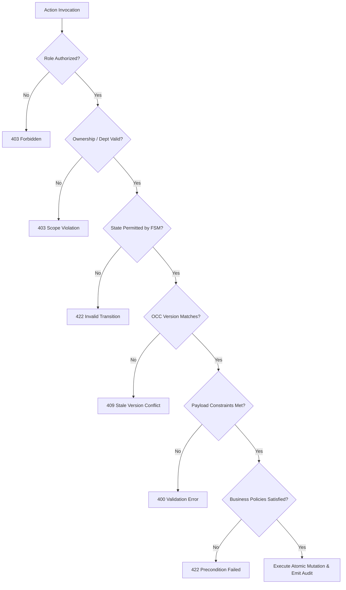

# Phase 08-A: Role × State × Action Matrix & Action Preconditions

**Document Identifier:** `08-role-state-action-matrix.md`  
**Classification:** Enterprise UX / Product Experience Blueprint  
**Standard:** Codifies the complete cross-product of 5 institutional roles × 13 lifecycle states × permissible actions, strictly reconciled with `AuthorizationPolicy.ts` and `BusinessInvariants.ts`.

---

## 1. Role × State × Action Authority Matrix

Legend:
- **`YES`**: Permitted action (rendered as active button; validated server-side).
- **`NO`**: Disallowed action (hidden or disabled in UI; rejected with HTTP 403/422 by backend).
- **`COND`**: Conditional on specific predicate (e.g. assigned handler match, ownership match, verification window).

| Lifecycle State | Action | Student (`ROLE_STUDENT`) | Handler (`ROLE_HANDLER`) | Dept Head (`ROLE_DEPT_HEAD`) | Management (`ROLE_MANAGEMENT`) | Admin (`ROLE_ADMIN`) | Backend Authority Enforcement |
| :--- | :--- | :---: | :---: | :---: | :---: | :---: | :--- |
| **`DRAFT`** | **Submit** | **YES** | NO | NO | NO | NO | Initial aggregate save |
| | **Cancel / Discard** | **YES** | NO | NO | NO | NO | Local discard |
| **`SUBMITTED`** | **Cancel Complaint** | **COND** (Owner only) | NO | NO | NO | NO | `CancelComplaintUseCase` |
| | **Review (Triage)** | NO | NO | **YES** (Dept) | **YES** | **YES** | `ReviewComplaintUseCase` |
| | **Assign Handler** | NO | NO | **YES** (Dept) | **YES** | **YES** | `AssignComplaintUseCase` (`INV-007`) |
| | **Reject Complaint** | NO | NO | **YES** (Dept) | **YES** | **YES** | `RejectComplaintUseCase` |
| | **Start Progress** | NO | NO | NO | NO | NO | Disallowed in SUBMITTED (`INV-004`) |
| | **Resolve** | NO | NO | NO | NO | NO | Disallowed in SUBMITTED |
| **`REVIEWED`** | **Assign Handler** | NO | NO | **YES** (Dept) | **YES** | **YES** | `AssignComplaintUseCase` |
| | **Forward Cross-Dept** | NO | **YES** (Dept) | **YES** (Dept) | **YES** | **YES** | `ForwardComplaintUseCase` (`INV-002`) |
| | **Escalate** | NO | **YES** (Dept) | **YES** (Dept) | **YES** | **YES** | `EscalateComplaintUseCase` |
| | **Reject Complaint** | NO | NO | **YES** (Dept) | **YES** | **YES** | `RejectComplaintUseCase` |
| | **Mark Duplicate** | NO | NO | **YES** (Dept) | **YES** | **YES** | `MarkDuplicateUseCase` |
| | **Cancel** | NO | NO | NO | NO | NO | Disallowed once reviewed (`BR-004`) |
| **`ASSIGNED`** | **Start Progress** | NO | **COND** (Assigned) | **YES** (Dept) | **YES** | **YES** | `StartProgressUseCase` |
| | **Reassign Handler** | NO | NO | **YES** (Dept) | **YES** | **YES** | `AssignComplaintUseCase` |
| | **Forward Cross-Dept** | NO | **YES** (Dept) | **YES** (Dept) | **YES** | **YES** | `ForwardComplaintUseCase` |
| | **Escalate** | NO | **YES** (Dept) | **YES** (Dept) | **YES** | **YES** | `EscalateComplaintUseCase` |
| | **Resolve** | NO | NO | NO | NO | NO | Must advance to IN_PROGRESS |
| **`IN_PROGRESS`** | **Resolve Complaint** | NO | **COND** (Assigned) | **YES** (Dept) | **YES** | **YES** | `ResolveComplaintUseCase` (`INV-005/006`)|
| | **Forward Cross-Dept** | NO | **YES** (Dept) | **YES** (Dept) | **YES** | **YES** | `ForwardComplaintUseCase` |
| | **Escalate** | NO | **YES** (Dept) | **YES** (Dept) | **YES** | **YES** | `EscalateComplaintUseCase` |
| | **Add Internal Note** | NO | **YES** (Dept) | **YES** (Dept) | **YES** | **YES** | `internal_notes` table (`INV-012`) |
| | **Cancel** | NO | NO | NO | NO | NO | Disallowed |
| **`FORWARDED`** | **Review (Receiving)** | NO | NO | **YES** (New Dept) | **YES** | **YES** | `ReviewComplaintUseCase` |
| | **Assign Handler** | NO | NO | **YES** (New Dept) | **YES** | **YES** | `AssignComplaintUseCase` |
| | **Escalate** | NO | NO | **YES** (New Dept) | **YES** | **YES** | `EscalateComplaintUseCase` |
| **`ESCALATED`** | **Intervene / Assign** | NO | NO | **YES** (Tier 2) | **YES** (Tier 3) | **YES** | Executive purview |
| | **Progress** | NO | **COND** (Assigned) | **YES** (Dept) | **YES** | **YES** | Operational resumption |
| | **Resolve** | NO | **COND** (Assigned) | **YES** (Dept) | **YES** | **YES** | `ResolveComplaintUseCase` |
| | **Forward** | NO | NO | **YES** (Dept) | **YES** | **YES** | `ForwardComplaintUseCase` |
| **`RESOLVED`** | **Verify & Close** | **COND** (Owner, <=5d)| NO | NO | NO | **YES** (Fallback) | `CloseComplaintUseCase` (`BR-016`) |
| | **Dispute & Reopen** | **COND** (Owner, <=5d)| NO | NO | NO | NO | `ReopenComplaintUseCase` (`BR-018`) |
| | **Auto-Close** | NO (System job) | NO | NO | NO | NO | Scheduled Job (`BR-017`) |
| | **Edit Summary** | NO | NO | NO | NO | NO | Immutable post-resolution |
| **`REOPENED`** | **Re-Triage / Assign** | NO | NO | **YES** (Dept) | **YES** | **YES** | `AssignComplaintUseCase` |
| | **Resume Progress** | NO | **COND** (Assigned) | **YES** (Dept) | **YES** | **YES** | `StartProgressUseCase` |
| | **Escalate** | NO | **YES** (Dept) | **YES** (Dept) | **YES** | **YES** | `EscalateComplaintUseCase` |
| **`REJECTED`** | **Confirm Close** | NO | NO | **YES** (Dept) | **YES** | **YES** | Terminal transition |
| **`DUPLICATE`** | **Confirm Close** | NO | NO | **YES** (Dept) | **YES** | **YES** | Terminal transition |
| **`CANCELLED`** | **Confirm Close** | NO | NO | **YES** (Dept) | **YES** | **YES** | Terminal transition |
| **`CLOSED`** | **ANY MUTATION** | **STRICTLY DISALLOWED** | **STRICTLY DISALLOWED** | **STRICTLY DISALLOWED** | **STRICTLY DISALLOWED** | **STRICTLY DISALLOWED** | **Terminal Invariant (`INV-003`)** |

---

## 2. Comprehensive Action Precondition Model

Every operational state-changing action enforces strict preconditions across 10 architectural dimensions:

### Action 1: Review Complaint (`REVIEW`)
- **Actor:** Department Head (`ROLE_DEPT_HEAD`), System Admin.
- **Required State:** `SUBMITTED`, `FORWARDED`, or `REOPENED`.
- **Required Ownership / Dept:** Caller's department must match complaint `department_id`.
- **Required Data:** `expectedVersion?: number` for OCC verification.
- **Confirmation Requirement:** Lightweight confirmation ("Mark this complaint as reviewed?").
- **Resulting State:** `REVIEWED`.
- **Failure Feedback:** "Unable to review complaint. It may have been triaged by another authority."
- **Audit Emission:** Appends `REVIEW` event.
- **Notification:** None.

### Action 2: Assign Handler (`ASSIGN`)
- **Actor:** Department Head, System Admin.
- **Required State:** `SUBMITTED`, `REVIEWED`, `FORWARDED`, `REOPENED`, or `ASSIGNED` (reassignment).
- **Required Ownership / Dept:** Assignee must actively belong to the complaint's department (`INV-007`).
- **Required Data:** `handlerId: UUID` (valid active staff member), optional `reason: string`.
- **Confirmation Requirement:** Modal prompt displaying technician name and current active workload.
- **Resulting State:** `ASSIGNED`.
- **Failure Feedback:** "Selected technician does not belong to this department or is inactive."
- **Audit Emission:** Appends `ASSIGNMENT` event with assignor, assignee, and rationale.
- **Notification:** Task alert sent to assigned handler.

### Action 3: Start Progress (`START_PROGRESS`)
- **Actor:** Assigned Handler (`assigned_handler_id === actor.userId`), System Admin.
- **Required State:** `ASSIGNED`.
- **Required Data:** Optional interim progress note.
- **Confirmation Requirement:** Simple button confirmation.
- **Resulting State:** `IN_PROGRESS`.
- **Failure Feedback:** "Only the designated assigned handler can start progress."
- **Audit Emission:** Appends `STATUS_CHANGE` to `IN_PROGRESS`.
- **Notification:** Informational alert sent to student.

### Action 4: Forward Complaint (`FORWARD`)
- **Actor:** Department Handler, Department Head.
- **Required State:** `REVIEWED`, `ASSIGNED`, `IN_PROGRESS`, `ESCALATED`.
- **Required Data:** `targetDepartmentId: UUID` (must differ from current `department_id` per `INV-002`), `rationale: string` (minimum 10 characters per `BR-010`).
- **Confirmation Requirement:** Modal with warning: "Transferring this complaint will reassign ownership to another department."
- **Resulting State:** `FORWARDED`.
- **Failure Feedback:** "Cannot forward complaint to the same department" or "Rationale must be at least 10 characters."
- **Audit Emission:** Appends `FORWARD` event with previous dept, new dept, and rationale.
- **Notification:** Alerts receiving department triage desk.
- **Special Invariant:** Reaching 3 forward cycles triggers Anti-Deadlock rule (`INV-010`) and elevates to Management.

### Action 5: Escalate Complaint (`ESCALATE`)
- **Actor:** Department Handler, Department Head.
- **Required State:** `ASSIGNED`, `IN_PROGRESS`, `FORWARDED`, `REOPENED`.
- **Required Data:** `targetTier: 'TIER_2_DEPARTMENT_HEAD' | 'TIER_3_MANAGEMENT'`, `reason: string` (non-empty).
- **Confirmation Requirement:** Modal displaying target tier authority and consequence.
- **Resulting State:** `ESCALATED`.
- **Failure Feedback:** "Escalation justification is mandatory."
- **Audit Emission:** Appends `ESCALATION` event with tier and justification.
- **Notification:** Urgent alert dispatched to target tier leadership.

### Action 6: Resolve Complaint (`RESOLVE`)
- **Actor:** Assigned Handler (`assigned_handler_id === actor.userId`), Department Head.
- **Required State:** `IN_PROGRESS`, `ESCALATED`.
- **Required Data:** `resolutionSummary: string` (minimum 20 characters per `BR-015`), optional/mandatory `proofAttachmentKeys: string[]` (`INV-006`).
- **Confirmation Requirement:** Detailed modal reviewing the corrective action and verifying proof uploads.
- **Resulting State:** `RESOLVED`.
- **Failure Feedback:** "Resolution summary must be at least 20 characters" or "This category mandates photographic proof of repair."
- **Audit Emission:** Appends `RESOLVE` event with summary and attachment references.
- **Notification:** High-priority verification alert dispatched to complainant.

### Action 7: Verify Resolution (`VERIFY_RESOLUTION`)
- **Actor:** Original Complainant Student (`complainant_id === actor.userId`).
- **Required State:** `RESOLVED`.
- **Required Window:** Within 5 business days of resolution timestamp (`BR-016`).
- **Required Data:** None (optional verification satisfaction feedback).
- **Confirmation Requirement:** Modal warning: "Confirming resolution will permanently CLOSE this complaint."
- **Resulting State:** `CLOSED`.
- **Failure Feedback:** "Only the original complainant can verify this resolution."
- **Audit Emission:** Appends `CLOSE` event with verification flag `true`.
- **Notification:** Alerts assigned handler and HOD of closure.

### Action 8: Dispute Resolution (`DISPUTE_REOPEN`)
- **Actor:** Original Complainant Student (`complainant_id === actor.userId`).
- **Required State:** `RESOLVED`.
- **Required Window:** Within 5 business days (`BR-016`, `BR-018`).
- **Required Data:** `disputeReason: string` (minimum 10 characters).
- **Confirmation Requirement:** Modal: "Disputing this resolution will return the complaint to the department for further investigation."
- **Resulting State:** `REOPENED`.
- **Failure Feedback:** "The 5-business-day dispute window has expired. Please submit a new complaint referencing this tracking code."
- **Audit Emission:** Appends `REOPEN` event with dispute reason.
- **Notification:** High-priority alert to HOD and handler.

### Action 9: Close Administratively (`CLOSE`)
- **Actor:** Department Head, System Admin, Management.
- **Required State:** `RESOLVED`, `REJECTED`, `DUPLICATE`, `CANCELLED`.
- **Required Data:** `reason: string` (non-empty).
- **Confirmation Requirement:** Strict administrative confirmation dialog.
- **Resulting State:** `CLOSED`.
- **Failure Feedback:** "Administrative closure reason is mandatory."
- **Audit Emission:** Appends `CLOSE` event with administrative rationale.
- **Notification:** Alerts student and handler.

### Action 10: Reject Complaint (`REJECT`)
- **Actor:** Department Head, System Admin.
- **Required State:** `SUBMITTED`, `REVIEWED`.
- **Required Data:** `reason: string` (non-empty justification).
- **Confirmation Requirement:** Rejection modal explaining that complainant will receive the reason.
- **Resulting State:** `REJECTED`.
- **Failure Feedback:** "Rejection justification is mandatory."
- **Audit Emission:** Appends `REJECT` event.
- **Notification:** Rejection notification dispatched to complainant student.

### Action 11: Mark Duplicate (`MARK_DUPLICATE`)
- **Actor:** Department Head, System Admin.
- **Required State:** `REVIEWED`.
- **Required Data:** `originalRefId: string` (format `CP-YYYY-XXXXX` of master active ticket).
- **Confirmation Requirement:** Modal linking target ticket to existing master reference.
- **Resulting State:** `DUPLICATE`.
- **Failure Feedback:** "Master tracking code not found or invalid."
- **Audit Emission:** Appends `MARK_DUPLICATE` event referencing master code.
- **Notification:** Notification to student referencing master ticket.

### Action 12: Cancel Complaint (`CANCEL`)
- **Actor:** Original Complainant Student (`complainant_id === actor.userId`).
- **Required State:** `SUBMITTED` or `DRAFT` only (`BR-004`).
- **Required Data:** `reason: string` (mandatory withdrawal reason).
- **Confirmation Requirement:** Modal: "Are you sure you want to withdraw this complaint? This cannot be undone."
- **Resulting State:** `CANCELLED`.
- **Failure Feedback:** "Complaints that have begun departmental review cannot be cancelled."
- **Audit Emission:** Appends `CANCEL` event with withdrawal reason.
- **Notification:** Alerts department triage desk.
