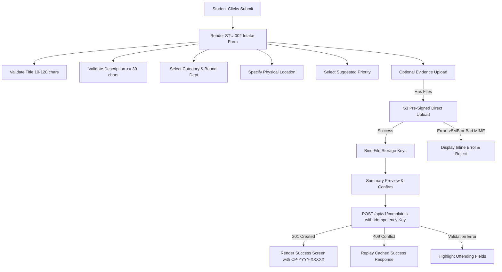

# Phase 08-A: Complaint Submission UX & Attachment Architecture

**Document Identifier:** `09-complaint-submission-ux.md`  
**Classification:** Enterprise UX / Product Experience Blueprint  
**Standard:** Defines the intake experience, field validation rules, attachment security, idempotency safeguards, and tracking code presentation.

---

## 1. Intake User Experience Design

The complaint submission interface (`STU-002`) represents the primary digital front door of the institution. It replaces ad-hoc emails, verbal reports, and paper chits with a disciplined, structured intake flow.

---

## 2. Field-by-Field Validation Specifications

Every submission attribute is strictly governed by domain value object constraints and database CHECK constraints:

| Field Name | Input Type | Required | Domain Rule / Invariant | Validation Boundary | Error Placement & Copy | Accessibility Attribute |
| :--- | :--- | :---: | :--- | :--- | :--- | :--- |
| **Title** | Single-line Text | **YES** | `ComplaintTitle`, `chk_complaint_title_len` | 10 to 120 characters | Below input: "Title must be between 10 and 120 characters (current: X)." | `aria-required="true"`, `aria-invalid` |
| **Category** | Select Dropdown | **YES** | `BR-005`, active category | Must select active category UUID | Below select: "Please select a valid complaint category." | `aria-required="true"` |
| **Department** | Select Dropdown | **YES** | `INV-001`, active department | Auto-selected from category default; modifiable | Below select: "An active owning department is required." | `aria-required="true"` |
| **Description**| Multi-line Textarea| **YES** | `ComplaintDescription`, `chk_complaint_desc_len` | Minimum 30 characters | Below textarea: "Description must provide at least 30 characters of detail." | `aria-required="true"`, `aria-describedby` |
| **Campus** | Select / Radio | **YES** | Institutional campus scope | Default: "Main Campus" | Below input: "Campus selection is required." | `aria-required="true"` |
| **Building** | Select Dropdown | **YES** | Relational building entity | Must select valid building | Below select: "Building selection is required." | `aria-required="true"` |
| **Floor / Room**| Text / Select | **YES** | Location specification | 1 to 100 characters | Below input: "Specific room, lab, or area is required." | `aria-required="true"` |
| **Location Detail**| Text Input | **YES** | Physical landmark context | 1 to 255 characters | Below input: "Additional physical location details required." | `aria-required="true"` |
| **Suggested Priority**| Radio Group | **YES** | `BR-003`, `Priority` VO | `LOW`, `MEDIUM`, `HIGH`, `URGENT` | Below group: "Please indicate grievance urgency." | `role="radiogroup"` |
| **Attachments**| Dropzone / File | **NO** | `BR-022`, `chk_attachment_size_limit` | Max 3 files; max 5MB/file; JPG/PNG/PDF | Inside dropzone: "File exceeds 5MB limit" or "Invalid format." | `aria-live="polite"` |

---

## 3. Attachment Architecture & Security UX (`FR-004`, `SEC-005`)

### 3.1 Strict Attachment Constraints
- **Maximum Files:** 3 files per complaint.
- **Maximum File Size:** 5,242,880 bytes (5.0 MB) strictly checked client-side and enforced server-side.
- **Approved MIME Whitelist:** `image/jpeg`, `image/png`, `application/pdf` exclusively.
- **Storage Strategy:** Private, encrypted Supabase storage bucket (`campus-plus-attachments`).

### 3.2 Secure Direct-to-Storage Upload Flow
1. **Selection:** User drops or selects a file in the dropzone.
2. **Pre-flight Validation:** Client immediately checks MIME type and binary size. Files > 5MB or with disallowed extensions are rejected immediately before any network call.
3. **Presigning:** Client calls `POST /api/v1/attachments/presign-upload` with filename, MIME type, and exact byte size.
4. **Direct S3 Upload:** Adapter returns signed URL and unique storage key (`complaints/temp/${uuid}-${sanitizedFilename}`). Client uploads binary payload directly to storage via `PUT` with progress bar indicator.
5. **Key Binding:** Upon successful upload, file key is stored in transient form state.
6. **Persistence:** When `POST /api/v1/complaints` succeeds, server transitions file records from temp staging to permanent binding in `attachments` table.

### 3.3 Known Operational Risk Visibility (`RISK-001`)
- **Temporary Orphan Accumulation:** Files uploaded via presigned URL where the user abandons the form prior to complaint submission remain in `complaints/temp/`. This is logged as a P2 operational risk in [`25-ux-risk-register.md`](./25-ux-risk-register.md). The UX enforces zero frontend workarounds; background garbage collection is handled by cloud lifecycle rules.

---

## 4. Idempotency & Concurrency Safeguards (`NFR-003`, `INV-013`)

To protect students with slow cellular connections or jittery campus Wi-Fi from accidental double-filings:
1. **Client-Side Submit Debounce:** On clicking `[Submit]`, the button enters a loading state with spinner and is disabled immediately.
2. **Deterministic Idempotency Key:** Client generates a UUID v4 `Idempotency-Key` on form initialization.
3. **Double Submission Defense:** If the student double-clicks or retries due to a network glitch, the second request carries the same idempotency key and SHA-256 payload hash.
4. **Replay Handling:** The server detects the in-flight or completed key in `idempotency_keys` table and returns the identical `201 Created` tracking code without creating duplicate records.

---

## 5. Success Experience & Tracking Code Hand-off (`FR-005`, `BR-003`)

Upon successful submission:
1. Form transition smoothly unmounts and renders the **Success Confirmation Screen** (`STU-002-S`).
2. Displays prominent **Tracking Reference ID** formatted as `CP-2026-XXXXX` in high-contrast monospaced font with a one-click `[Copy Reference Code]` button.
3. Confirms owning department: "Your grievance has been routed to the **Civil Maintenance Department**."
4. Outlines next steps:
   - "A department authority will review your submission within institutional working hours."
   - "You will receive in-app notifications as the status changes."
5. Primary Call to Action: `[View Complaint & Track Progress]` -> navigates to `STU-003`.
6. Secondary Call to Action: `[Return to Dashboard]` -> navigates to `STU-001`.
