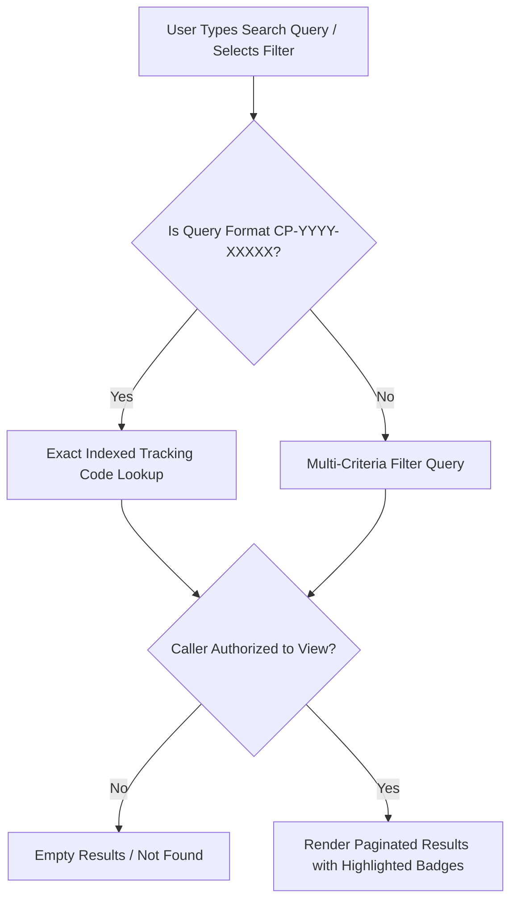

# Phase 08-A: Search, Filter, Notification & Empty State Architecture

**Document Identifier:** `10-search-filter-ux.md`  
**Classification:** Enterprise UX / Product Experience Blueprint  
**Standard:** Defines the multi-criteria search engine, role-scoped data filtering, notification center, and reusable empty state system.

---

## 1. Multi-Criteria Search & Filtering Engine (`FR-026`)

The search architecture balances high-speed retrieval of specific tracking codes (`CP-YYYY-XXXXX`) with faceted filtering across grievance dimensions.

### 1.1 Supported Filter Dimensions
- **Reference Identifier:** Exact match indexed via unique index `idx_complaints_ref_id`.
- **Status Filter:** Multi-select pills (`SUBMITTED`, `ASSIGNED`, `IN_PROGRESS`, `FORWARDED`, `ESCALATED`, `RESOLVED`, `CLOSED`).
- **Priority Filter:** Dropdown (`URGENT`, `HIGH`, `MEDIUM`, `LOW`).
- **Department Scope:** Filterable by department (dropdown restricted for staff; global for Admin/Management).
- **Date Range:** Picker supporting Semester, Month, Custom Range (`created_at`).

### 1.2 Search Result Security & RLS Defense
- **Zero Data Leakage:** Search queries execute under PostgreSQL Row-Level Security (`00008_row_level_security_policies.sql`). Students querying search terms never receive matching records belonging to other students.
- **Search Result Cards:** Results display Tracking Code, Status Badge, Title, Department, and Date. Staff views include assigned technician tag; student views exclude internal details.

---

## 2. In-App Notification Center Architecture (`FR-020`, `OD-011`)

### 2.1 Scope Boundary
- **In-App Notifications:** **MVP Core**.
- **Transactional Email / SMS / WhatsApp:** **POST-MVP** (explicitly deferred per `OD-011`).

### 2.2 Notification Event Catalog

| Trigger Event | Target Recipient | Notification Title | Notification Message Template | Target Deep-Link | Priority |
| :--- | :--- | :--- | :--- | :--- | :---: |
| **New Complaint** | Dept Head | New Complaint Submitted | "Complaint {ref_id} ({category}) submitted to {department}." | `/complaints/{id}` | Normal |
| **Handler Assigned** | Handler | Task Assigned to You | "You have been assigned to handle complaint {ref_id}." | `/complaints/{id}` | High |
| **Work In Progress** | Student | Remediation Started | "Assigned technician has commenced work on complaint {ref_id}." | `/complaints/{id}` | Normal |
| **Complaint Forwarded**| Receiving HOD | Inward Forwarded Complaint | "{ref_id} forwarded from {from_dept}. Reason: {reason}." | `/complaints/{id}` | High |
| **Complaint Escalated**| HOD, Management | Grievance Escalated | "{ref_id} elevated to {tier}. Justification: {reason}." | `/complaints/{id}` | Urgent |
| **Complaint Resolved** | Student | Resolution Ready for Verification | "Work on {ref_id} completed. Please review and verify resolution." | `/complaints/{id}` | High |
| **Resolution Disputed**| HOD, Handler | Resolution Disputed | "Complainant disputed resolution on {ref_id}. Reason: {reason}." | `/complaints/{id}` | Urgent |
| **Complaint Closed** | Student, Handler | Complaint Closed | "{ref_id} has been verified and permanently closed." | `/complaints/{id}` | Normal |

### 2.3 UX Interaction Pattern
- **Bell Icon Badge:** Global navigation bell displays red counter badge indicating unread notifications count (`notifications` table where `recipient_id = auth.uid() AND is_read = FALSE`).
- **Notification Drawer:** Clicking bell slides in notification drawer from right. Notifications sorted by `created_at DESC` using partial index `idx_notifications_inbox`.
- **Deep-Link Navigation:** Clicking any notification card marks it read (`UPDATE notifications SET is_read = TRUE, read_at = NOW()`) and navigates immediately to target complaint.

---

## 3. Universal Empty State System (`Section 44`)

Empty states must never leave users stranded. Every empty state adheres to a 3-part design rule:
1. **Explain the Condition:** Clearly communicate *why* the view contains no records.
2. **Provide Actionable Guidance:** Direct the user to the next logical step.
3. **Prevent Confusion:** Distinguish between a genuine zero state, a filtered zero state, and a system error.

### Reusable Empty State Patterns

| Context | Heading | Descriptive Copy | Action Button | Icon / Visual Treatment |
| :--- | :--- | :--- | :--- | :--- |
| **No Submitted Complaints** | No Complaints Yet | "You haven't submitted any complaints. If you experience an issue on campus, let us know." | `[Submit New Complaint]` | Document icon; primary role accent |
| **No Active Tasks (Handler)** | All Caught Up! | "You have no active complaints assigned to you right now. Check the department queue for untriaged items." | `[View Department Queue]` | Check-circle icon; calm green/teal |
| **No Triage Items (HOD)** | Triage Queue Clear | "There are no incoming unassigned complaints awaiting review in your department." | `[View Active Workload]` | Shield-check icon; soft lavender |
| **No Search Results** | No Matching Complaints | "We couldn't find any complaints matching your query. Check the tracking reference or clear active filters." | `[Reset Filters]` | Search-minus icon; neutral slate |
| **No Notifications** | Inbox Empty | "You have no unread notifications. Updates regarding your grievances will appear here." | None | Bell-slash icon; neutral gray |
| **No Escalated Tickets** | Zero Active Escalations | "There are currently no complaints requiring executive Tier 3 intervention across campus." | None | Check-badge icon; muted rose |
| **No Recurring Clusters** | No Chronic Hotspots | "No complaint clusters have met the >=3 incident threshold in the last 30 days." | None | Sparkles icon; institutional slate |
