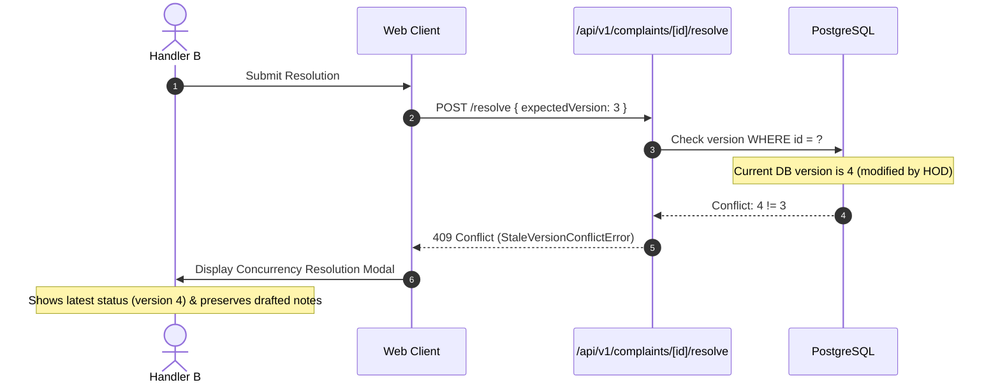

# Phase 08-A: Error UX Strategy, Concurrency & Idempotency

**Document Identifier:** `11-error-ux-strategy.md`  
**Classification:** Enterprise UX / Product Experience Blueprint  
**Standard:** Defines user-facing recovery strategies for all system exceptions, Optimistic Concurrency Control (OCC) collisions, and network idempotency replays.

---

## 1. RFC-Aligned Error Taxonomy & Recovery Mapping

Every backend error code mapped from `AppError` and `ErrorCodes.ts` is translated into actionable, empathetic user feedback without exposing internal stack traces:

| Backend Error Code | HTTP Status | User-Facing Headline | Clear Non-Technical Explanation | Primary Action / Recovery | Secondary Action |
| :--- | :---: | :--- | :--- | :--- | :--- |
| **`VALIDATION_FAILED`** | **400** | Form Submission Incomplete | "Some fields contain invalid entries or missing information. Please review the highlighted fields." | Focus first invalid input | None |
| **`UNAUTHENTICATED`** | **401** | Session Expired | "Your institutional login session has timed out for security. Please sign in again to continue." | `[Sign In Again]` | Preserve form draft |
| **`FORBIDDEN`** | **403** | Access Restricted | "You do not have permission to access this complaint or perform this action." | `[Back to Dashboard]` | Contact IT Support |
| **`NOT_FOUND`** | **404** | Complaint Not Found | "The requested complaint tracking reference does not exist or is no longer accessible." | `[Check Tracking Reference]` | `[Back to Dashboard]` |
| **`CONFLICT` (OCC)** | **409** | Record Updated by Another User | "This complaint was updated by another authority while you were viewing it. Your changes were not applied to prevent data overwrites." | `[Reload Latest Version]` | View diff in modal |
| **`CONFLICT` (Idempotency)**| **409**| Request Already In-Flight | "A submission with identical information is currently being processed. Please wait a moment." | Spinner wait dialog | Check dashboard |
| **`CONFLICT` (Anti-Deadlock)**|**409**| Transfer Limit Reached | "This complaint has been forwarded 3 times without resolution and is now locked for Management review." | `[View Escalation Queue]` | Contact Management |
| **`STATE_TRANSITION_INVALID`**|**422**| Action Not Permitted | "This action cannot be performed from the current complaint status." | `[Refresh Status]` | `[Back to Detail]` |
| **`PRECONDITION_FAILED` (Proof)**|**422**| Resolution Proof Required | "This complaint category requires photographic evidence verifying physical completion." | Open file upload dialog | Cancel |
| **`PRECONDITION_FAILED` (Window)**|**422**| Dispute Window Closed | "The 5-business-day dispute window for this resolution has expired. A new ticket must be logged." | `[Submit New Complaint]` | View closed record |
| **`RATE_LIMIT_EXCEEDED`** | **429** | Too Many Requests | "You have performed too many actions in a short period. Please wait a few moments." | Auto-countdown timer (60s) | None |
| **`INTERNAL_ERROR`** | **500** | Temporary System Issue | "Campus Plus encountered an unexpected error. Our engineering team has been automatically alerted." | `[Try Again]` | `[Return Home]` |
| **`EXTERNAL_SERVICE_ERROR`**|**502**| Storage Service Busy | "Unable to connect to document storage. Upload failed. Please try again." | `[Retry Upload]` | Select smaller file |
| **`SERVICE_UNAVAILABLE`** | **503** | Maintenance In Progress | "Campus Plus is temporarily offline for scheduled institutional maintenance." | Refresh page | View status page |

---

## 2. Optimistic Concurrency Control (OCC) UX Strategy (`NFR-004`, `INV-009`)

### 2.1 The Multi-Authority Concurrency Problem
When a Department Head and an Assigned Handler view the same complaint simultaneously:
- User A opens complaint (version 3).
- User B opens complaint (version 3).
- User A reassigns complaint -> database advances to version 4.
- User B submits resolution attempting to mutate version 3.

### 2.2 Concurrency Conflict UX Resolution Pattern
1. **Never Silently Overwrite:** The backend rejects stale version mutations with HTTP 409.
2. **Never Wipe User Work:** When a 409 Conflict occurs, the UI **preserves** whatever text the user typed (e.g. resolution summary, forwarding notes) in client state.
3. **Concurrency Conflict Dialog:** A modal appears displaying:
   - "This complaint was updated by another user while you were typing."
   - Summary of what changed (e.g. "Status changed to ESCALATED by HOD Dr. Sharma at 11:42 AM").
   - Action Button 1: `[Reload Latest Version & Keep My Notes]` (merges fresh database state with drafted text).
   - Action Button 2: `[Cancel My Action]`.

---

## 3. Idempotency UX Strategy (`INV-013`, `NFR-003`)

### 3.1 Network Jitter & Double-Click Mitigation
- When a user submits a complaint on a smartphone with weak cellular coverage, they may tap `[Submit]` repeatedly.
- The UI binds a unique `Idempotency-Key` (UUID v4) to the form instance.
- If the first request is still processing, the second request returns a graceful in-flight status: "Processing your request, please wait..."
- If the first request already succeeded, the second request receives the cached `201 Created` response envelope, smoothly routing the user to the success screen without creating duplicate database rows.

---

## 4. Safe Failure & Degraded Network Modes
- **Offline Detection:** If the client loses internet connectivity during form completion, an amber banner appears: "You are currently offline. Your drafted text is saved locally."
- **Non-Destructive Retry:** Form submission errors never clear entered form inputs.
- **Error Stack Trace Sanitization:** Stack traces, SQL queries, database table names, and internal server paths are strictly stripped from all production error responses (`errorHandler.ts`).
