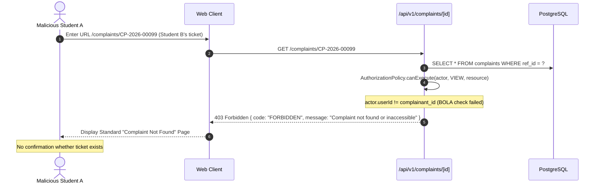

# Phase 08-A: Privacy UX Boundaries & Access Control Governance

**Document Identifier:** `12-privacy-ux-boundaries.md`  
**Classification:** Enterprise UX / Product Experience Blueprint  
**Standard:** Defines the strict information boundaries between students, departmental handlers, department heads, system administrators, and executive management.

---

## 1. Information Visibility Classification Matrix

Every data field in the Campus Plus system is classified across 5 institutional tiers:

| Information Dimension | Student / Complainant | Assigned Handler | Department Head | Institutional Management | System Administrator | Privacy Governance Rule |
| :--- | :---: | :---: | :---: | :---: | :---: | :--- |
| **Tracking Reference ID** | **FULL** | **FULL** | **FULL** | **FULL** | **FULL** | Public institutional tracking reference |
| **Complaint Title & Description** | **FULL** | **FULL** | **FULL** | **FULL** | **FULL** | Core grievance narrative |
| **Complaint Lifecycle Status** | **FULL** | **FULL** | **FULL** | **FULL** | **FULL** | Real-time status transparency (`FR-006`) |
| **Complainant Student Name** | **SELF** | **FULL** | **FULL** | **MASKED** | **FULL** | PII protection (`PRIV-001`) |
| **Complainant Roll / PRN** | **SELF** | **FULL** | **FULL** | **MASKED** | **FULL** | Student identification |
| **Complainant Phone & Email** | **SELF** | **FULL** | **FULL** | **HIDDEN** | **FULL** | Masked from executive trend views |
| **Initial Evidence Attachments** | **FULL** | **FULL** | **FULL** | **FULL** | **FULL** | Signed URL access (`SEC-005`) |
| **Assigned Handler Name** | **OFFICE / NAME** | **FULL** | **FULL** | **FULL** | **FULL** | Departmental transparency |
| **Public Progress Remarks** | **FULL** | **FULL** | **FULL** | **FULL** | **FULL** | Transparent milestones |
| **Internal Administrative Notes** | **HIDDEN** | **FULL** (Dept) | **FULL** (Dept) | **FULL** | **FULL** | **Strict Staff Secrecy (`INV-012`)** |
| **Resolution Summary Narrative** | **FULL** | **FULL** | **FULL** | **FULL** | **FULL** | Subject to student verification |
| **Resolution Proof Photos** | **FULL** | **FULL** | **FULL** | **FULL** | **FULL** | Evidence verification |
| **Full Audit Trail (Actor IDs/IPs)**| **SANITIZED** | **DEPT** | **DEPT** | **FULL** | **FULL** | Raw audit protected by trigger |
| **Other Students' Complaints** | **NONE** | **NONE** | **NONE** | **AGGREGATED** | **CONDITIONAL** | **BOLA / IDOR Defense (`SEC-002`)** |

---

## 2. Broken Object-Level Authorization (BOLA / IDOR) Defense

### 2.1 The Direct Object Reference Threat
In a complaint management system, predictable URLs like `/complaints/00000000-0000-0000-0000-000000001001` or `/complaints/CP-2026-00045` represent a primary target for horizontal privilege escalation (e.g. Student A altering the URL to view Student B's sensitive disciplinary or ragging complaint).

### 2.2 Standardized Safe Rejection Contract
- When an unauthorized user attempts to view a complaint:
  - The API returns HTTP 403 / 404 with message: `"Complaint not found or inaccessible."`
  - The UI displays the generic **Not Found / Inaccessible** error page.
  - The UI **never** discloses: "This complaint belongs to another student" or "You are not authorized to view Student John's complaint."

---

## 3. Dual-Level Remark Architecture (`INV-012`, `PRIV-002`)

To allow staff technicians, wardens, and department heads to communicate candidly without causing unnecessary alarm or leaking technical debates to students:
1. **Public Activity Feed (`PUBLIC`):**
   - Visible to the complainant student.
   - Contains formal lifecycle transitions: "Submitted", "Assigned to Civil Maintenance", "Investigation in Progress", "Resolution proposed".
   - Contains formal public remarks intended for student instructions.
2. **Internal Coordination Workspace (`INTERNAL`):**
   - Rendered in a dedicated tab on `FAC-002` titled "Internal Staff Notes".
   - Visually distinguished with a warm sand / amber header and lock icon.
   - Strictly excluded from `StudentComplaintDTO` and public timeline API endpoints.
   - Student clients receive zero bytes of internal notes in network responses.

---

## 4. Personally Identifiable Information (PII) Minimization

- **Executive Analytics Views (`MGT-001`, `MGT-002`):**
  - High-level dashboards aggregate complaints by category, department, and location.
  - Student names, email addresses, phone numbers, and roll numbers are completely omitted from analytical data payloads.
  - Prevents executive leadership from inadvertently viewing personal student grievance details during aggregate performance reviews.
