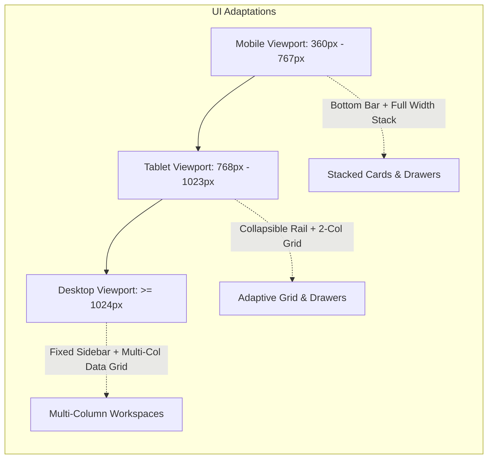

# Phase 08-A: Responsive UX Strategy & Device Breakpoint Architecture

**Document Identifier:** `13-responsive-ux-strategy.md`  
**Classification:** Enterprise UX / Product Experience Blueprint  
**Standard:** Defines multi-device layout adaptations, stacking behavior, navigation transformations, and touch ergonomics for viewports >= 360px (`NFR-008`).

---

## 1. Responsive Viewport Breakpoints

Campus Plus is architected as a **single, unified, mobile-responsive web application**. It strictly prohibits maintaining separate mobile codebases or diverting mobile users to a dumbed-down portal.

| Breakpoint Tier | Viewport Width Range | Target Devices | Primary Navigation | Layout Architecture | Data Presentation |
| :--- | :--- | :--- | :--- | :--- | :--- |
| **Mobile (`sm`)** | `360px` – `767px` | Smartphones (iPhone, Android) | Bottom Navigation Bar (4 icons) + Header Drawer | Single-column fluid stack; full-width cards | Compact Cards with tap-to-expand |
| **Tablet (`md`)** | `768px` – `1023px` | iPad, Android Tablets, Foldables | Collapsible Navigation Rail | 2-column responsive grid; contextual slide-overs | Responsive Table with horizontal scroll or card switch |
| **Desktop (`lg/xl`)** | `>= 1024px` | Laptops, Desktop Workstations | Fixed Role-Themed Sidebar (240px width) | Multi-column dashboard grid (3-4 columns) | Full Data Grids with inline actions & sortable headers |

---

## 2. Screen-by-Screen Responsive Transformation Matrix

### 2.1 `STU-001`: Student Dashboard
- **What Stays:** Top metric counters, active complaints list, primary submit action button.
- **What Stacks:** 3-column metric cards on desktop stack into a swipeable carousel or vertical stack on mobile.
- **What Becomes Floating Action Button (FAB):** The primary `[Submit New Complaint]` button converts into a floating action button on mobile bottom-right for instant thumb access.
- **What Remains Always Visible:** Active complaint reference code, status badge, and unread notification indicator.

### 2.2 `STU-002`: Complaint Intake Submission Form
- **What Stays:** Form title, input sequence, mandatory field markers, character counters.
- **What Stacks:** 2-column input rows (Category + Department, Campus + Building) stack into a clean single-column vertical flow.
- **What Collapses:** Location selectors use accordion groups on mobile to reduce initial vertical scroll.
- **Attachment Dropzone:** Converts from desktop drag-and-drop box to a native smartphone camera/file picker trigger button.
- **Action Buttons:** Submit button pins to mobile bottom screen edge with safe-area padding.

### 2.3 `STU-003` & `FAC-002`: Complaint Detail & Workspace
- **What Stays:** Reference ID header, status banner, narrative description, timeline nodes.
- **What Collapses:** On desktop, narrative and timeline render side-by-side (60/40 split). On mobile, they stack vertically, with timeline collapsible into an expandable accordion.
- **What Becomes Drawer:** The staff "Internal Notes" panel on `FAC-002` shifts from a tabbed right-hand pane on desktop to a slide-over bottom sheet on mobile.
- **Action Buttons:** Operational buttons (Resolve, Forward, Escalate) dock into a sticky bottom action bar on smartphones.

### 2.4 `FAC-001` & `HOD-001`: Operational & Triage Dashboards
- **What Stays:** Priority badges, reference codes, SLA countdown indicators.
- **What Collapses:** Wide data tables collapse into touch-friendly grievance cards displaying: Reference + Priority Tag + SLA Timer + Action Chevron.
- **What Becomes Drawer:** Technician assignment modal (`HOD-002`) renders as a slide-up bottom sheet on mobile devices.

### 2.5 `MGT-001`: Executive Dashboard
- **What Stays:** High-level KPI totals and critical escalation counts.
- **What Collapses:** Wide comparative department tables convert into ranked list cards with bar sparklines.
- **What Scrolls:** Dense analytical charts support pinch-zoom or horizontal scroll with sticky department header columns.

---

## 3. Touch Ergonomics & Mobile-First Principles
1. **Minimum Touch Target:** All buttons, interactive pills, and selector items strictly maintain a minimum touch target of **44 × 44 pixels** (`WCAG 2.1 AA`).
2. **Thumb Zone Architecture:** Primary operational triggers (Submit, Verify, Start Progress) are positioned within the natural bottom-half thumb reach zone on mobile viewports.
3. **No Horizontal Body Scroll:** Page layout wrappers strictly enforce `overflow-x: hidden` with fluid percentages and clamp functions (`clamp(1rem, 2vw, 2rem)`).
4. **Form Input Auto-Zoom Prevention:** Form inputs specify `font-size: 16px` minimum on mobile to prevent iOS Safari from triggering disruptive auto-zoom upon focus.
