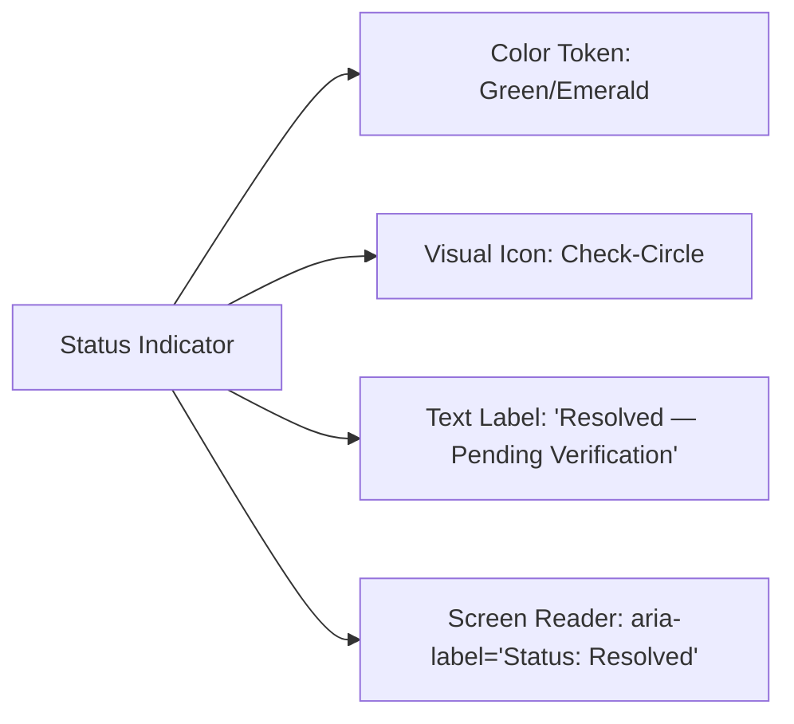

# Phase 08-A: Accessibility UX Requirements & Inclusive Design

**Document Identifier:** `14-accessibility-ux-requirements.md`  
**Classification:** Enterprise UX / Product Experience Blueprint  
**Standard:** Codifies mandatory accessibility standards targeting full **WCAG 2.1 Level AA** compliance across all interactive surfaces.

---

## 1. Foundational Accessibility Principles

In an educational institution, accessibility is an ethical imperative and institutional compliance requirement. Campus Plus must remain fully operable by students and staff with visual, motor, auditory, or cognitive disabilities.

---

## 2. Non-Color State Indicators (`Section 92`)

A core failure mode of generic UI systems is conveying critical information solely through color (e.g. green for resolved, red for escalated). **Campus Plus strictly prohibits conveying status or error exclusively through color.**

Every state indicator combines 4 distinct sensory channels:
1. **Semantic Color Token:** Muted background and high-contrast text.
2. **Distinct Icon Symbol:**
   - *Submitted:* Clock / Inbox icon
   - *Assigned:* User-check icon
   - *In Progress:* Wrench / Gear icon
   - *Escalated:* Exclamation-triangle alert icon
   - *Resolved:* Check-circle icon
   - *Closed:* Lock / Shield icon
   - *Duplicate:* Link / Copy icon
3. **Explicit Text Label:** Exact textual state name displayed visibly alongside the icon.
4. **ARIA Role & Live Attribute:** Programmatic screen-reader accessibility labels.

---

## 3. Color Contrast Ratios (WCAG AA Standards)

All text, icons, and interactive borders must meet or exceed WCAG 2.1 AA minimum contrast thresholds:
- **Normal Text (< 18pt):** Minimum contrast ratio of **4.5:1** against surrounding surface.
- **Large Text (>= 18pt or >= 14pt bold):** Minimum contrast ratio of **3.0:1**.
- **UI Components & Interactive Borders:** Minimum contrast ratio of **3.0:1** against background.

### Audit of Locked Role Palettes vs WCAG 4.5:1 Target
- **Student Text (`#33475B`) on Surface (`#FAFCFE`):** Contrast ratio **9.1:1** ([x] **PASS**)
- **Handler Text (`#2E4A42`) on Surface (`#FAFDFC`):** Contrast ratio **8.9:1** ([x] **PASS**)
- **HOD Text (`#43395A`) on Surface (`#FCFAFE`):** Contrast ratio **10.2:1** ([x] **PASS**)
- **Director Text (`#37495A`) on Surface (`#FBFCFD`):** Contrast ratio **8.8:1** ([x] **PASS**)
- **Management Text (`#5C333A`) on Surface (`#FEFAFA`):** Contrast ratio **9.5:1** ([x] **PASS**)

---

## 4. Keyboard Navigation & Focus Governance
1. **Logical Tab Sequence:** Keyboard tab order mirrors the visual layout: Header -> Primary Navigation -> Page Header -> Main Action -> Content Panels -> Footer.
2. **Unambiguous Focus Indicators:** All focusable elements (buttons, links, inputs, cards) display a high-contrast focus ring: `outline: 2px solid #33475B; outline-offset: 2px;`.
3. **Modal Focus Trapping:** When dialogs open (`STU-004`, `FAC-003`, `FAC-005`), keyboard focus is trapped within the active dialog. Pressing `Escape` closes the dialog and restores focus to the triggering element.
4. **Global Keyboard Shortcuts:**
   - `Ctrl + K` (or `Cmd + K`): Opens Multi-Criteria Search Modal (`SHR-002`).
   - `Escape`: Closes open modals, drawers, and menus.

---

## 5. Screen-Reader Experience (Assistive Technology)
1. **Semantic HTML Structure:** Pages use native `<header>`, `<nav>`, `<main>`, `<aside>`, `<footer>`, `<section>`, and `<article>` landmarks.
2. **Heading Order:** Every screen enforces a strict heading hierarchy: single `<h1>` per page, followed by sequential `<h2>` and `<h3>`. Zero skipped heading levels.
3. **Form Error Association:** Form validation errors are programmatically bound to inputs via `aria-describedby="input-error-id"`, with invalid inputs flagged using `aria-invalid="true"`.
4. **Live Announcements (`aria-live`):**
   - Status updates and incoming notifications use `aria-live="polite"` to avoid interrupting screen reader speech.
   - Critical timeout warnings or submission errors use `aria-live="assertive"`.

---

## 6. Motion, Zoom & Ergonomic Accommodations
1. **Reduced Motion:** If user system specifies `prefers-reduced-motion: reduce`, all layout transitions, drawer slide-ins, and pulse animations are completely disabled (`transition: none !important; animation: none !important;`).
2. **Text Resizing:** The layout supports resizing up to **200% zoom** without text truncation, layout overlapping, or loss of content.
