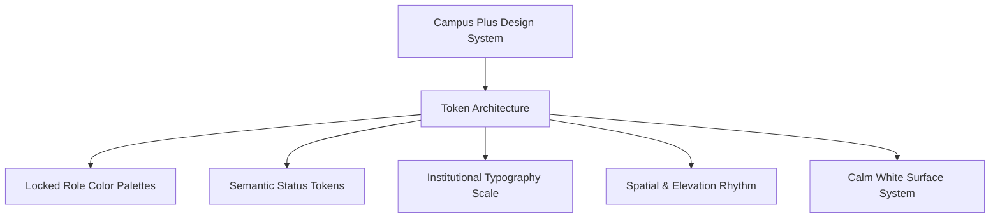

# Phase 08-A: Design System Foundation & Locked Role Palettes

**Document Identifier:** `15-design-system-foundation.md`  
**Classification:** Enterprise UX / Product Experience Blueprint  
**Standard:** Codifies the design tokens, locked institutional role palettes, semantic status tokens, typography, and visual language rules.

---

## 1. Design System Philosophy

Campus Plus design system embodies a **calm, institutional, trustworthy, and human** visual identity. It rejects flashy consumer gradients, neon glows, and generic AI templates in favor of crisp typography, generous whitespace, and role-themed accents.

---

## 2. Locked Institutional Role Color Palettes (`Section 14`)

The following role color specifications are **IMMUTABLE** and codified verbatim from institutional design governance:

### Role 1: Student / Complainant (`ROLE_STUDENT`, `ROLE_FACULTY`)
- **Primary:** `#7FA8D9` (Calm Institutional Blue)
- **Secondary:** `#B8D0EC` (Soft Sky Blue)
- **Accent:** `#EAF2FB` (Subtle Ice Blue)
- **Surface:** `#FAFCFE` (Clean Off-White)
- **Text:** `#33475B` (Deep Slate Charcoal)

### Role 2: Faculty Handler / Technician (`ROLE_HANDLER`)
- **Primary:** `#7FC4B2` (Sage Operational Teal)
- **Secondary:** `#B7E0D3` (Muted Mint)
- **Accent:** `#E9F6F1` (Pale Foam)
- **Surface:** `#FAFDFC` (Clean Mint Tint)
- **Text:** `#2E4A42` (Deep Forest Charcoal)

### Role 3: Department Authority / Head of Department (`ROLE_DEPT_HEAD`)
- **Primary:** `#B39DDB` (Dignified Lavender Purple)
- **Secondary:** `#D6C6EC` (Soft Lilac)
- **Accent:** `#F3EDFA` (Pale Iris)
- **Surface:** `#FCFAFE` (Clean Violet Tint)
- **Text:** `#43395A` (Deep Plum Slate)

### Role 4: Senior Authority / System Administrator (`ROLE_ADMIN`)
- **Primary:** `#9FB4C7` (Steel Authority Slate)
- **Secondary:** `#C7D5E0` (Muted Blue-Gray)
- **Accent:** `#EEF3F7` (Pale Mist)
- **Surface:** `#FBFCFD` (Clean Gray Tint)
- **Text:** `#37495A` (Deep Iron Charcoal)

### Role 5: College Body / Institutional Management (`ROLE_MANAGEMENT`)
- **Primary:** `#E3A6AE` (Executive Rosewood)
- **Secondary:** `#F0C9CE` (Soft Blush)
- **Accent:** `#FBEDEF` (Pale Rose Tint)
- **Surface:** `#FEFAFA` (Clean Rose Tint)
- **Text:** `#5C333A` (Deep Burgundy Charcoal)

---

## 3. Role Color Governance (`Section 16`)

Role colors are applied systematically to establish instant institutional context without visual chaos:
1. **Top Shell Header Accent:** A 3px colored accent bar along the top header matches the active role's Primary color.
2. **Active Navigation Pill:** The currently selected sidebar navigation item uses the role's Accent background and Primary text.
3. **Primary Call to Action:** Key action buttons (`Submit`, `Verify`, `Assign`) utilize the role's Primary color as background with white high-contrast text.
4. **Card Borders:** Cards utilize subtle neutral borders (`#E2E8F0`), with featured metric widgets adopting the role's Accent surface.

---

## 4. Semantic Status Color Tokens

Complaint statuses are governed by consistent semantic tokens across all roles:

| Lifecycle Status | Background Token | Text Token | Border Token | Semantic Meaning |
| :--- | :--- | :--- | :--- | :--- |
| **`DRAFT`** | `#F1F5F9` (Slate-100) | `#475569` (Slate-600) | `#CBD5E1` (Slate-300) | Draft / Not Submitted |
| **`SUBMITTED`** | `#EFF6FF` (Blue-50) | `#1D4ED8` (Blue-700) | `#BFDBFE` (Blue-200) | Awaiting Department Triage |
| **`REVIEWED`** | `#EEF2FF` (Indigo-50) | `#4338CA` (Indigo-700) | `#C7D2FE` (Indigo-200) | Verified & In Triage Queue |
| **`ASSIGNED`** | `#F0FDFA` (Teal-50) | `#0F766E` (Teal-700) | `#99F6E4` (Teal-200) | Technician Allocated |
| **`IN_PROGRESS`** | `#ECFDF5` (Emerald-50)| `#047857` (Emerald-700)| `#A7F3D0` (Emerald-200)| Active Remediation |
| **`FORWARDED`** | `#FFFBEB` (Amber-50) | `#B45309` (Amber-700) | `#FDE68A` (Amber-200) | Transferred Cross-Dept |
| **`ESCALATED`** | `#FFF1F2` (Rose-50) | `#BE123C` (Rose-700) | `#FECDD3` (Rose-200) | Elevated to Supervisory Tier |
| **`RESOLVED`** | `#F0FDF4` (Green-50) | `#15803D` (Green-700) | `#BBF7D0` (Green-200) | Remediated; Verify Pending |
| **`CLOSED`** | `#F8FAFC` (Slate-50) | `#64748B` (Slate-500) | `#E2E8F0` (Slate-200) | Permanently Closed |
| **`REOPENED`** | `#FFF7ED` (Orange-50) | `#C2410C` (Orange-700)| `#FED7AA` (Orange-200)| Resolution Disputed |
| **`REJECTED`** | `#FEF2F2` (Red-50) | `#B91C1C` (Red-700) | `#FECACA` (Red-200) | Triage Rejection |
| **`DUPLICATE`** | `#FAF5FF` (Purple-50) | `#7E22CE` (Purple-700)| `#E9D5FF` (Purple-200)| Linked to Master Reference |
| **`CANCELLED`** | `#F1F5F9` (Slate-100) | `#64748B` (Slate-500) | `#CBD5E1` (Slate-300) | Submitter Withdrawn |

---

## 5. Typography System (`Section 72`)

Standardized on modern, crisp, institutional sans-serif font family (`system-ui, -apple-system, BlinkMacSystemFont, 'Segoe UI', Roboto, sans-serif`):

| Type Level | Size | Weight | Line Height | Usage Context |
| :--- | :---: | :---: | :---: | :--- |
| **Display Header** | `28px` (1.75rem) | Bold (700) | 1.2 | Top dashboard titles, welcome hero |
| **Page Title (`h1`)**| `22px` (1.375rem) | SemiBold (600)| 1.3 | Screen headlines (`STU-002`, `STU-003`) |
| **Section Header (`h2`)**| `18px` (1.125rem) | SemiBold (600)| 1.4 | Card headers, widget section dividers |
| **Card Subtitle (`h3`)**| `15px` (0.9375rem)| Medium (500) | 1.4 | Form section headers, table headers |
| **Body Text** | `14px` (0.875rem) | Regular (400) | 1.5 | Complaint descriptions, narrative copy |
| **Small / Metadata**| `12px` (0.75rem) | Regular (400) | 1.4 | Timestamps, author role tags, captions |
| **Monospace Reference**| `13px` (0.8125rem)| Medium (500) | 1.4 | Tracking references (`CP-YYYY-XXXXX`) |

---

## 6. Spatial Rhythm, Borders & Shadows
- **Base Grid:** 4px baseline unit. Standard margins and paddings: `8px`, `12px`, `16px`, `24px`, `32px`.
- **Border Radius:**
  - Badges & Pills: `9999px` (Full pill).
  - Buttons & Inputs: `6px` (Restrained modern radius).
  - Cards & Panels: `8px` or `12px` (Subtle curvature).
- **Subtle Elevation / Shadows:**
  - Flat Card: `border: 1px solid #E2E8F0; box-shadow: 0 1px 2px 0 rgba(0, 0, 0, 0.05);`
  - Floating Modal / Drawer: `box-shadow: 0 10px 15px -3px rgba(0, 0, 0, 0.1);`
