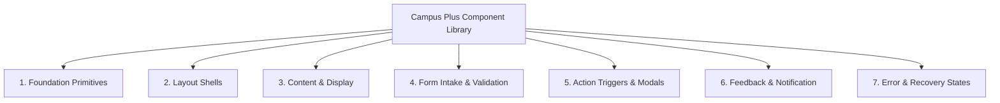

# Phase 08-A: Component Taxonomy & State Architecture

**Document Identifier:** `16-component-taxonomy.md`  
**Classification:** Enterprise UX / Product Experience Blueprint  
**Standard:** Catalogs all reusable frontend component primitives across 7 architectural tiers, defining the 9 canonical interaction states.

---

## 1. Reusable Component Taxonomy Index

### 1.1 Tier 1: Foundation Primitives
- `Typography`: Text, Heading, MonospaceCode, Label, Caption.
- `Icon`: Accessible SVG wrapper with standard sizes (`16px`, `20px`, `24px`) and aria-hidden semantics.
- `ColorToken`: Semantic role and status color wrapper.
- `Divider`: Subtle horizontal and vertical separation rules.

### 1.2 Tier 2: Layout Shells
- `AppShell`: Global container integrating Header, Sidebar, Main Content, and Notification Drawer.
- `PageContainer`: Responsive centered container with max-width bounds (`1280px`).
- `ResponsiveGrid`: 12-column grid collapsing gracefully on mobile.
- `Stack`: Vertical or horizontal layout container with strict gap tokens (`gap-2`, `gap-4`, `gap-6`).

### 1.3 Tier 3: Content & Display
- `Card`: Primary surface component (extends existing `src/presentation/components/Card.tsx`) with header, body, and action footer slots.
- `MetricCard`: KPI display showing number, label, icon, and trend badge.
- `DataTable`: Responsive tabular list with sortable columns, pagination controls, and empty state slot.
- `Timeline`: Chronological audit trail component rendering public milestone nodes or internal staff logs.
- `StatusBadge`: Semantic pill component combining status token, visual icon, and screen-reader label (`SHR-003`).

### 1.4 Tier 4: Form Intake & Validation
- `TextInput`: Accessible single-line input with prefix/suffix icons and live character counters.
- `Textarea`: Auto-expanding multi-line text input with minimum/maximum character trackers.
- `SelectDropdown`: Accessible single-select dropdown with keyboard search filtering.
- `RadioGroup`: Multi-option radio cards for priority and category selection.
- `FileUploadDropzone`: File dropzone with progress bar, drag-and-drop feedback, and MIME/size validators.

### 1.5 Tier 5: Action Triggers & Modals
- `Button`: Primary, Secondary, Outline, Ghost, and Destructive variants.
- `IconButton`: Accessible circular icon button for search, notifications, and menu toggles.
- `ModalDialog`: Centered overlay modal with backdrop blur, focus trapping, and escape dismiss.
- `SlideOverDrawer`: Right-hand slide-over drawer for notifications and internal notes.
- `ConfirmationModal`: High-friction confirmation dialog for irreversible lifecycle transitions (Verify, Dispute, Reject).

### 1.6 Tier 6: Feedback & Notification
- `ToastNotification`: Non-modal transient notification appearing top-right (auto-dismiss 5s).
- `AlertBanner`: High-prominence contextual alert banner (Info, Success, Warning, Error).
- `SkeletonLoader`: Shimmer loading placeholder mirroring table and card shapes.
- `EmptyState`: Contextual zero-data display with explanation and action button (`SHR-005`).

### 1.7 Tier 7: Error & Recovery States
- `NotFoundError`: Clean 404 screen with tracking reference search box.
- `ForbiddenError`: Safe 403 access-denied screen protecting private records.
- `ConflictModal`: OCC version collision dialog offering refresh and work preservation.

---

## 2. Canonical 9-State Interactive Component Model (`Section 71`)

Every interactive component (buttons, inputs, select fields, cards) must define its visual behavior across 9 standard states:

| Component State | Visual Behavior & Style Representation | Focus / ARIA Attributes | User Action / Event Trigger |
| :--- | :--- | :--- | :--- |
| **1. Default** | Base resting state; subtle neutral border; role-themed or neutral surface | Standard DOM tab order | Element loaded and idle |
| **2. Hover** | Background shifts by 5% lightness; subtle shadow elevation increases | None | Mouse cursor enters bounding box |
| **3. Focus** | 2px high-contrast solid outline; 2px offset; outline color matches role slate | `outline: 2px solid #33475B` | Keyboard Tab navigation onto element |
| **4. Active** | Scale transform 0.98; background shifts to darker pressed tone | `:active` | Mouse click down / touch press down |
| **5. Selected** | Role accent background; primary color border; checkmark or radio pill filled | `aria-selected="true"`, `aria-checked="true"` | User selects item or tab |
| **6. Disabled** | Opacity 50%; cursor `not-allowed`; pointer-events none; no hover response | `disabled`, `aria-disabled="true"` | Action unavailable by business rule |
| **7. Loading** | Content hidden or dimmed; inline spinner replaces text; pointer-events none | `aria-busy="true"`, `aria-live="polite"` | In-flight asynchronous API mutation |
| **8. Error** | Red border (`#EF4444`); red error text below input; warning icon appears | `aria-invalid="true"`, `aria-describedby` | Client or server validation rejection |
| **9. Success** | Green border (`#10B981`); checkmark icon confirmation; transient success pulse | `aria-live="polite"` | Operation completed successfully |
