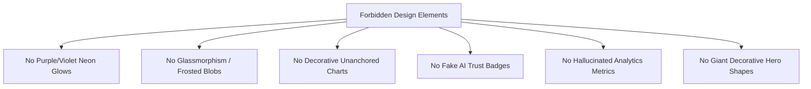

# Phase 08-A: Anti-AI Design Governance & Visual Authenticity

**Document Identifier:** `17-anti-ai-design-rules.md`  
**Classification:** Enterprise UX / Product Experience Blueprint  
**Standard:** Prohibits generic AI aesthetic clichés, decorative gimmicks, unverified metrics, and ungrounded visual filler.

---

## 1. The Anti-AI Design Principle

Modern enterprise software frequently suffers from "AI slop" — designs generated by superficial AI prompting characterized by purple-violet neon glows, translucent glassmorphism cards, arbitrary animated particle backgrounds, and meaningless decorative charts.

**Campus Plus is a serious institutional grievance resolution product.** It handles sensitive issues including infrastructure breakdowns, hostel safety, academic evaluations, and disciplinary grievances. Its visual presentation must communicate **institutional dignity, accountability, calmness, and rigorous truth**.

---

## 2. Forbidden Visual Clichés & Prohibited Anti-Patterns

### Prohibited Item Catalog
1. **NO Neon Gradients & Glows:** No purple-to-cyan gradient borders, no ambient glowing buttons, and no floating glowing dots.
2. **NO Glassmorphism / Translucent Blur Blobs:** No `backdrop-filter: blur(20px)` layered over floating colored spheres. Backgrounds must be clean, solid, institutional white (`#FFFFFF`, `#FAFCFE`).
3. **NO Decorative / Fake Charts:** No sparklines or area charts added purely to fill empty card space without binding to real backend data.
4. **NO Invented Metrics (`Section 86`):**
   - No "AI Sentiment Score"
   - No "Grievance Satisfaction Index (98.4%)"
   - No "Department Efficiency Ranking"
   - No "Resolution Probability Predictor"  
   *Rule: If a metric is not calculated by an implemented database query or view, it must be labeled **`METRIC DEFINITION REQUIRED`** or omitted.*
5. **NO Fake AI Badges:** No "Powered by Autonomous AI Triage", "Blockchain Grievance Verification", or generic sparkles icons on buttons.
6. **NO Giant Useless Pill Buttons:** Actions must be sized appropriately for desktop and mobile workflows, not giant oversized pill buttons dominating the screen.

---

## 3. The 3 Functional Justification Questions (`Section 74`)

Before any visual element, widget, border, or animation is permitted into the Campus Plus design system, it must satisfy three rigorous questions:

1. **Why does this element exist?**  
   *Must have an explicit purpose tied to a user requirement or business rule (e.g. "To display the 5-day verification countdown timer per BR-016").*
2. **What user problem does it solve?**  
   *Must directly aid in grievance submission, tracking, triage, remediation, or accountability.*
3. **What specific information does it communicate?**  
   *Must deliver factual, unambiguous institutional data.*

**Rule:** If a designer or engineer cannot provide a direct, factual answer to all three questions, **THE ELEMENT MUST BE REMOVED IMMEDIATELY.**
