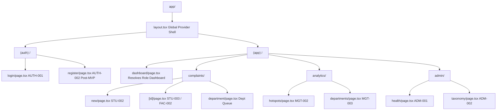

# Phase 08-A: Frontend Routing Architecture & Navigation UX

**Document Identifier:** `18-frontend-routing-ux.md`  
**Classification:** Enterprise UX / Product Experience Blueprint  
**Standard:** Defines the conceptual Next.js App Router structure, role-based route guards, deep-linking contracts, and safe unauthenticated/unauthorized recovery behaviors.

---

## 1. Conceptual Next.js App Router Architecture

Campus Plus utilizes Next.js App Router route groups to enforce role boundaries while sharing common layouts and authenticated session providers.

---

## 2. Comprehensive Route Specification Matrix

| Conceptual Route Path | Allowed Roles | Screen ID | Functional Purpose | Entry Navigation | Deep-Link Behavior | Unauthorized Access (403) | Not Found (404) |
| :--- | :--- | :--- | :--- | :--- | :--- | :--- | :--- |
| `/login` | Public | `AUTH-001` | User sign-in & authentication | Direct, redirect on unauth | Clean render | N/A | N/A |
| `/dashboard` | All Authenticated | Dynamic | Role-specific primary landing | Root entry after auth | Renders role view | Redirect to `/login` | N/A |
| `/complaints/new` | `ROLE_STUDENT`, `ROLE_FACULTY` | `STU-002` | Intake submission form | Dashboard FAB / button | Direct to form | 403 Forbidden | N/A |
| `/complaints` | All Authenticated | List | Scoped complaints portfolio | Sidebar "Complaints" | Direct with query params | Redirect to `/login` | N/A |
| `/complaints/[id]` | Authorized Stakeholder | `STU-003` / `FAC-002` | Single complaint workspace | Card click, notif link | Accepts UUID or Tracking Code | Safe 403 (No existence leak) | 404 Not Found Page |
| `/complaints/department` | `ROLE_HANDLER`, `ROLE_DEPT_HEAD` | Queue | Department-wide ticket queue | Staff sidebar | Direct navigation | 403 Forbidden | N/A |
| `/analytics/hotspots` | `ROLE_MANAGEMENT`, `ROLE_DEPT_HEAD` | `MGT-002` | Recurrence cluster explorer | Analytics sidebar | Direct navigation | 403 Forbidden | N/A |
| `/analytics/departments`| `ROLE_MANAGEMENT` | `MGT-003` | Turnaround comparison matrix | Management sidebar | Direct navigation | 403 Forbidden | N/A |
| `/admin/audit` | `ROLE_ADMIN` | `ADM-001` | Immutable audit log viewer | Admin sidebar | Direct navigation | 403 Forbidden | N/A |
| `/admin/taxonomy` | `ROLE_ADMIN` | `ADM-002` | Dept & category management | Admin sidebar | Direct navigation | 403 Forbidden | N/A |

---

## 3. Deep-Linking & Authorization Guards
1. **Dynamic Complaint Resolution:** `/complaints/[id]` inspects the identifier format:
   - If formatted as `CP-YYYY-XXXXX`, resolves via `findByTrackingCode`.
   - If formatted as UUID v4, resolves via `findById`.
2. **Safe Unauthorized Rejection (BOLA Defense):** If a student navigates to a valid complaint belonging to another user, the client renders the standardized **"Complaint Inaccessible"** screen without revealing submitter name or department.
3. **Session Loss During Flow:** If an auth session expires while filling a multi-step form, the client caches the form draft in memory, routes to `/login`, and returns the user to the form with state intact upon re-authentication.
