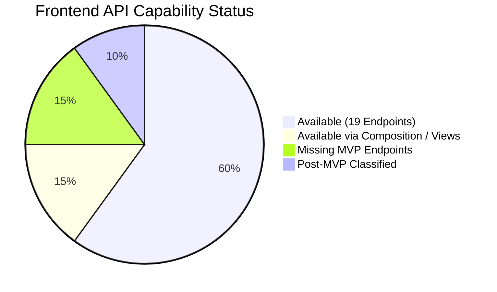

# Phase 08-A: Forensic Frontend API Gap Register

**Document Identifier:** `20-frontend-api-gaps.md`  
**Classification:** Enterprise UX / Product Experience Blueprint  
**Standard:** Forensic audit identifying every data point and action required by the UX that lacks a dedicated Next.js API endpoint.

---

## 1. API Gap Audit Overview

A strict audit of `src/app/api/` versus the UX requirements (`02-requirement-to-ux-traceability.md`, `06-screen-inventory.md`) identifies **12 functional areas** requiring composition, new endpoints, or post-MVP classification.

---

## 2. Comprehensive API Gap Register

| Gap ID | Required UX Capability | Consuming Screen | Current Repository State | Classification | Recommended Engineering Resolution | Impact on Phase 08-B |
| :--- | :--- | :--- | :--- | :---: | :--- | :--- |
| **`GAP-001`** | **In-App Notifications Retrieval** | `SHR-001` Header Drawer | Table `notifications` exists (`00005`), index exists (`00007`), RLS exists (`00008`), but **no `GET /api/v1/notifications` route exists**. | **MISSING (MVP)** | Implement `GET /api/v1/notifications` querying table where `recipient_id = auth.uid()`. | High (Blocks live inbox) |
| **`GAP-002`** | **Mark Notification as Read** | `SHR-001` Header Drawer | Table column `is_read` exists; **no mutation route exists**. | **MISSING (MVP)** | Implement `PATCH /api/v1/notifications/[id]/read`. | High |
| **`GAP-003`** | **Active Categories Lookup** | `STU-002` Intake Form | Table `categories` exists (`00002`); **no `GET /api/v1/categories` route exists**. | **MISSING (MVP)** | Implement cached `GET /api/v1/categories` endpoint. | Blocker for dynamic form |
| **`GAP-004`** | **Active Departments Lookup** | `FAC-003` Forwarding Modal | Table `departments` exists (`00002`); **no `GET /api/v1/departments` route exists**. | **MISSING (MVP)** | Implement cached `GET /api/v1/departments` endpoint. | Blocker for forwarding |
| **`GAP-005`** | **Department Handlers Lookup** | `HOD-002` Assignment Modal | Tables `department_memberships` and `users` exist; **no handler lookup route exists**. | **MISSING (MVP)** | Implement `GET /api/v1/departments/[id]/handlers`. | Blocker for assignment |
| **`GAP-006`** | **Campus Locations Lookup** | `STU-002` Intake Form | Table `locations` exists (`00002`); **no `GET /api/v1/locations` route exists**. | **MISSING (MVP)** | Implement `GET /api/v1/locations` endpoint. | Medium (Can use freetext) |
| **`GAP-007`** | **Recurring Clusters Feed** | `MGT-002`, `HOD-001` | Database view `recurring_complaint_clusters` exists (`00009`), **no API route exposes it**. | **AVAILABLE WITH COMPOSITION** | Implement `GET /api/v1/analytics/recurring-clusters`. | Medium |
| **`GAP-008`** | **Department SLA Performance** | `MGT-003` Matrix | Database view `department_sla_performance` exists (`00009`), **no API route exposes it**. | **AVAILABLE WITH COMPOSITION** | Implement `GET /api/v1/analytics/department-sla`. | Medium |
| **`GAP-009`** | **Dashboard KPI Summaries** | `STU-001`, `FAC-001`, `MGT-001`| Client currently must fetch full complaint list with counts. | **AVAILABLE WITH COMPOSITION** | Implement aggregate `GET /api/v1/complaints/summary`. | Low (Can compose client-side) |
| **`GAP-010`** | **User Profile Update** | Header Profile Modal | Table `users` exists; **no update route exists**. | **POST-MVP** | Defer to Post-MVP (Profile is read-only in MVP). | None |
| **`GAP-011`** | **SLA Policy Configuration** | `ADM-002` Taxonomy | Table `sla_policies` exists; **no admin CRUD route exists**. | **POST-MVP** | Managed via SQL migrations in MVP. | None |
| **`GAP-012`** | **Transactional Email Dispatch** | Background worker | Port `NotificationPort.sendEmail` exists; adapter uses in-app only. | **POST-MVP** | Formally deferred per `OD-011`. | None |
