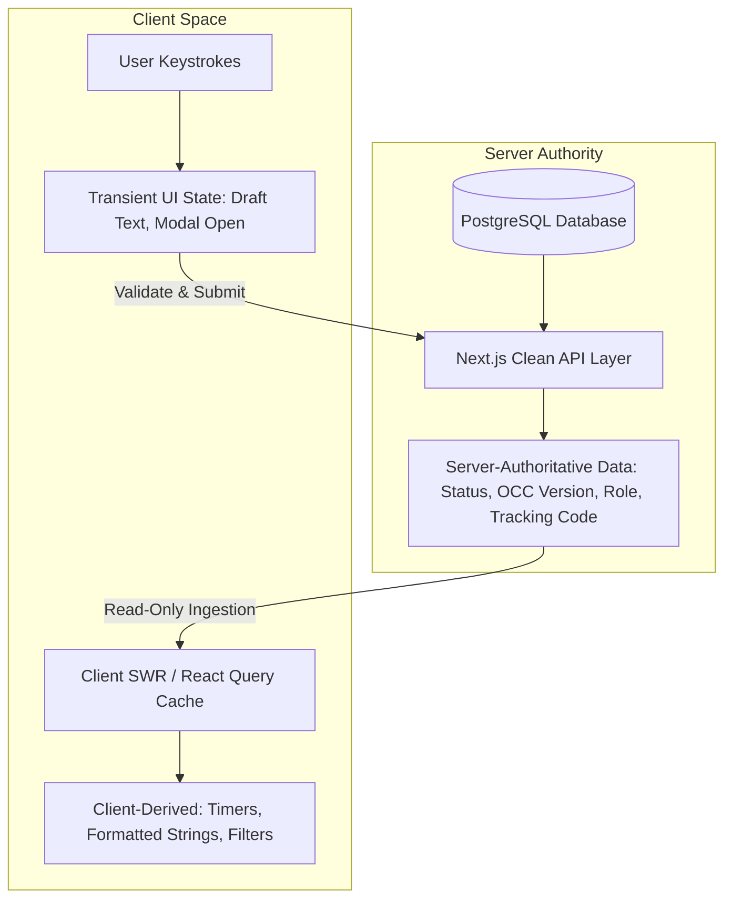

# Phase 08-A: Frontend Data Ownership & Authority Boundaries

**Document Identifier:** `21-frontend-data-ownership.md`  
**Classification:** Enterprise UX / Product Experience Blueprint  
**Standard:** Codifies absolute separation between server-authoritative data, client-derived state, and transient UI memory.

---

## 1. The Single Source of Truth Principle

A critical flaw in enterprise applications is allowing client-side state managers (e.g. Redux, Zustand, React Context) to become pseudo-authoritative over domain truth.

**Architecture Rule:** In Campus Plus, the frontend is an **untrusted presentation consumer**. The PostgreSQL database and clean domain model remain the sole authoritative arbiters of grievance truth.

---

## 2. Complete Data Ownership Classification

| Data Dimension | Authority Realm | Persistence Mechanism | Mutation Rules | Client Role |
| :--- | :--- | :--- | :--- | :--- |
| **User Role & Claims** | **Server** | Supabase Auth + `user_roles` table | Strictly immutable on client; derived from DB session | Ingests read-only `actor.role` |
| **Department Binding** | **Server** | `department_memberships` table | Server database query | Ingests read-only `actor.departmentId` |
| **Complaint Status** | **Server** | `complaints.status` enum | Mutated solely via verified domain use cases | Displays badge; triggers state APIs |
| **OCC Version** | **Server** | `complaints.version` integer | Incremented atomically on every aggregate save | Passes `expectedVersion` in requests |
| **Tracking Reference** | **Server** | `complaints.ref_id` (`CP-YYYY-XXXXX`)| Allocated via PostgreSQL sequence `tracking_code_seq` | Displays and copies reference string |
| **Audit Records** | **Server** | `action_history` table | Append-only via database trigger (`INV-011`) | Renders timeline milestones |
| **Form Inputs (In-Flight)**| **Client** | React Hook / Local Component State | Mutated by user typing; cleared on successful submit | Authoritative for uncommitted draft |
| **Filter & Search Toggles**| **Client** | URL Search Params (`?status=...`) | Mutated by user clicking filter tabs or search box | Drives query parameters sent to API |
| **Modal / Drawer States** | **Client** | React Component State | Local boolean toggles (`isOpen: boolean`) | Controls visual overlay presentation |
| **SLA Countdown Timer** | **Client-Derived**| Computed from `sla_due_at` | Calculated in memory: `sla_due_at - Date.now()` | Renders countdown string (e.g. "14h left")|
