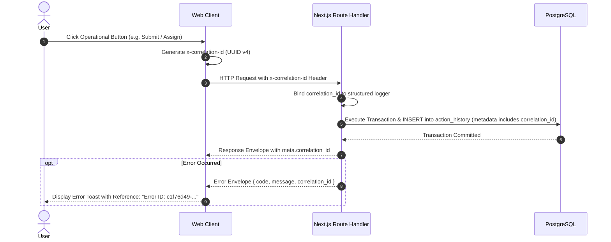

# Phase 08-A: UX Observability, Correlation Tracing & User Telemetry

**Document Identifier:** `22-ux-observability.md`  
**Classification:** Enterprise UX / Product Experience Blueprint  
**Standard:** Defines client-side telemetry capture, distributed correlation tracing (`x-correlation-id`), error reporting, and privacy sanitization.

---

## 1. Distributed Tracing & Correlation ID Lifecycle

Every operational user action initiates an unbroken audit and observability chain linking client clicks to database triggers:

---

## 2. Observable User Interactions Catalog

| Monitored Interaction | Triggering Screen | Emitted Telemetry Event | Contextual Metadata Captured | Performance Target |
| :--- | :--- | :--- | :--- | :---: |
| **Complaint Submission** | `STU-002` | `ux.complaint.submit` | Category ID, Suggested Priority, Has Attachments (T/F) | `< 800ms` API time |
| **File Upload Pre-flight**| `STU-002` | `ux.attachment.upload` | MIME Type, File Size (Bytes), Duration | Direct S3 throughput |
| **Worklist Task Select** | `FAC-001` | `ux.handler.task_open` | Ticket Priority, Overdue Status | `< 300ms` view render |
| **Start Progress** | `FAC-002` | `ux.complaint.progress` | Elapsed time since assignment | `< 500ms` API time |
| **Forward Complaint** | `FAC-003` | `ux.complaint.forward` | From Dept ID, To Dept ID, Rationale Length | `< 500ms` API time |
| **Escalate Ticket** | `FAC-004` | `ux.complaint.escalate` | Target Tier, Reason Category | `< 500ms` API time |
| **Resolve Complaint** | `FAC-005` | `ux.complaint.resolve` | Category, Proof Attached (T/F), SLA Met (T/F) | `< 800ms` API time |
| **Verify Resolution** | `STU-004` | `ux.complaint.verify` | Elapsed days since resolution | `< 500ms` API time |
| **Dispute Resolution** | `STU-004` | `ux.complaint.dispute` | Reason Length, Days elapsed | `< 500ms` API time |
| **Search Query** | `SHR-002` | `ux.search.execute` | Filter count, Has code match, Result count | `< 300ms` query latency |
| **Form Validation Error**| `STU-002` | `ux.validation.failure` | Offending field name, Error rule code | Client-side immediate |
| **OCC Conflict Collision**| All Screens | `ux.concurrency.conflict` | Expected Version vs Database Version | Surfaced immediately |

---

## 3. Telemetry Privacy & PII Sanitization Safeguards

To prevent student data leaks into operational logs or third-party monitoring:
1. **Zero Text Payload Logging:** Telemetry events **never** record grievance titles, descriptions, comments, or resolution notes. Only metadata (e.g. `char_length`) is transmitted.
2. **Zero PII Logging:** Student names, roll numbers, phone numbers, and email addresses are strictly scrubbed before client log events dispatch.
3. **Password & Credential Masking:** All authentication credentials and session tokens are completely blocked from client error logging.
