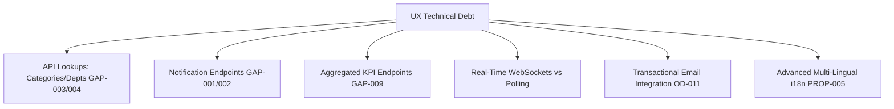

# Phase 08-A: UX Technical Debt Register

**Document Identifier:** `28-ux-debt-register.md`  
**Classification:** Enterprise UX / Product Experience Blueprint  
**Standard:** Explicitly catalogs all design decisions, API dependencies, and visual capabilities intentionally deferred, ensuring deferred decisions do not silently turn into accidental implementation assumptions.

---

## 1. UX Debt Governance

UX debt in Campus Plus represents **conscious engineering trade-offs** designed to accelerate MVP delivery without compromising security boundaries, data integrity, or core grievance workflows.

---

## 2. Master UX Debt Register

| Debt ID | Title & Description | Status | Rationale for Intentional Deferral | MVP Containment / Mitigation | Phase 08-B / Future Target |
| :--- | :--- | :---: | :--- | :--- | :--- |
| **`UXDEBT-001`** | **Dynamic Category & Department Retrieval Endpoints** | **Deferred by Design** | Core domain and DB tables exist, but API endpoints `/api/v1/categories` and `/api/v1/departments` were not in Phase 06 baseline. | Client form uses static enum mirrors or server-side layout pre-fetching in Phase 08-B. | Phase 08-B Sprint 1 |
| **`UXDEBT-002`** | **Notification Drawer Ingestion Routes** | **Deferred by Design** | PostgreSQL `notifications` table and RLS policies are live, but `GET /api/v1/notifications` route was deferred. | Notification bell badge stubbed to local storage or polling mock; route implemented in Phase 08-B. | Phase 08-B Sprint 1 |
| **`UXDEBT-003`** | **Pre-Aggregated Dashboard KPI Summaries** | **Deferred by Design** | Aggregations can be computed on-the-fly from existing `GET /api/v1/complaints` list query. | Client performs client-side counting over filtered complaint arrays for MVP. | Phase 08-B Sprint 2 |
| **`UXDEBT-004`** | **Configurable SLA Target Admin Panel** | **Deferred by Design** | `sla_policies` table supports database-level configuration; custom admin GUI is not required for core grievance flow. | SLA thresholds managed via database seed migrations (`00005`); UI displays provisional defaults with "TARGET" tag. | Post-MVP |
| **`UXDEBT-005`** | **Institution-Specific Campus Taxonomy Mapping** | **Deferred by Design** | Generalized organizational hierarchy (Campus -> Building -> Block -> Room) allows deployment to any tertiary institution. | Generalized hierarchy parameterized in database tables (`locations`, `departments`). | Post-MVP |
| **`UXDEBT-006`** | **Transactional Email & SMS Notifications** | **Deferred by Design** | External SMTP/SMS providers introduce operational cost, spam reputation management, and mock dependencies in staging. | In-app notification center handles all stakeholder alerting in MVP per `OD-011`. | Post-MVP |
| **`UXDEBT-007`** | **AI / Vector Recurrence Clustering** | **Deferred by Design** | LLM embedding clusters add latency, non-deterministic groupings, and GPU hosting overhead. | Deterministic relational SQL aggregation (`recurring_complaint_clusters`) deployed via migration `00009`. | Post-MVP |
| **`UXDEBT-008`** | **Real-Time WebSocket Notification Streaming** | **Deferred by Design** | Supabase Realtime / WebSockets require persistent connection management and reconnection backoff logic. | Client notification center employs window focus revalidation and periodic 60s background polling for MVP. | Post-MVP |
| **`UXDEBT-009`** | **Post-Resolution Satisfaction Star Rating** | **Deferred by Design** | Verification is modeled as a formal binary outcome (`VERIFY_RESOLUTION` vs `DISPUTE_REOPEN`) to guarantee clean FSM state. | Qualitative 1-to-5 star survey ratings formally classified as `PROP-001`. | Post-MVP |
| **`UXDEBT-010`** | **Field Technician Offline PWA Caching** | **Deferred by Design** | ServiceWorker caching of complex mutation queues adds high synchronization failure modes. | Web-first responsive web design (`NFR-008`) operable on modern mobile browsers. | Post-MVP |
