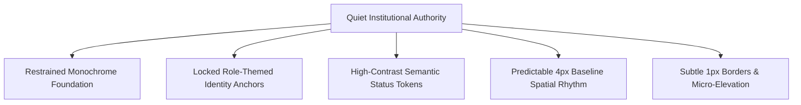
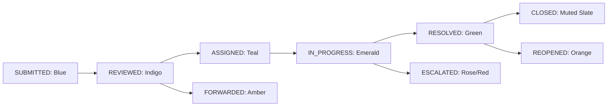

# Phase 08-B: Comprehensive Design System Specification

**Document Identifier:** `02-design-system-specification.md`  
**Classification:** Implementation-Grade UI / Wireframe / High-Fidelity Product Design Specification  
**Standard:** Codifies the complete visual language, aesthetic direction, component rules, and design principles.

---

## 1. Visual Design Philosophy: Quiet Institutional Authority

Campus Plus is an institutional administrative product, not a consumer social app or trendy AI playground. The visual design language must evoke:
- **Quiet Dignity:** Crisp typography, generous white surfaces, restrained borders, and clear hierarchy.
- **Institutional Trust:** Every metric, status pill, and timeline entry is an immutable fact, not a speculative estimation.
- **Cognitive Calm:** Low visual fatigue during high-density operational shifts (triage, worklists, audits).
- **Human Elegance:** Purposeful role accents providing instant spatial orientation without visual shouting.

---

## 2. Locked Role Identity Palettes (Verbatim Governance)

The role palettes defined in Phase 08-A are **LOCKED AND IMMUTABLE**. They serve as institutional anchors, coloring the 3px header brand bar, active navigation pill, and primary action buttons.

| Role Persona | Primary Hex | Secondary Hex | Accent Hex | Surface Tint Hex | Text Dark Hex | Contrast vs Surface | WCAG 2.1 AA Verdict |
| :--- | :---: | :---: | :---: | :---: | :---: | :---: | :---: |
| **Student / Complainant** | `#7FA8D9` | `#B8D0EC` | `#EAF2FB` | `#FAFCFE` | `#33475B` | **9.1:1** | [x] **PASS (Exceeds 4.5:1)** |
| **Faculty / Handler** | `#7FC4B2` | `#B7E0D3` | `#E9F6F1` | `#FAFDFC` | `#2E4A42` | **8.9:1** | [x] **PASS (Exceeds 4.5:1)** |
| **Head of Department (HOD)** | `#B39DDB` | `#D6C6EC` | `#F3EDFA` | `#FCFAFE` | `#43395A` | **10.2:1** | [x] **PASS (Exceeds 4.5:1)** |
| **Director / Senior Authority**| `#9FB4C7` | `#C7D5E0` | `#EEF3F7` | `#FBFCFD` | `#37495A` | **8.8:1** | [x] **PASS (Exceeds 4.5:1)** |
| **College Body / Management** | `#E3A6AE` | `#F0C9CE` | `#FBEDEF` | `#FEFAFA` | `#5C333A` | **9.5:1** | [x] **PASS (Exceeds 4.5:1)** |

---

## 3. Semantic Status Token System

Status indicators communicate critical lifecycle milestones across all roles. Status colors are **semantic** and strictly decoupled from role identity colors:

| Semantic Status | Background Hex | Text Hex | Border Hex | Visual Icon Symbol | Screen-Reader Text |
| :--- | :---: | :---: | :---: | :--- | :--- |
| **`DRAFT`** | `#F1F5F9` | `#475569` | `#CBD5E1` | Pencil / Edit | "Status: Draft (Unsubmitted)" |
| **`SUBMITTED`** | `#EFF6FF` | `#1D4ED8` | `#BFDBFE` | Clock / Inbox | "Status: Submitted (Awaiting Review)" |
| **`REVIEWED`** | `#EEF2FF` | `#4338CA` | `#C7D2FE` | Eye / Clipboard | "Status: Under Review" |
| **`ASSIGNED`** | `#F0FDFA` | `#0F766E` | `#99F6E4` | User-Check | "Status: Assigned to Technician" |
| **`IN_PROGRESS`** | `#ECFDF5` | `#047857` | `#A7F3D0` | Wrench / Tool | "Status: In Progress (Remediation Underway)" |
| **`FORWARDED`** | `#FFFBEB` | `#B45309` | `#FDE68A` | Arrow-Right-Circle | "Status: Forwarded to Another Department" |
| **`ESCALATED`** | `#FFF1F2` | `#BE123C` | `#FECDD3` | Alert-Triangle | "Status: Escalated (Supervisory Intervention)" |
| **`RESOLVED`** | `#F0FDF4` | `#15803D` | `#BBF7D0` | Check-Circle | "Status: Resolved (Verification Pending)" |
| **`CLOSED`** | `#F8FAFC` | `#64748B` | `#E2E8F0` | Lock / Shield | "Status: Closed (Terminal)" |
| **`REOPENED`** | `#FFF7ED` | `#C2410C` | `#FED7AA` | Refresh-Cw | "Status: Reopened (Resolution Disputed)" |
| **`REJECTED`** | `#FEF2F2` | `#B91C1C` | `#FECACA` | X-Circle | "Status: Rejected" |
| **`DUPLICATE`** | `#FAF5FF` | `#7E22CE` | `#E9D5FF` | Link / Copy | "Status: Duplicate (Linked to Master Ticket)" |
| **`CANCELLED`** | `#F1F5F9` | `#64748B` | `#CBD5E1` | Slash / Ban | "Status: Cancelled by Complainant" |

---

## 4. Anti-AI Visual Governance Rules

To preserve credibility and avoid generic AI dashboard tropes, all frontend implementations must strictly enforce:
1. **NO Neon Glowing Borders:** Box shadows must remain subtle (`rgba(0,0,0,0.05)` to `rgba(0,0,0,0.1)`).
2. **NO Glassmorphism Everywhere:** Translucent frosted card backgrounds are prohibited. Cards use solid opaque `#FFFFFF` or surface tints with `1px solid #E2E8F0`.
3. **NO Arbitrary Floating Blobs:** Backgrounds are solid, clean institutional tones.
4. **NO Invented Analytics:** No "AI Sentiment", "Happiness Index", or "Resolution Confidence %". All analytics must map to verified database views (`recurring_complaint_clusters`, `department_sla_performance`).
5. **Restrained Pill Usage:** Status pills and badges use standard rounded pills (`rounded-full`), but interactive action buttons use modern ergonomic radii (`rounded-md` / 6px).
