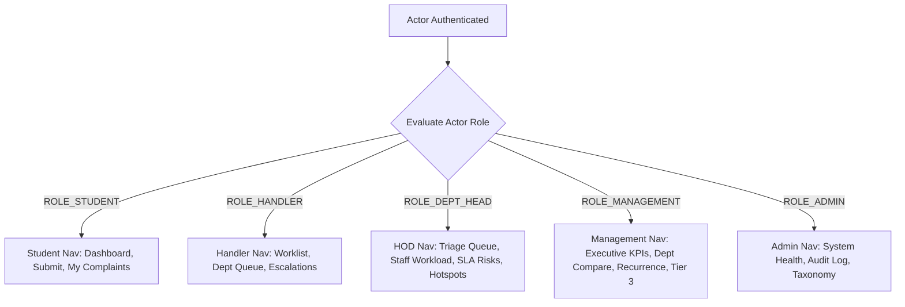

# Phase 08-B: Navigation System & Responsive Mobile Shell

**Document Identifier:** `06-navigation-and-responsive-shell.md`  
**Classification:** Implementation-Grade UI / Wireframe / High-Fidelity Product Design Specification  
**Standard:** Defines the complete navigation hierarchy, mobile bottom-bar architecture, and drawer interaction patterns.

---

## 1. Role-Scoped Navigation Hierarchy

Navigation is dynamic and strictly bounded by the authenticated actor's server-derived role claims:



---

## 2. Mobile Bottom Navigation Bar (`h-[56px]`, `sm:hidden`)

On mobile smartphones (<768px), primary navigation shifts to an ergonomic thumb-accessible bottom bar:

```
+-------------------------------------------------------------------+
|    [Home]        [Complaints]      [ + New ]       [Notifications]|
|   Dashboard       Worklist / List   Intake FAB        Alerts (3)  |
+-------------------------------------------------------------------+
```

### Bottom Bar Slots by Role
1. **Student:**
   - Tab 1: `Home` (`/dashboard` - `STU-001`)
   - Tab 2: `Complaints` (`/complaints` - History)
   - Tab 3 (Center Primary): `+ New` (Prominent elevated intake trigger)
   - Tab 4: `Alerts` (Opens notification slide-over)
2. **Handler / Technician:**
   - Tab 1: `Tasks` (`/dashboard` - Worklist `FAC-001`)
   - Tab 2: `Dept Queue` (`/complaints/department`)
   - Tab 3: `Escalations` (`/complaints/escalated`)
   - Tab 4: `Alerts` (Notifications)
3. **Department Head:**
   - Tab 1: `Triage` (`/dashboard` - Unassigned items `HOD-001`)
   - Tab 2: `Team` (`/team/workload`)
   - Tab 3: `SLA Alerts` (`/analytics/sla`)
   - Tab 4: `Alerts` (Notifications)
4. **Institutional Management:**
   - Tab 1: `Executive` (`/dashboard` - Overview `MGT-001`)
   - Tab 2: `Depts` (`/analytics/departments`)
   - Tab 3: `Hotspots` (`/analytics/hotspots`)
   - Tab 4: `Tier 3` (`/complaints/tier-3`)

---

## 3. Hamburger Slide-Over Navigation Drawer
- **Trigger:** Top header hamburger icon button (mobile and tablet only).
- **Animation:** Slides smoothly from left edge (`transform: translateX(0)`, duration `200ms ease-out`).
- **Anatomy:**
  - Header: Role avatar, full user name, institutional email, active role badge.
  - Body: Full navigation item list (including secondary items like "Campus Hotspots", "System Health", "Help & FAQs").
  - Footer: Institutional software version (`Campus Plus v1.0`) and high-contrast `[Sign Out]` button.
- **Accessibility:** Background overlay traps focus within drawer; pressing `Escape` or tapping outside unmounts drawer and restores focus to hamburger trigger.
