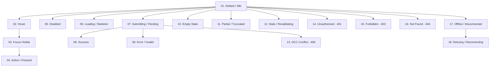

# Phase 08-B: Component Interaction & Lifecycle State Matrix

**Document Identifier:** `08-component-state-matrix.md`  
**Classification:** Implementation-Grade UI / Wireframe / High-Fidelity Product Design Specification  
**Standard:** Codifies the 18 distinct interactive, lifecycle, and network states across all design system components.

---

## 1. The 18-State Component Architecture

Every interactive surface in Campus Plus must account for 18 discrete states to guarantee deterministic UX under all operational and network conditions:

---

## 2. Exhaustive Component Family State Matrix

| State ID | State Name | Form Inputs (`TextInput`, `TextArea`) | Action Triggers (`Button`) | Content Surfaces (`Card`, `Table`) | Status Badges (`StatusPill`) |
| :--- | :--- | :--- | :--- | :--- | :--- |
| **01** | **Default / Idle** | `border-border bg-surface text-text-primary` | Solid/outline role theme, `opacity-100` | Clean background `bg-surface border-border` | Standard semantic background and text |
| **02** | **Hover** | `border-border-strong` | `opacity-90` or `bg-surface-hover` | Subtle border highlight `border-border-strong` | No hover state (non-interactive) |
| **03** | **Focus-Visible** | `outline-none ring-2 ring-[var(--role-primary)] ring-offset-2` | `ring-2 ring-[var(--role-primary)] ring-offset-2` | Outer card focus ring if card is clickable | No focus (unless copyable tracking code) |
| **04** | **Active / Pressed** | Scale 100%, caret blinking | `scale-[0.98] transition-transform` | `bg-surface-subtle` | No active state |
| **05** | **Disabled** | `bg-surface-subtle text-text-muted cursor-not-allowed` | `opacity-40 cursor-not-allowed pointer-events-none` | Dimmed opacity `opacity-60` | Muted monochrome badge |
| **06** | **Loading / Skeleton** | Shimmer skeleton placeholder `animate-pulse bg-gray-200` | Spinner prepended, text disabled | Table skeleton rows with pulsating blocks | Muted placeholder pill |
| **07** | **Submitting** | Input locked `readonly`, spinner inside icon slot | Spinner replaces text or disables button | Overlay backdrop with subtle progress bar | No state change |
| **08** | **Success** | Green border `border-status-resolved-border`, checkmark icon | Green flash background or checkmark | Toast confirmation appears at bottom right | Transitions to target state badge |
| **09** | **Error / Invalid** | Red border `border-status-rejected-border text-status-rejected-text` | Shake animation on rejection | Red alert banner inserted at top of card | Renders REJECTED / ESCALATED badge |
| **10** | **Empty (0 items)** | Placeholder text visible | Hidden or disabled | Centered empty illustration + guidance message | N/A |
| **11** | **Partial / Truncated** | Text ellipsis with scroll capability | Label truncated with tooltip | Table renders first N rows + "Show more" | Full text rendered (no truncation) |
| **12** | **Stale / Revalidating** | Subtle top-edge pulsing blue line | Button remains responsive | Soft banner: "Updating data in background..." | Maintains previous value |
| **13** | **OCC Conflict (409)** | Field locked; modal opens showing conflicting version | Button disabled; triggers diff modal | Warning banner: "Record updated by another user"| Flashes red outline |
| **14** | **Unauthorized (401)** | Input blurred; redirect trigger | Button redirects to `/login` | Full screen lock with login modal | N/A |
| **15** | **Forbidden (403)** | Read-only with lock icon | Button hidden or disabled with lock icon | "You do not have permission to view this section"| Renders gray lock pill |
| **16** | **Not Found (404)** | Error: "Referenced entity does not exist" | Button returns user to dashboard | Full page/card 404 illustration + home button | N/A |
| **17** | **Offline** | Banner: "Offline. Changes saved locally." | Disabled with tooltip: "Network unavailable" | Yellow status bar: "Operating in cached mode" | Cached status displayed |
| **18** | **Retrying** | Spinning retry icon inside field | Button shows "Retrying (1/3)..." | Pulsing indicator with "Reconnecting..." | N/A |

---

## 3. Conflict & Error State Guidelines

### 3.1 Concurrency Conflict (State 13 - HTTP 409)
- **Trigger:** When a user attempts to update a complaint whose `version` has been incremented by another user or automated event.
- **UI Presentation:** An `alertdialog` modal appears titled **"Record Modified by Another User"**.
- **User Choice:**
  1. **"Review Latest Changes"** (Reloads the complaint data into the view, discarding unsaved input).
  2. **"Copy My Changes to Clipboard"** (Copies local form entries so the user does not lose their draft text).

### 3.2 Offline & Network Disconnection (State 17 & 18)
- **Top Toast:** Persistent non-blocking banner at viewport top: `"Network connection lost. Offline mode active."`
- **Form Submissions:** Disabled with message: `"Cannot submit updates while offline."`
