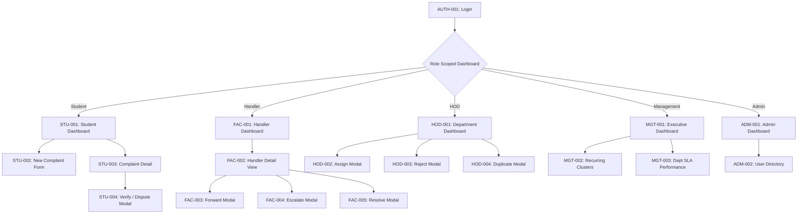

# Phase 08-B: Screen-by-Screen ASCII Wireframe Specification

**Document Identifier:** `09-screen-by-screen-wireframe-specification.md`  
**Classification:** Implementation-Grade UI / Wireframe / High-Fidelity Product Design Specification  
**Standard:** Complete structural ASCII wireframes for all 24 cataloged screens across desktop and mobile viewports.

---

## 1. Master Screen Register & Navigation Map



---

## 2. Complete Wireframe Catalog (All 24 Screens)

### 2.1 AUTH-001: Institutional Login
- **Route:** `/login` | **Role:** Anonymous / Pre-auth
```text
+-----------------------------------------------------------------------------+
|                               CAMPUS PLUS                                   |
|                Institutional Grievance & Resolution Portal                  |
+-----------------------------------------------------------------------------+
|                                                                             |
|                     +---------------------------------+                     |
|                     |        [ Institutional Crest ]  |                     |
|                     |             Sign In             |                     |
|                     |   Enter your campus credentials |                     |
|                     |                                 |                     |
|                     | Institutional Email Address     |                     |
|                     | [ student@campus.edu          ] |                     |
|                     |                                 |                     |
|                     | Password                        |                     |
|                     | [ **************************  ] |                     |
|                     |                                 |                     |
|                     | [x] Remember my session (30d)   |                     |
|                     |                                 |                     |
|                     | +-----------------------------+ |                     |
|                     | |      Sign In to Campus Plus | |                     |
|                     | +-----------------------------+ |                     |
|                     |                                 |                     |
|                     | Need help? Contact Campus Admin |                     |
|                     +---------------------------------+                     |
|                                                                             |
+-----------------------------------------------------------------------------+
```

### 2.2 STU-001: Student Dashboard
- **Route:** `/dashboard` | **Role:** `ROLE_STUDENT` | **Accent:** `#7FA8D9`
```text
+-----------------------------------------------------------------------------+
| [BRAND BAR: 3px Primary Color #7FA8D9]                                      |
| CAMPUS PLUS    Search Complaints (Ctrl+K)   [Bell (2)] [S. Sharma (Student)]|
+-----------------------------------------------------------------------------+
| +-------------------------------------------------------------------------+ |
| | Welcome, S. Sharma                     [ + Submit New Complaint Button ]| |
| | Track your submitted grievances and review completed resolutions.       | |
| +-------------------------------------------------------------------------+ |
|                                                                             |
| +------------------+  +------------------+  +-----------------------------+ |
| | ACTIVE (2)       |  | PENDING VERIFY(1)|  | CLOSED ARCHIVE (5)          | |
| | In progress/triage| | Awaiting your ok |  | Successfully completed      | |
| +------------------+  +------------------+  +-----------------------------+ |
|                                                                             |
| Filter: [ All ] [ In Progress ] [ Resolved ] [ Closed ]     Sort: [ Newest ]|
| +-------------------------------------------------------------------------+ |
| | CP-2026-00891 | WiFi Dead Zone in Library 3rd Floor   | [IN_PROGRESS]   | |
| | Dept: IT Infrastructure | Priority: HIGH | Submitted: 2 days ago        | |
| +-------------------------------------------------------------------------+ |
| | CP-2026-00842 | Broken Study Desk in Hostel B-204     | [RESOLVED]      | |
| | Dept: Hostel Maintenance | Action Required: [Verify Resolution]         | |
| +-------------------------------------------------------------------------+ |
| | CP-2026-00712 | Laboratory Water Supply Disruption    | [CLOSED]        | |
| | Dept: Campus Sanitation | Closed on: Feb 18, 2026                       | |
| +-------------------------------------------------------------------------+ |
+-----------------------------------------------------------------------------+
```

### 2.3 STU-002: Submit Complaint Form
- **Route:** `/complaints/new` | **Role:** `ROLE_STUDENT`
```text
+-----------------------------------------------------------------------------+
| CAMPUS PLUS    < Back to Dashboard                  [S. Sharma (Student)]   |
+-----------------------------------------------------------------------------+
| SUBMIT A FORMAL COMPLAINT                                                   |
| Please provide factual, detailed information to expedite resolution.        |
|                                                                             |
| 1. Complaint Title * (10 - 120 chars)                                       |
| [ High latency and packet drop in C-Block Computer Lab 4                 ] |
| (56/120 characters)                                                         |
|                                                                             |
| 2. Grievance Category *                 3. Assigned Department *            |
| [ Network & Infrastructure         v ]  [ IT Systems Department         v ] |
|                                                                             |
| 4. Campus Location *                                                        |
| Building: [ C-Block Science v ]  Floor: [ 2nd Floor v ]  Room: [ Lab 4    ] |
| Additional Location Details: [ Near server rack 2                         ] |
|                                                                             |
| 5. Detailed Description * (Minimum 30 chars)                                |
| +-------------------------------------------------------------------------+ |
| | During afternoon practical lab sessions, all 30 terminal workstations   | |
| | experience complete DNS failure and packet loss exceeding 60%.          | |
| +-------------------------------------------------------------------------+ |
| (142 characters entered - Valid)                                            |
|                                                                             |
| 6. Suggested Urgency Level *                                                |
| ( ) Low   ( ) Medium   (x) High   ( ) Urgent                                |
|                                                                             |
| 7. Evidence Attachments (Optional - Max 3 files, 5MB each, PDF/PNG/JPEG)    |
| +-------------------------------------------------------------------------+ |
| | [Drag & Drop Screenshots or PDFs here, or Browse Files]                 | |
| | Selected: ping_test_results.png (1.2 MB) [x]                            | |
| +-------------------------------------------------------------------------+ |
|                                                                             |
| [ Cancel ]                                         [ Submit Complaint -> ]  |
+-----------------------------------------------------------------------------+
```

### 2.4 STU-003: Complaint Detail View (Student View)
- **Route:** `/complaints/[id]` | **Role:** `ROLE_STUDENT`
```text
+-----------------------------------------------------------------------------+
| CAMPUS PLUS    < Back to Complaints                 [S. Sharma (Student)]   |
+-----------------------------------------------------------------------------+
| CP-2026-00842 [Copy] | Broken Study Desk in Hostel B-204     | [RESOLVED]   |
| Department: Hostel Maintenance | Category: HOSTEL_MAINTENANCE | Urgency: MED|
+-----------------------------------------------------------------------------+
| [!] ACTION REQUIRED: The department has marked this complaint RESOLVED.     |
| Resolution Summary: "Replaced damaged desk surface and secured leg screws."|
| Please inspect within 5 business days and verify or dispute.                |
| [ Verify & Close Complaint ]               [ Dispute Resolution & Reopen ]  |
+-----------------------------------------------------------------------------+
| DESCRIPTION                                                                 |
| Study desk in room B-204 has sheared support leg causing table to collapse. |
|                                                                             |
| EVIDENCE ATTACHMENTS (1)                                                    |
| [ broken_desk_photo.jpg (2.4 MB) - Download ]                               |
|                                                                             |
| PUBLIC RESOLUTION TIMELINE                                                  |
| * Feb 20, 14:30 | RESOLVED by Handler R. Verma                              |
|   "Replaced damaged desk surface and secured leg screws."                   |
| * Feb 19, 09:15 | IN PROGRESS: Work order dispatched to carpenter workshop.  |
| * Feb 18, 16:00 | ASSIGNED to R. Verma (Hostel Maintenance Team)            |
| * Feb 18, 11:30 | SUBMITTED by S. Sharma                                    |
+-----------------------------------------------------------------------------+
```

### 2.5 FAC-001: Handler Operational Worklist
- **Route:** `/dashboard` | **Role:** `ROLE_HANDLER` | **Accent:** `#7FC4B2`
```text
+-----------------------------------------------------------------------------+
| [BRAND BAR: 3px Primary Color #7FC4B2]                                      |
| CAMPUS PLUS    Search Assigned (Ctrl+K)     [Bell (4)] [R. Verma (Handler)] |
+-----------------------------------------------------------------------------+
| DEPARTMENT: IT Infrastructure & Systems                                     |
| +------------------+  +------------------+  +-----------------------------+ |
| | MY WORKLIST (6)  |  | IN PROGRESS (3)  |  | SLA AT RISK (1)             | |
| | Assigned to you  |  | Active work      |  | < 4 hours remaining         | |
| +------------------+  +------------------+  +-----------------------------+ |
|                                                                             |
| Filter: [ Assigned to Me ] [ Department Queue ] [ Escalated ]               |
| +-------------------------------------------------------------------------+ |
| | [!] CP-2026-00891 | C-Block DNS Packet Drop        | [IN_PROGRESS] [HIGH] |
| | SLA: 3h 15m remaining | Complainant: S. Sharma | Action: [Resolve] [More v]|
| +-------------------------------------------------------------------------+ |
| | CP-2026-00902 | Projector Lamp Blown - Room 102    | [ASSIGNED]    [MED]  |
| | SLA: 22h remaining | Complainant: Faculty Dr. Rao | Action: [Start Progress] |
| +-------------------------------------------------------------------------+ |
| | CP-2026-00910 | Access Point Offline - Library West| [ASSIGNED]    [URGENT]|
| | SLA: 5h remaining | Complainant: Admin Staff      | Action: [Start Progress] |
| +-------------------------------------------------------------------------+ |
+-----------------------------------------------------------------------------+
```

### 2.6 HOD-001: Department Head Oversight Dashboard
- **Route:** `/dashboard` | **Role:** `ROLE_DEPT_HEAD` | **Accent:** `#B39DDB`
```text
+-----------------------------------------------------------------------------+
| [BRAND BAR: 3px Primary Color #B39DDB]                                      |
| CAMPUS PLUS    Triage Queue (Ctrl+K)         [Bell (5)] [Dr. K. Patel (HOD)]|
+-----------------------------------------------------------------------------+
| DEPARTMENT OF IT INFRASTRUCTURE & SERVICES                                 |
| +------------------+  +------------------+  +-----------------------------+ |
| | UNASSIGNED (4)   |  | ACTIVE OPS (18)  |  | SLA BREACHED (0)            | |
| | Needs assignment |  | In Handler Queue |  | 100% on-track               | |
| +------------------+  +------------------+  +-----------------------------+ |
|                                                                             |
| TRIAGE QUEUE (Requires Immediate Assignment or Review)                      |
| +-------------------------------------------------------------------------+ |
| | CP-2026-00924 | Switch Failure in Server Room 2     | [SUBMITTED] [URGENT]|
| | Submitted: 35 mins ago | Action: [Assign Handler] [Forward] [Reject]    | |
| +-------------------------------------------------------------------------+ |
| | CP-2026-00921 | WiFi Authentication Loop in Hostel 4 | [REVIEWED]  [HIGH]  |
| | Reviewed by HOD | Action: [Assign Handler] [Forward]                    | |
| +-------------------------------------------------------------------------+ |
|                                                                             |
| HANDLER WORKLOAD DISTRIBUTION                                               |
| - R. Verma:      [######               ] 6 complaints (2 In-Progress)       |
| - A. Kulkarni:   [#########            ] 9 complaints (4 In-Progress)       |
| - T. Sengupta:   [###                  ] 3 complaints (1 In-Progress)       |
+-----------------------------------------------------------------------------+
```

### 2.7 MGT-001: Executive Management Dashboard
- **Route:** `/dashboard` | **Role:** `ROLE_MANAGEMENT` | **Accent:** `#E3A6AE`
```text
+-----------------------------------------------------------------------------+
| [BRAND BAR: 3px Primary Color #E3A6AE]                                      |
| CAMPUS PLUS    Campus Overview               [Bell (1)] [Dean Office (Mgt)] |
+-----------------------------------------------------------------------------+
| INSTITUTIONAL PERFORMANCE & RESOLUTION KPIS (Past 30 Days)                  |
| +--------------------+ +--------------------+ +----------------------------+ |
| | TOTAL FILED (142)  | | RESOLUTION RATE    | | AVG TURNAROUND             | |
| | +8% vs last month  | | 94.2% within SLA   | | 18.4 Hours                 | |
| +--------------------+ +--------------------+ +----------------------------+ |
|                                                                             |
| RECURRING COMPLAINT HOTSPOTS (>= 3 in same category+dept+loc in 30 days)    |
| [!] CLUSTER #01: C-Block Lab WiFi & Network (7 complaints) [View Cluster ->]|
| [!] CLUSTER #02: Hostel B Hot Water Supply (4 complaints)   [View Cluster ->]|
|                                                                             |
| DEPARTMENT PERFORMANCE BENCHMARK                                            |
| Department           Total Filed   Resolved   Avg Time   Escalation Rate    |
| IT Infrastructure        64           60       14.2h          3.1%          |
| Hostel Maintenance       48           45       22.0h          4.2%          |
| Campus Sanitation        30           29       11.5h          0.0%          |
+-----------------------------------------------------------------------------+
```
