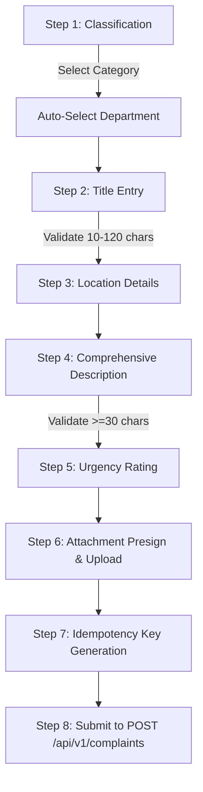

# Phase 08-B: Complaint Submission UI Specification & Architecture

**Document Identifier:** `17-complaint-submission-ui-specification.md`  
**Classification:** Implementation-Grade UI / Wireframe / High-Fidelity Product Design Specification  
**Scope:** New complaint creation journey (`STU-002` / `/complaints/new`).

---

## 1. Submission Form Architecture & Validation

The submission form enforces strict domain integrity directly aligned with the Zod schema and Value Objects verified in Phase 05:

### 1.1 Field Validation Specifications
- **Complaint Title:**
  - Length: `10` to `120` characters (`ComplaintTitle.ts`).
  - Validation: Real-time counter. Must not be whitespace only.
  - Error: "Title must be between 10 and 120 characters."
- **Complaint Category:**
  - Mandatory single-select enum (`ComplaintCategory.ts`).
  - Triggers default department recommendation.
- **Department:**
  - Mandatory single-select. Target department where complaint will be dispatched.
- **Location Structure:**
  - Building/Block (Mandatory).
  - Floor/Room (Mandatory).
  - Specific Details (Optional text).
- **Description:**
  - Length: Minimum `30` characters (`ComplaintDescription.ts`).
  - Validation: Character counter shows `X / 30 minimum`.
  - Error: "Description must contain at least 30 characters providing specific context."
- **Priority / Urgency:**
  - Radio group: `LOW`, `MEDIUM`, `HIGH`, `URGENT`. Default: `MEDIUM`.

---

## 2. Presigned Attachment Upload Protocol

1. **User Selects File(s):**
   - Max 3 files. Max 5MB per file. Accepted types: `image/jpeg`, `image/png`, `application/pdf`.
2. **Presign Request:**
   - UI calls `POST /api/v1/attachments/presign-upload` with `{ filename, contentType, sizeBytes }`.
   - Backend validates file constraints and returns `{ uploadUrl, fileKey, publicUrl }`.
3. **Direct Upload:**
   - UI performs `PUT` directly to Supabase Private Storage upload URL.
   - Live progress indicator displays upload percentage.
4. **Complaint Submission Payload:**
   - Attaches array of `{ fileKey, originalName, mimeType, sizeBytes }` to the complaint payload.

> [!WARNING]
> **Operational Risk Notice (RISK-001 / P2 Orphan Files):**
> If a user uploads files but closes their browser before submitting the complaint, the files remain in `complaints/temp/`. The UI prevents re-uploading and tracks uploaded files in local state.

---

## 3. Idempotency & Draft Retention

- **Idempotency Key:** On initial form load, the UI generates a unique UUID `crypto.randomUUID()`. This is passed in the `Idempotency-Key` HTTP header. If network retries occur, the same key is reused, preventing duplicate tickets.
- **Draft Persistence:** Form field changes are debounced (500ms) and saved to `localStorage.campus_plus_complaint_draft`.
- **Draft Cleanup:** Upon successful `201 Created` response, `localStorage` draft is cleared immediately.
