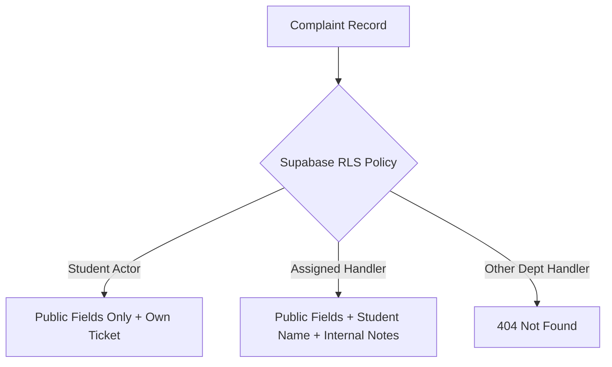

# Phase 08-B: Security & Privacy UI Architecture

**Document Identifier:** `24-security-and-privacy-ui-specification.md`  
**Classification:** Implementation-Grade UI / Wireframe / High-Fidelity Product Design Specification  
**Standard:** Client-side privacy boundaries, BOLA/IDOR defense, PII protection, and session security.

---

## 1. Zero Trust UI Architecture

The frontend client operates under a strict **Zero Trust** doctrine:
- **Client Checks Are Only Ergonomics:** Hiding a button or disabling an input is strictly for user experience, never for security. The server-side `AuthorizationPolicy.ts` and PostgreSQL Row-Level Security (RLS) policies are the sole authorities.
- **BOLA / IDOR Defense:** If an unauthorized user attempts to view a complaint URL (e.g. Student B navigating to `/complaints/CP-2026-A123` owned by Student A), the frontend renders a generic `404 Not Found` state without confirming the existence of the ticket.

---

## 2. Student Privacy & PII Protection

### Protection Standards:
- **Contact Masking:** Student personal phone numbers and personal emails are never exposed on standard staff triage views.
- **Internal Notes Segregation (`INV-012`):** Internal notes are filtered server-side. The frontend component tree contains zero hidden or commented DOM nodes containing staff discussion when rendered for a student.

---

## 3. Session & Storage Security

- **JWT Storage:** Supabase Auth tokens are managed in HTTP-only or secure client storage with automatic renewal.
- **Presigned Upload Safety:** Direct-to-storage uploads use pre-signed URLs with strict 15-minute expiration and exact content-type validation (`image/jpeg`, `image/png`, `application/pdf`). SVG files are rejected to prevent stored XSS attacks.
